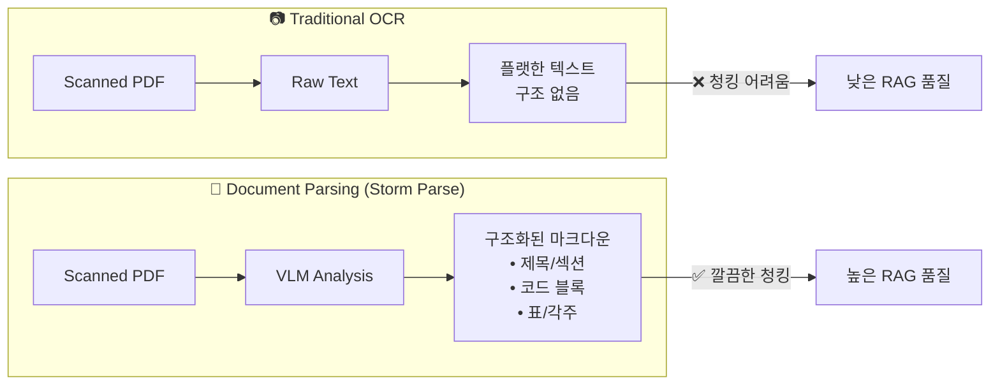

# Project Brief: Personal Library RAG System

> **Created**: 2025-12-04
> **Updated**: 2025-12-05
> **Version**: 1.2

---

## Executive Summary

BookBrain은 50권 이상의 개발 서적(PDF)을 시맨틱+키워드 하이브리드 검색으로 탐색하는 개인 라이브러리 시스템이다.

**핵심 가치**: "생각나는 대로 검색하고, 정확한 출처를 찾는다"

---

## 1. Problem Statement

### 현재 상황 (As-Is)
- **다수의 개발 서적** (50권 이상, 지속 증가 예정)을 스캔하여 PDF로 보유
- 특정 내용을 찾으려면 각 PDF를 열어 Ctrl+F로 키워드 검색
- **문제점**:
  - 정확한 키워드를 기억해야만 검색 가능
  - 의미 기반 검색 불가 ("매핑 설정 방법" vs "mapping configuration")
  - 여러 책에 걸친 크로스 레퍼런스 어려움
  - 출처(어떤 책, 몇 페이지)를 기억하기 어려움

### 목표 상황 (To-Be)
- 모든 장서를 벡터 DB에 저장하여 **시맨틱 검색** 가능
- 키워드 + 의미 기반 **하이브리드 검색**으로 정확도 향상
- 검색 결과에 **출처(책명, 페이지)** 명확히 표시
- 웹 UI를 통해 언제 어디서든 접근 가능

---

## 2. Project Goals

### Primary Goals

| Goal | Description | Success Metric |
|------|-------------|----------------|
| G1 | 자연어로 장서 검색 | "elasticsearch 매핑" 검색 시 관련 내용 상위 노출 |
| G2 | 하이브리드 검색 구현 | 키워드 정확 매칭 + 의미 유사도 결합 |
| G3 | 출처 추적 | 검색 결과에 책명, 챕터, 페이지 표시 |
| G4 | 웹 기반 접근 | 외부에서 브라우저로 검색 가능 |

### Secondary Goals (Future → v2.0+)
- AI 요약 기능 (RAG with LLM)
- LangChain/LangGraph 기반 에이전트
- 논문/아티클 확장

---

## 3. Version Roadmap

| Version | Codename | Focus | Key Features |
|---------|----------|-------|--------------|
| **v1.0** | Search | 검색 전용 | 하이브리드 검색, 출처 추적, Web UI |
| **v2.0** | Brain | RAG 확장 | LLM 답변 생성, 대화형 Q&A |
| **v3.0** | Agent | 에이전트 | LangGraph 기반 멀티스텝 추론 |

```
Timeline (개인 프로젝트, 유연):
━━━━━━━━━━━━━━━━━━━━━━━━━━━━━━━━━━━━━━━━━━━━━━━━━━━
  v1.0 MVP        v1.1 Polish      v2.0 RAG
  [검색 기능]      [UX 개선]        [AI 답변]
━━━━━━━━━━━━━━━━━━━━━━━━━━━━━━━━━━━━━━━━━━━━━━━━━━━
```

---

## 4. Scope

### In Scope
- **Document Parsing API (Storm Parse)** 활용한 PDF 텍스트 추출
- 파싱된 텍스트 → 청크 분할 파이프라인
- 벡터 임베딩 및 Chroma DB 저장
- BM25 키워드 검색 구현
- 하이브리드 검색 (벡터 + BM25) 통합
- Streamlit 기반 검색 UI
- Oracle Cloud (Ubuntu) 배포

### Out of Scope (v1.0)
- AI 요약/챗봇 기능 (v2.0 고려)
- 모바일 전용 앱
- 다중 사용자 인증
- 실시간 PDF 업로드 (초기 배치 처리)

### Non-Goals (명시적으로 하지 않을 것)

> 기능 추가 유혹이 올 때 참조할 기준선

| Category | Non-Goal | 이유 |
|----------|----------|------|
| **협업** | 다중 사용자/계정 관리 | 개인 전용 시스템 |
| **협업** | 공유/코멘트/협업 기능 | 복잡도 증가 |
| **에디터** | 북마크/하이라이트 에디터 | PDF 뷰어 영역 침범 |
| **독서 관리** | 읽음/안읽음 추적, 독서 노트 | Notion 등 기존 도구 활용 |
| **외부 연동** | 소셜 공유, 외부 API 제공 | 개인용 |
| **모바일** | 네이티브 앱, PWA 최적화 | Web 우선 |
| **자동화** | 자동 PDF 수집/구매 연동 | 수동 업로드로 충분 |

---

## 5. Constraints & Assumptions

### Constraints

| Type | Description |
|------|-------------|
| Infrastructure | Oracle Cloud Free Tier (ARM 4 OCPU, 24GB RAM) |
| Budget | 임베딩 API 유료 OK (OpenAI), Document Parsing API 비용 발생 |
| Data | 다수의 개발 서적 (50권+), 한글 설명 + 영어 코드 혼합 |
| Timeline | 취미/포트폴리오 목적, 급하지 않음 |

### Assumptions
- Storm Parse API로 고품질 구조화된 텍스트 확보 가능
- 책당 평균 10만 자, 100-200 청크 예상
- 단일 사용자 (본인만 사용)
- 책 수는 계속 증가할 수 있음

---

## 5. Key User Scenarios

### Scenario 1: 개념 검색

```
User: "elasticsearch의 매핑에 대해서 알려줘"
System:
  - [Elasticsearch 실전 가이드] Chapter 3, p.45
    "매핑(Mapping)은 인덱스에 저장될 문서의 구조를 정의..."
  - [검색 엔진 구축] Chapter 5, p.112
    "필드 타입과 분석기 설정을 통해 매핑을 구성..."
```

### Scenario 2: 기술 옵션 탐색

```
User: "Spring Security 인증 관련 옵션 알려줘"
System:
  - [스프링 시큐리티 인 액션] Chapter 4, p.89
    "FormLogin, OAuth2, JWT 기반 인증 방식..."
  - [실전 스프링 부트] Chapter 12, p.301
    "SecurityFilterChain 설정 옵션..."
```

### Scenario 3: 출처 확인

```
User: "DDD에서 Aggregate 설계 원칙이 어디 나와있지?"
System:
  - [도메인 주도 설계] Chapter 6, p.125-130
    "Aggregate는 데이터 변경의 단위로..."
  - [DDD Start!] Chapter 3, p.78
    "Aggregate Root를 통해서만 접근..."
```

---

## 6. Risk & Cost Analysis

### 6.1 Cost Budget

> **월 예산 목표**: $30 이하 (API 비용 중심)

| Service | Unit Cost | Estimated Usage | Monthly Cost | Notes |
|---------|-----------|-----------------|--------------|-------|
| **Storm Parse API** | ~$0.01/page | 50권 × 300p = 15,000p (일회성) | ~$150 (일회성) | 초기 수집 시에만 발생 |
| **OpenAI Embedding** | $0.00002/1K tokens | ~5M tokens (일회성) | ~$0.10 (일회성) | 수집 시 + 검색 시 |
| **OpenAI Embedding (검색)** | $0.00002/1K tokens | ~100 queries/day × 100 tokens | ~$0.06/month | 일상 사용 |
| **Oracle Cloud** | Free Tier | ARM 4 OCPU, 24GB | $0 | Always Free |
| **Domain (선택)** | ~$12/year | 1개 | ~$1/month | 없어도 무방 |

**비용 산정 공식**:

수집 비용:

$$
C_{\text{ingest}} = P \times C_{\text{storm}} + \frac{T_{\text{total}}}{1000} \times C_{\text{embed}}
$$

여기서:
- $P$ = 총 페이지 수 (~15,000)
- $C_{\text{storm}}$ = Storm Parse 페이지당 비용 (~$0.01)
- $T_{\text{total}}$ = 총 토큰 수 (~5M)
- $C_{\text{embed}}$ = OpenAI 임베딩 1K 토큰당 비용 ($0.00002)

월간 운영 비용:

$$
C_{\text{monthly}} = Q_{\text{daily}} \times 30 \times T_q \times C_{\text{embed}} / 1000
$$

여기서:
- $Q_{\text{daily}}$ = 일일 검색 횟수 (~100)
- $T_q$ = 쿼리당 평균 토큰 (~100)

### 6.2 Risk Register

| ID | Risk | Category | Impact | Likelihood | Score | Mitigation | Trigger |
|----|------|----------|--------|------------|-------|------------|---------|
| R1 | Storm Parse API 비용 폭증 | Cost | High | Low | 🟡 | 사전 비용 계산, Upstage 백업 | 예상 비용 2배 초과 시 |
| R2 | OpenAI API 가격 인상 | Cost | Medium | Medium | 🟡 | 로컬 임베딩 모델 대안 준비 | 가격 50% 이상 인상 시 |
| R3 | PDF 파싱 품질 저하 (스캔 상태) | Quality | High | Medium | 🟠 | 샘플 테스트 후 진행, 수동 보정 | 10% 이상 파싱 실패 시 |
| R4 | Oracle Free Tier 리소스 제한 | Infra | Medium | Low | 🟢 | 청크 크기 최적화, 스왑 설정 | 메모리 80% 이상 |
| R5 | 한글+코드 혼합 임베딩 품질 | Quality | Medium | Medium | 🟡 | 다국어 모델 평가, 청크 전략 조정 | 검색 관련도 70% 미만 |
| R6 | Chroma DB 확장성 한계 | Infra | Low | Low | 🟢 | 모니터링, Qdrant 마이그레이션 계획 | 10만 청크 초과 시 |
| R7 | 백업/복구 실패 | Data | High | Low | 🟡 | 주기적 백업 테스트, 복구 절차 문서화 | 월 1회 복구 테스트 |

**Risk Score 계산**:

$$
\text{Score} = \text{Impact} \times \text{Likelihood}
$$

| Score | Level | Action |
|-------|-------|--------|
| 🟢 1-3 | Low | 모니터링만 |
| 🟡 4-6 | Medium | 대응 계획 수립 |
| 🟠 7-9 | High | 즉시 대응 필요 |

---

## 7. Stakeholders

| Role | Name | Responsibility |
|------|------|----------------|
| Product Owner | 본인 | 요구사항 정의, 최종 승인 |
| Developer | 본인 | 설계, 구현, 배포 |
| End User | 본인 | 검색 사용, 피드백 |

---

## 8. Success Criteria

### MVP (v1.0) 완료 조건
- [ ] 보유 장서 전체 벡터 DB 적재 완료
- [ ] 하이브리드 검색 동작 확인
- [ ] 검색 결과에 출처(책, 페이지) 표시
- [ ] Streamlit UI 외부 접속 가능
- [ ] Oracle Cloud 안정 운영

### Quality Metrics with Measurement Plan

| Metric | Target | Measurement Method | Frequency |
|--------|--------|-------------------|-----------|
| 검색 응답 시간 | < 2초 (p95) | Streamlit에서 100회 요청, 95th percentile 측정 | 릴리즈 시 |
| 관련 결과 Top-5 포함율 | > 80% | 대표 쿼리 50개로 평가, 수동 관련성 판정 | 릴리즈 시 |
| 시스템 가용성 | > 95% | UptimeRobot 또는 cron health check | 월간 |
| 사용자 검색 시간 절감 | 5분 → 30초 | 자가 측정 (Before/After 비교) | MVP 완료 후 |
| 재검색 성공률 | > 90% | 이전에 찾았던 내용 다시 찾기 성공 | 2주 사용 후 |

**대표 쿼리 셋 (Representative Query Set)**:
- `docs/prd.md` Section 11에 50개 정의

---

## 9. Document Parsing Strategy

### OCR vs Document Parsing



### 선택: Storm Parse API
- **이유**: VLM 기반으로 레이아웃 + 의미 분석
- **장점**: 코드 블록, 표, 각주 자동 분리
- **백업**: Upstage Document AI

---

## Next Steps

1. PRD 상세 작성 → `docs/prd.md`
2. 시스템 아키텍처 설계 → `docs/architecture.md`
3. 기술 스택 결정 → `docs/tech-stack.md`
