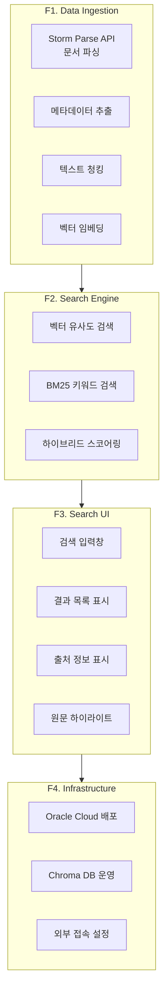
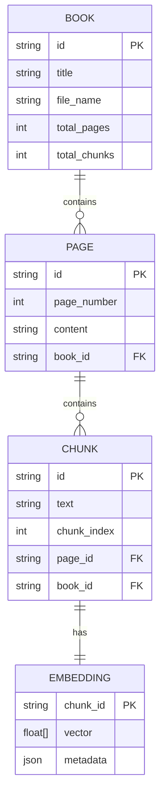
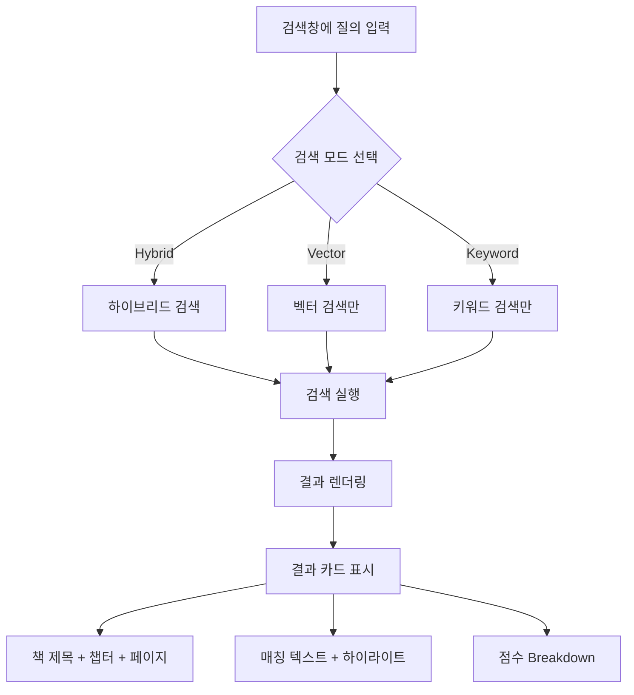
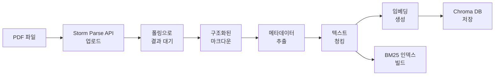
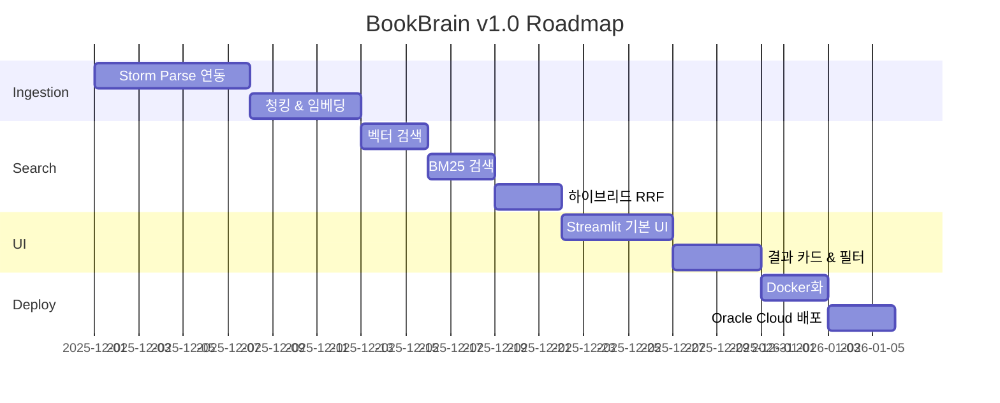

# Product Requirements Document (PRD)

> **Created**: 2025-12-04
> **Updated**: 2025-12-05
> **Version**: 1.2

---

## 1. Product Overview

### 1.1 Product Name
**BookBrain** - Personal Library RAG System

### 1.2 Vision Statement
> "내가 읽은 모든 책에서, 생각나는 대로 검색하고, 정확한 출처를 찾는다"

### 1.3 Product Summary
개인이 보유한 개발 서적(PDF)을 Document Parsing API로 구조화하고, 벡터화하여 시맨틱 검색과 키워드 검색을 결합한 하이브리드 검색 시스템. 웹 UI를 통해 자연어 질의로 관련 내용을 찾고, 출처(책명, 챕터, 페이지)를 명확히 제공한다.

---

## 2. User Persona & Usage Scenarios

### 2.1 Primary Persona: Developer Reader

| Attribute | Description |
|-----------|-------------|
| **Demographics** | 30대 중반, 한국 백엔드 개발자 |
| **Library** | 개발 서적 50권+ (Java, Spring, DDD, ES, K8s 등) |
| **Goal** | 읽었던 내용을 빠르게 찾고 정확한 출처 확인 |
| **Pain Point** | PDF 여러 개 열어서 Ctrl+F, 정확한 키워드 기억 안 남 |
| **Tech Level** | 고급 (시스템 직접 구축 가능) |
| **Device** | MacBook (업무), iPad (독서), 스마트폰 (가끔) |

### 2.2 Usage Scenarios with Context

#### Scenario A: 코딩 중 레퍼런스 검색 (평일 업무 시간)

```
상황: Spring Security에서 JWT 필터 순서를 조절해야 하는데 정확한 방법이 기억 안 남
시간: 평일 오후 3시, 업무 중
디바이스: MacBook, 브라우저 탭 옆에 IDE 열린 상태
사용 패턴:
  1. BookBrain 탭으로 이동 (이미 열려 있음)
  2. "Spring Security JWT 필터 순서" 입력
  3. 상위 3개 결과 스캔 (10초)
  4. 관련 코드 스니펫이 있는 결과 클릭
  5. 출처 확인 후 해당 책 페이지로 이동 또는 코드 복사
목표: 2분 내 해결
```

#### Scenario B: 블로그 작성 시 인용 (주말 저녁)

```
상황: DDD Aggregate 설계 원칙에 대한 블로그 글 작성 중, 정확한 인용 필요
시간: 주말 저녁 8시, 카페에서
디바이스: MacBook
사용 패턴:
  1. "DDD Aggregate 설계 원칙" 검색
  2. 여러 책에서 나온 결과 비교 (도메인 주도 설계 vs DDD Start!)
  3. 각 결과의 출처(책명, 페이지) 확인
  4. 마크다운으로 인용문 복사
목표: 5분 내 3개 이상 인용 확보
```

#### Scenario C: 출퇴근 중 개념 복습 (이동 중)

```
상황: 지하철에서 면접 준비, "CAP 정리"가 뭐였더라?
시간: 평일 아침 8시, 출근 지하철
디바이스: 스마트폰 (반응형 웹)
사용 패턴:
  1. 스마트폰 브라우저로 BookBrain 접속
  2. "CAP theorem 정리" 간단히 검색
  3. 핵심 요약이 담긴 청크 읽기
  4. 어떤 책에 있었는지 기억해두기
목표: 1분 내 핵심 복습
```

#### Scenario D: 새 책 추가 후 검색 확인 (비정기)

```
상황: 새로 구매한 "클린 아키텍처" PDF를 라이브러리에 추가
시간: 주말 오후, 집에서
디바이스: MacBook
사용 패턴:
  1. CLI로 새 책 인제스트: `bookbrain ingest clean_architecture.pdf`
  2. 진행률 확인 (예상: 300페이지, 5분)
  3. 완료 후 테스트 검색: "의존성 역전 원칙"
  4. 새 책 결과가 포함되는지 확인
목표: 10분 내 인제스트 완료 및 검색 확인
```

### 2.3 일일 사용 패턴 예상

| 시간대 | 사용 빈도 | 주요 Scenario |
|--------|----------|---------------|
| 출근 (08:00-09:00) | 낮음 | C. 개념 복습 |
| 업무 (09:00-18:00) | 높음 | A. 코딩 중 레퍼런스 |
| 퇴근 (18:00-19:00) | 낮음 | C. 개념 복습 |
| 저녁 (19:00-23:00) | 중간 | B. 블로그/학습 |
| 주말 | 중간 | B, D. 학습, 책 추가 |

---

## 3. Functional Requirements

### 3.1 Feature Map



### 3.2 Feature Details

#### F1: Data Ingestion Pipeline

| ID | Feature | Description | Priority |
|----|---------|-------------|----------|
| F1.1 | Document Parsing | Storm Parse API로 PDF → 구조화 마크다운 | Must |
| F1.2 | 메타데이터 파싱 | 책 제목, 챕터, 페이지 번호 추출 | Must |
| F1.3 | 텍스트 청킹 | 의미 단위로 텍스트 분할 (800 토큰) | Must |
| F1.4 | 청크 오버랩 | 문맥 유지를 위한 청크 간 오버랩 (200 토큰) | Should |
| F1.5 | 벡터 임베딩 | OpenAI text-embedding-3-small | Must |
| F1.6 | Chroma 저장 | 벡터 + 메타데이터 저장 | Must |
| F1.7 | BM25 인덱스 | 키워드 검색용 인덱스 빌드 | Must |

#### F2: Search Engine

| ID | Feature | Description | Priority |
|----|---------|-------------|----------|
| F2.1 | 벡터 검색 | 코사인 유사도 기반 시맨틱 검색 | Must |
| F2.2 | BM25 검색 | 키워드 기반 정확 매칭 | Must |
| F2.3 | 하이브리드 검색 | RRF (Reciprocal Rank Fusion) | Must |
| F2.4 | 가중치 조절 | 벡터/키워드 비율 조절 가능 | Should |
| F2.5 | 필터링 | 책별, 챕터별 필터 | Should |
| F2.6 | 리랭킹 | 결과 재정렬 옵션 | Could |

#### F3: Search UI (Streamlit)

| ID | Feature | Description | Priority |
|----|---------|-------------|----------|
| F3.1 | 검색창 | 자연어 질의 입력 | Must |
| F3.2 | 결과 카드 | 매칭 텍스트 + 출처 표시 | Must |
| F3.3 | 출처 정보 | 책명, 챕터, 페이지 번호 | Must |
| F3.4 | 키워드 하이라이트 | 검색어 강조 표시 | Should |
| F3.5 | 검색 모드 토글 | 벡터/키워드/하이브리드 선택 | Should |
| F3.6 | 결과 개수 조절 | Top-K 설정 | Should |
| F3.7 | 책 필터 | 특정 책에서만 검색 | Could |
| F3.8 | 마크다운 내보내기 | 검색 결과 복사/저장 | Could |

#### F4: Infrastructure

| ID | Feature | Description | Priority |
|----|---------|-------------|----------|
| F4.1 | Docker 컨테이너화 | 앱 + DB 컨테이너 | Must |
| F4.2 | Oracle Cloud 배포 | ARM 인스턴스 활용 | Must |
| F4.3 | HTTPS 설정 | Let's Encrypt 인증서 | Should |
| F4.4 | 기본 인증 | Nginx Basic Auth | Should |
| F4.5 | 백업 스크립트 | Chroma DB + BM25 백업 | Should |

---

## 4. Non-Functional Requirements

### 4.1 Performance

| Metric | Target | Measurement |
|--------|--------|-------------|
| 검색 응답 시간 | < 2초 | 쿼리 ~ 결과 반환 |
| 동시 사용자 | 1명 | 단일 사용자 |
| 데이터 용량 | ~200MB | 벡터 + 인덱스 |

### 4.2 Reliability

| Metric | Target |
|--------|--------|
| 가용성 | 95% (개인 서비스) |
| 데이터 무결성 | 백업 주 1회 |

### 4.3 Security

| Aspect | Requirement |
|--------|-------------|
| 인증 | Nginx Basic Auth |
| 데이터 | 개인 서적, 외부 공유 없음 |
| API Key | 환경 변수로 관리 |

---

## 5. Data Model

### 5.1 Document Chunk Schema



### 5.2 Chunk Metadata

```python
{
    "id": "uuid",
    "text": "청크 텍스트 내용...",
    "embedding": [0.1, 0.2, ...],  # 1536 dims
    "metadata": {
        "book_title": "모던 자바 인 액션",
        "book_file": "modern_java_in_action.pdf",
        "chapter": "1장 - 자바 8, 9, 10, 11",
        "page_start": 37,
        "page_end": 39,
        "chunk_index": 12,
        "total_chunks": 180
    }
}
```

### 5.3 Search Result Schema

```python
{
    "query": "자바 8 스트림 API",
    "results": [
        {
            "text": "자바 8에서 제공하는 스트림 API는...",
            "score": 0.89,
            "score_vector": 0.85,
            "score_bm25": 0.92,
            "book_title": "모던 자바 인 액션",
            "chapter": "1장",
            "page": 45,
            "highlight": "...<mark>스트림 API</mark>는..."
        }
    ],
    "total_results": 15,
    "search_mode": "hybrid",
    "search_time_ms": 234
}
```

---

## 6. User Flows

### 6.1 Main Search Flow



### 6.2 Data Ingestion Flow



---

## 7. UI Wireframe

### 7.1 Main Search Screen

```
┌─────────────────────────────────────────────────────────────────┐
│  📚 BookBrain                               [Hybrid ▼] [10 ▼]   │
├─────────────────────────────────────────────────────────────────┤
│                                                                  │
│  ┌───────────────────────────────────────────────────────────┐  │
│  │ 🔍 자바 8 스트림 API 사용법                                │  │
│  └───────────────────────────────────────────────────────────┘  │
│                                                                  │
│  📊 Found 12 results (0.8s)                                      │
│  ════════════════════════════════════════════════════════════   │
│                                                                  │
│  ┌───────────────────────────────────────────────────────────┐  │
│  │ 📖 모던 자바 인 액션                                       │  │
│  │ 1장 - 자바 8, 9, 10, 11 | Page 44-45                       │  │
│  │ ─────────────────────────────────────────────────────────  │  │
│  │ "자바 8에서 제공하는 <mark>스트림 API</mark>는             │  │
│  │ 데이터베이스 질의 언어에서 표현식을 처리하는 것처럼        │  │
│  │ 병렬 연산을 지원합니다..."                                  │  │
│  │ ─────────────────────────────────────────────────────────  │  │
│  │ 🎯 Score: 0.92  │  Vector: 0.88  │  BM25: 0.95             │  │
│  └───────────────────────────────────────────────────────────┘  │
│                                                                  │
│  ┌───────────────────────────────────────────────────────────┐  │
│  │ 📖 이펙티브 자바                                           │  │
│  │ 7장 - 람다와 스트림 | Page 201-202                         │  │
│  │ ...                                                         │  │
│  └───────────────────────────────────────────────────────────┘  │
│                                                                  │
└─────────────────────────────────────────────────────────────────┘
```

### 7.2 Sidebar (Stats & Filters)

```
┌─────────────────────┐
│ 📊 라이브러리 통계   │
│ ───────────────     │
│ 총 책: 52권          │
│ 총 청크: 10,234개    │
├─────────────────────┤
│ 🔖 책 필터           │
│ ───────────────     │
│ ☐ 모던 자바 인 액션  │
│ ☐ 이펙티브 자바      │
│ ☐ 스프링 인 액션     │
│ ...                  │
├─────────────────────┤
│ 🕐 최근 검색         │
│ ───────────────     │
│ • 스트림 API         │
│ • Optional 사용법    │
│ • 람다 표현식        │
└─────────────────────┘
```

---

## 8. Release Plan

### v1.0 - MVP



### v1.1 - Enhancement
- 검색 필터 (책별, 챕터별)
- 검색 히스토리
- 결과 내보내기 (Markdown)

### v2.0 - AI Integration
- RAG 기반 AI 요약
- LangChain/LangGraph 에이전트
- 대화형 Q&A

---

## 9. Open Questions

| # | Question | Owner | Status |
|---|----------|-------|--------|
| 1 | Storm Parse API 비용 구조 확인 | PO | Open |
| 2 | 청킹 사이즈 최적값? (800 vs 1000 토큰) | Architect | Open |
| 3 | 한글+코드 혼합 최적 임베딩 모델? | Architect | Decided (3-small) |
| 4 | 하이브리드 검색 RRF k 값? | Architect | Decided (k=60) |
| 5 | Upstage 백업 옵션 테스트 필요? | Developer | Open |

---

## 10. Appendix

### A. Glossary

| Term | Definition |
|------|------------|
| RAG | Retrieval-Augmented Generation |
| Document Parsing | 문서 구조 분석 및 텍스트 추출 (OCR 포함) |
| 벡터 검색 | 임베딩 벡터 간 유사도 기반 검색 |
| BM25 | Best Matching 25, 키워드 빈도 기반 검색 알고리즘 |
| RRF | Reciprocal Rank Fusion, 랭킹 기반 점수 통합 |
| 청킹 | 긴 텍스트를 검색 단위로 분할 |
| 임베딩 | 텍스트를 고차원 벡터로 변환 |

### B. Reference Links

- [Storm Parse API](https://storm-apis.apidog.io/)
- [Chroma DB](https://www.trychroma.com/)
- [LangChain](https://python.langchain.com/)
- [OpenAI Embeddings](https://platform.openai.com/docs/guides/embeddings)
- [Streamlit](https://streamlit.io/)

---

## 11. Representative Query Set

> **용도**: 검색 품질 평가, 회귀 테스트, 임베딩 모델 비교
> **평가 방법**: 각 쿼리에 대해 Top-5 결과 중 관련 결과 포함 여부 수동 판정

### 11.1 Java/JVM (10개)

| # | Query | Expected Book(s) | Category |
|---|-------|------------------|----------|
| Q01 | "자바 8 스트림 API 사용법" | 모던 자바 인 액션 | 개념 |
| Q02 | "Optional 올바른 사용 패턴" | 이펙티브 자바 | 패턴 |
| Q03 | "람다 표현식 문법" | 모던 자바 인 액션 | 문법 |
| Q04 | "자바 동시성 synchronized vs Lock" | 자바 병렬 프로그래밍 | 비교 |
| Q05 | "GC 튜닝 G1 설정" | JVM 성능 튜닝 | 설정 |
| Q06 | "record 클래스 언제 사용" | 이펙티브 자바 3판 | When-to-use |
| Q07 | "CompletableFuture 체이닝 예제" | 모던 자바 인 액션 | 예제 |
| Q08 | "자바 메모리 모델 happens-before" | 자바 병렬 프로그래밍 | 개념 |
| Q09 | "Sealed class 사용 이유" | 모던 자바 | 개념 |
| Q10 | "String pool 동작 원리" | JVM 이해 | 내부 동작 |

### 11.2 Spring Framework (10개)

| # | Query | Expected Book(s) | Category |
|---|-------|------------------|----------|
| Q11 | "Spring Security JWT 필터 순서" | 스프링 시큐리티 인 액션 | 설정 |
| Q12 | "스프링 트랜잭션 propagation 종류" | 스프링 인 액션 | 개념 |
| Q13 | "@Transactional readOnly 효과" | 스프링 데이터 JPA | 설정 |
| Q14 | "스프링 빈 라이프사이클 순서" | 스프링 인 액션 | 동작 원리 |
| Q15 | "WebClient vs RestTemplate 차이" | 스프링 5 레시피 | 비교 |
| Q16 | "스프링 이벤트 비동기 처리" | 스프링 인 액션 | 패턴 |
| Q17 | "@Async 설정 방법" | 스프링 부트 | 설정 |
| Q18 | "스프링 캐시 추상화 사용법" | 스프링 인 액션 | 기능 |
| Q19 | "SecurityFilterChain 커스터마이징" | 스프링 시큐리티 | 설정 |
| Q20 | "스프링 배치 청크 처리 구조" | 스프링 배치 가이드 | 아키텍처 |

### 11.3 Architecture & Design (10개)

| # | Query | Expected Book(s) | Category |
|---|-------|------------------|----------|
| Q21 | "DDD Aggregate 설계 원칙" | 도메인 주도 설계 | 개념 |
| Q22 | "헥사고날 아키텍처 포트와 어댑터" | 클린 아키텍처 | 아키텍처 |
| Q23 | "CQRS 패턴 언제 적용" | DDD 구현 | When-to-use |
| Q24 | "이벤트 소싱 장단점" | 마이크로서비스 패턴 | 비교 |
| Q25 | "의존성 역전 원칙 예제" | 클린 아키텍처 | 예제 |
| Q26 | "Bounded Context 경계 설정" | DDD Start! | 개념 |
| Q27 | "Saga 패턴 보상 트랜잭션" | 마이크로서비스 패턴 | 패턴 |
| Q28 | "레이어드 아키텍처 vs 클린 아키텍처" | 클린 아키텍처 | 비교 |
| Q29 | "도메인 이벤트 발행 시점" | DDD 구현 | 패턴 |
| Q30 | "팩토리 패턴 DDD에서 역할" | 도메인 주도 설계 | 개념 |

### 11.4 Database & Search (10개)

| # | Query | Expected Book(s) | Category |
|---|-------|------------------|----------|
| Q31 | "Elasticsearch 매핑 dynamic 설정" | ES 실전 가이드 | 설정 |
| Q32 | "인덱스 설계 복합 인덱스 순서" | SQL 성능 최적화 | 패턴 |
| Q33 | "JPA N+1 문제 해결 방법" | 자바 ORM 표준 JPA | 문제 해결 |
| Q34 | "Redis 캐시 TTL 전략" | Redis 실전 가이드 | 패턴 |
| Q35 | "PostgreSQL 실행 계획 분석" | PostgreSQL 가이드 | 분석 |
| Q36 | "샤딩 전략 종류" | 데이터 중심 애플리케이션 | 개념 |
| Q37 | "Elasticsearch analyzer 한글 설정" | ES 실전 가이드 | 설정 |
| Q38 | "트랜잭션 격리 수준 차이" | SQL 성능 최적화 | 비교 |
| Q39 | "CQRS 읽기 모델 동기화" | 마이크로서비스 패턴 | 패턴 |
| Q40 | "데드락 탐지 및 해결" | 데이터베이스 시스템 | 문제 해결 |

### 11.5 DevOps & Infrastructure (10개)

| # | Query | Expected Book(s) | Category |
|---|-------|------------------|----------|
| Q41 | "쿠버네티스 Pod 리소스 제한 설정" | 쿠버네티스 인 액션 | 설정 |
| Q42 | "도커 멀티스테이지 빌드 예제" | 도커/쿠버네티스 | 예제 |
| Q43 | "CI/CD 파이프라인 블루그린 배포" | DevOps 핸드북 | 패턴 |
| Q44 | "프로메테우스 메트릭 수집 구조" | 프로메테우스 가이드 | 아키텍처 |
| Q45 | "Helm 차트 values 오버라이드" | 쿠버네티스 인 액션 | 설정 |
| Q46 | "서킷 브레이커 설정 값 튜닝" | 마이크로서비스 패턴 | 설정 |
| Q47 | "로그 중앙화 ELK 스택 구조" | 로깅 가이드 | 아키텍처 |
| Q48 | "쿠버네티스 HPA 스케일링 조건" | K8s 실전 가이드 | 설정 |
| Q49 | "Nginx 리버스 프록시 설정" | 시스템 관리 | 설정 |
| Q50 | "SSL 인증서 자동 갱신 설정" | DevOps 핸드북 | 설정 |

### 11.6 Query Categories Summary

| Category | Count | 설명 |
|----------|-------|------|
| 개념 | 12 | 정의, 원리 설명 |
| 설정 | 12 | 구체적인 설정 방법 |
| 패턴 | 10 | 디자인/구현 패턴 |
| 비교 | 6 | A vs B 비교 |
| 예제 | 4 | 코드 예제 요청 |
| 문제 해결 | 3 | 트러블슈팅 |
| When-to-use | 2 | 언제 사용하는지 |
| 아키텍처 | 1 | 구조 설명 |

### 11.7 평가 기준

```python
# 각 쿼리에 대해:
# 1 = Top-5에 관련 결과 포함 (성공)
# 0 = Top-5에 관련 결과 없음 (실패)

# 성공률 계산
success_rate = sum(scores) / len(queries) * 100

# 목표: 80% 이상
```

**관련성 판단 기준**:
- ✅ 관련: 쿼리 주제를 직접 다루는 내용
- ✅ 관련: 쿼리 주제의 예제/코드 포함
- ❌ 비관련: 키워드만 일치하고 맥락 다름
- ❌ 비관련: 완전히 다른 주제

---

## 12. v2.0 RAG Extension Considerations

> v1.0 개발 시 v2.0 RAG 확장을 고려해 미리 준비해둘 사항

### 12.1 Chunk Metadata 확장 필드

v1.0에서 저장하되 v2.0에서 활용할 메타데이터:

```python
class ChunkMetadataV2Ready(BaseModel):
    # === v1.0 필수 필드 ===
    book_id: str
    book_title: str
    chapter: Optional[str]
    page_start: int
    page_end: int
    chunk_index: int

    # === v2.0 RAG 활용 필드 (v1.0에서 미리 저장) ===

    # 청크 분류 (RAG 프롬프트 힌트용)
    content_type: Literal["prose", "code", "table", "list", "definition"] = "prose"

    # 코드 청크인 경우 언어 태그
    code_language: Optional[str] = None  # "java", "python", "sql", etc.

    # 상위 섹션 계층 (컨텍스트 윈도우 확장용)
    parent_chapter: Optional[str] = None
    parent_section: Optional[str] = None

    # 인접 청크 참조 (컨텍스트 확장용)
    prev_chunk_id: Optional[str] = None
    next_chunk_id: Optional[str] = None

    # 요약/키워드 (캐싱용, 선택적)
    summary: Optional[str] = None  # v2.0에서 LLM으로 생성 후 저장
    keywords: list[str] = []       # 추출된 키워드
```

### 12.2 RAG 프롬프트 설계 고려

v2.0 RAG 답변 생성 시 사용할 컨텍스트 포맷:

```python
# 프롬프트 템플릿에 들어갈 청크 포맷
CHUNK_CONTEXT_TEMPLATE = """
[Source: {book_title} - {chapter} (p.{page_start}-{page_end})]
[Type: {content_type}]
{text}
---
"""

# 프롬프트 예시
RAG_PROMPT_TEMPLATE = """
다음은 사용자의 개발 서적 라이브러리에서 검색된 관련 내용입니다.

{contexts}

위 내용을 바탕으로 다음 질문에 답변해주세요.
반드시 출처(책 제목, 페이지)를 명시해주세요.

질문: {query}

답변:
"""
```

### 12.3 청킹 전략 v2.0 호환성

| 전략 | v1.0 | v2.0 고려 |
|------|------|-----------|
| **청크 크기** | 800 tokens | 유지 (LLM 컨텍스트 윈도우 고려) |
| **오버랩** | 200 tokens | 유지 (연속성 보장) |
| **코드 블록** | 별도 청크 | ✅ code_language 메타데이터 저장 |
| **표/리스트** | 통합 청크 | ✅ content_type으로 구분 |
| **청크 연결** | 없음 | ✅ prev/next_chunk_id 저장 |

### 12.4 인접 청크 검색 (Context Window Extension)

v2.0에서 RAG 답변 품질 향상을 위해 인접 청크 추가 로드:

```python
def get_extended_context(chunk_id: str, window: int = 1) -> list[Chunk]:
    """
    검색된 청크의 앞뒤 청크까지 포함하여 반환

    Args:
        chunk_id: 검색된 청크 ID
        window: 앞뒤로 포함할 청크 수 (기본 1)

    Returns:
        [prev_chunk, current_chunk, next_chunk] 형태의 리스트
    """
    current = get_chunk(chunk_id)
    result = [current]

    # 이전 청크들
    prev_id = current.metadata.prev_chunk_id
    for _ in range(window):
        if prev_id:
            prev_chunk = get_chunk(prev_id)
            result.insert(0, prev_chunk)
            prev_id = prev_chunk.metadata.prev_chunk_id

    # 다음 청크들
    next_id = current.metadata.next_chunk_id
    for _ in range(window):
        if next_id:
            next_chunk = get_chunk(next_id)
            result.append(next_chunk)
            next_id = next_chunk.metadata.next_chunk_id

    return result
```

### 12.5 v1.0 → v2.0 마이그레이션 체크리스트

- [ ] 모든 청크에 `content_type` 필드 존재
- [ ] 코드 청크에 `code_language` 태그 완료
- [ ] `prev_chunk_id`, `next_chunk_id` 연결 완료
- [ ] 프롬프트 템플릿 디렉토리 구조 준비 (`prompts/`)
- [ ] LLM 호출 인터페이스 추상화 (`LLMClient` 프로토콜)

### 12.6 v2.0 추가 의존성 (참고용)

```toml
# v2.0에서 추가될 패키지 (v1.0에서는 설치 불필요)
[tool.poetry.group.v2.dependencies]
langchain = "^0.1.0"
langchain-openai = "^0.0.5"
langgraph = "^0.0.10"  # v3.0 에이전트용
```
