# System Architecture Document

> **Role**: Architect
> **Created**: 2025-12-04
> **Updated**: 2025-12-04
> **Version**: 1.1

---

## 1. Architecture Overview

### 1.1 High-Level Architecture

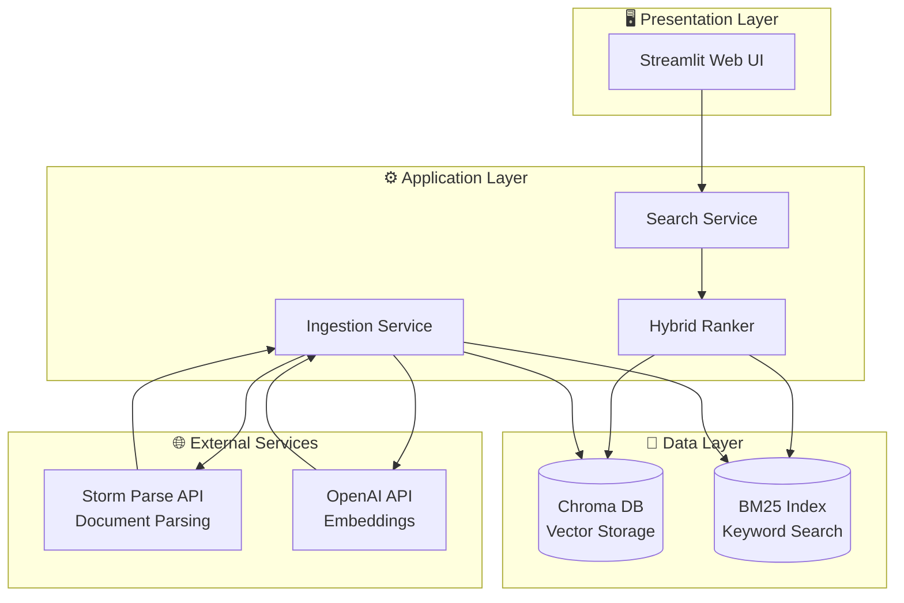

### 1.2 Deployment Architecture

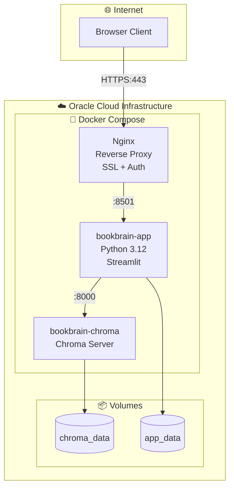

### 1.3 Security Architecture

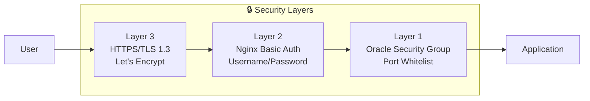

---

## 2. Component Design

### 2.1 Ingestion Pipeline

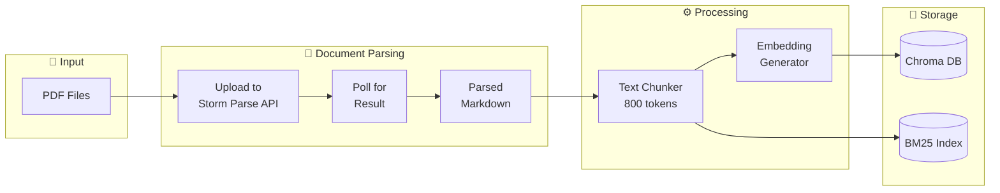

#### Storm Parse API Integration

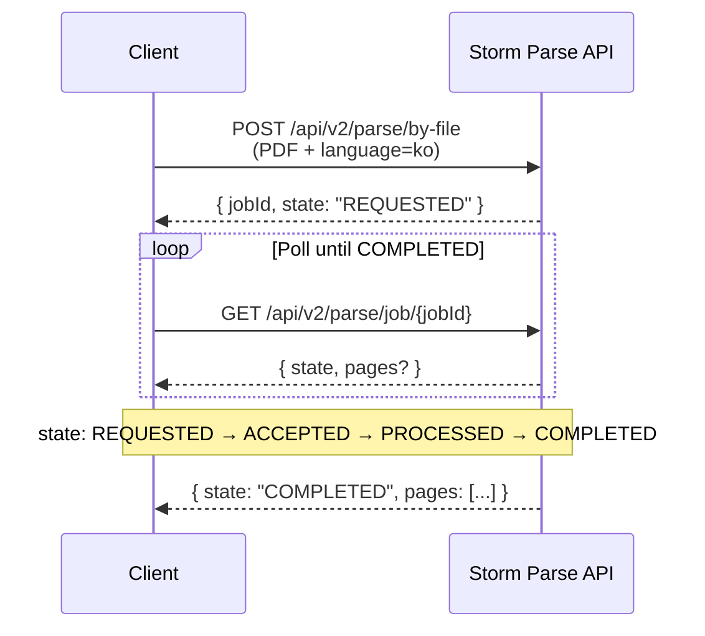

#### Process Flow Detail

1. **PDF Upload**
   - Input: PDF 파일 경로
   - API: Storm Parse `/api/v2/parse/by-file`
   - Output: jobId

2. **Result Polling**
   - API: Storm Parse `/api/v2/parse/job/{jobId}`
   - States: REQUESTED → ACCEPTED → PROCESSED → COMPLETED
   - Output: Structured markdown per page

3. **Metadata Extraction**
   ```python
   metadata = {
       "book_title": "파일명에서 추출",
       "book_file": "원본 파일명",
       "page_number": "API 응답에서 추출",
       "chapter": "### 패턴으로 추출"
   }
   ```

4. **Text Chunking**
   - Strategy: `RecursiveCharacterTextSplitter`
   - Chunk Size: 800 tokens (약 1600자 한글)
   - Chunk Overlap: 200 tokens (약 400자)
   - Separators: `["\n\n", "\n", "```", ". ", " "]`

5. **Embedding Generation**
   - Model: `text-embedding-3-small` (OpenAI)
   - Dimension: 1536
   - Batch Size: 100 chunks per request

6. **Storage**
   - Chroma: Vector + Metadata
   - BM25 Index: pickle 파일로 저장

### 2.2 Search Engine

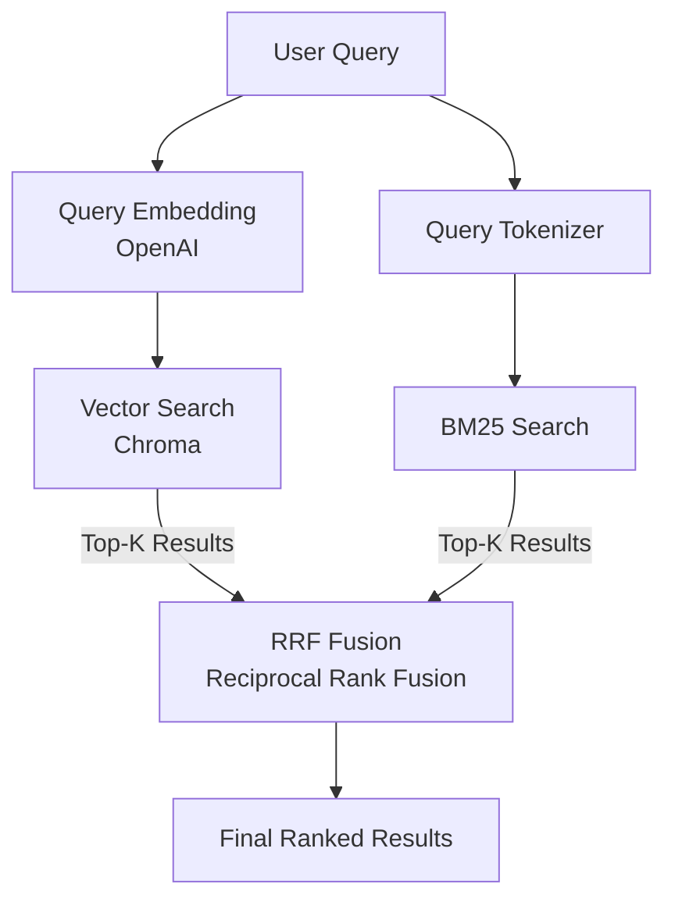

#### Hybrid Scoring: Reciprocal Rank Fusion

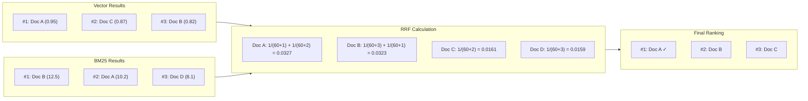

**RRF 공식**:
```
score(d) = Σ 1 / (k + rank(d))
```
- k = 60 (기본 상수)
- 스케일이 다른 점수를 랭킹 기반으로 통합

### 2.3 UI Components

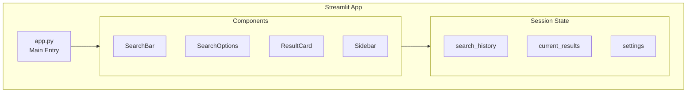

---

## 3. Data Flow

### 3.1 Ingestion Data Flow

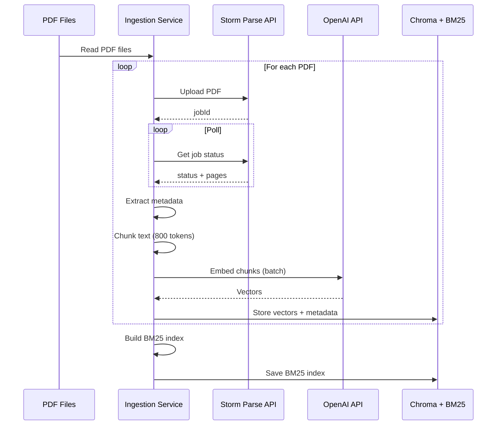

### 3.2 Search Data Flow

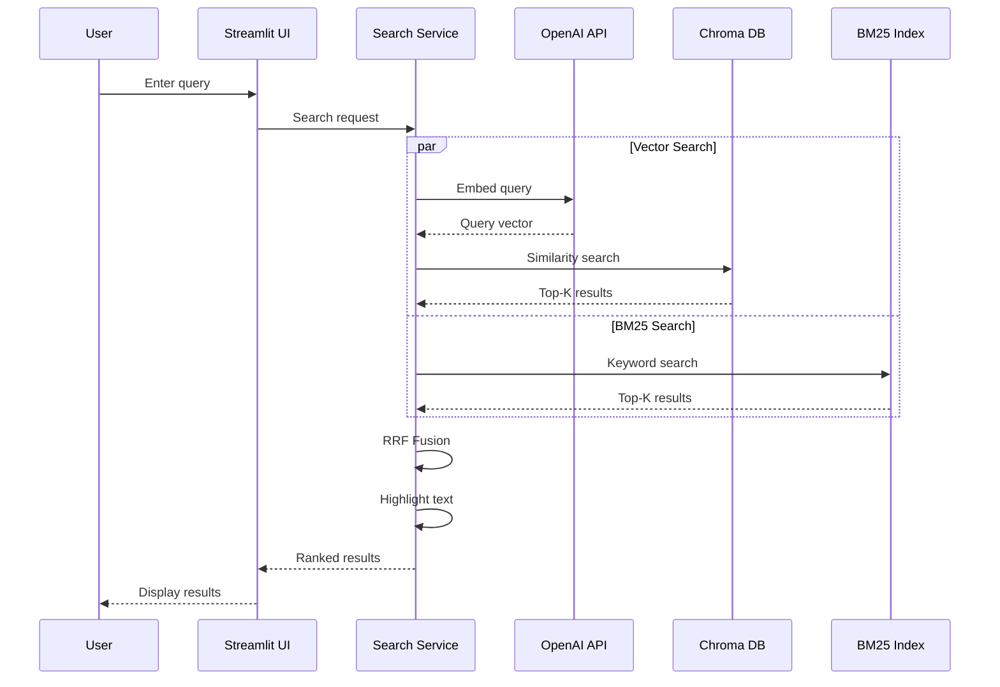

---

## 4. Technical Decisions

### 4.1 Document Parsing: Storm Parse API

| 고려 옵션 | 장점 | 단점 | 선택 |
|----------|------|------|------|
| **Storm Parse API** | VLM 기반, 구조 인식 우수, 한글 지원 | API 비용 | ✅ |
| PyMuPDF/pdfplumber | 무료, 로컬 처리 | 레이아웃 인식 약함 | - |
| Upstage Document AI | 한국 기업, 한글 최적화 | Storm 대비 검증 필요 | 백업 |

### 4.2 Embedding Model Selection

| Model | Dimension | 한글 성능 | 코드 성능 | 비용 | 선택 |
|-------|-----------|----------|----------|------|------|
| text-embedding-3-small | 1536 | Good | Good | $0.02/1M | ✅ |
| text-embedding-3-large | 3072 | Better | Better | $0.13/1M | - |
| multilingual-e5-large | 1024 | Good | Medium | Free | 백업 |

**결정**: `text-embedding-3-small`
- 이유: 비용 효율, 충분한 품질, 한글+코드 혼합 지원

### 4.3 Chunking Strategy

```python
CHUNK_CONFIG = {
    "chunk_size": 800,        # 토큰 (약 1600자 한글)
    "chunk_overlap": 200,     # 토큰 (약 400자)
    "separators": [
        "\n\n",               # 단락 구분
        "\n",                 # 줄바꿈
        "```",                # 코드 블록
        ". ",                 # 문장 끝
        " ",                  # 단어
    ],
    "length_function": "tiktoken",
}
```

### 4.4 BM25 vs Elasticsearch

| Aspect | rank_bm25 | Elasticsearch |
|--------|-----------|---------------|
| 설치 | pip install | 별도 서버 |
| 리소스 | 낮음 (인메모리) | 높음 |
| 확장성 | 낮음 | 높음 |
| 복잡도 | 낮음 | 높음 |

**결정**: `rank_bm25`
- 이유: 개인 프로젝트 규모에 적합, Oracle Free Tier 리소스 고려

---

## 5. Scalability & Future

### 5.1 Current Scale (v1.0)

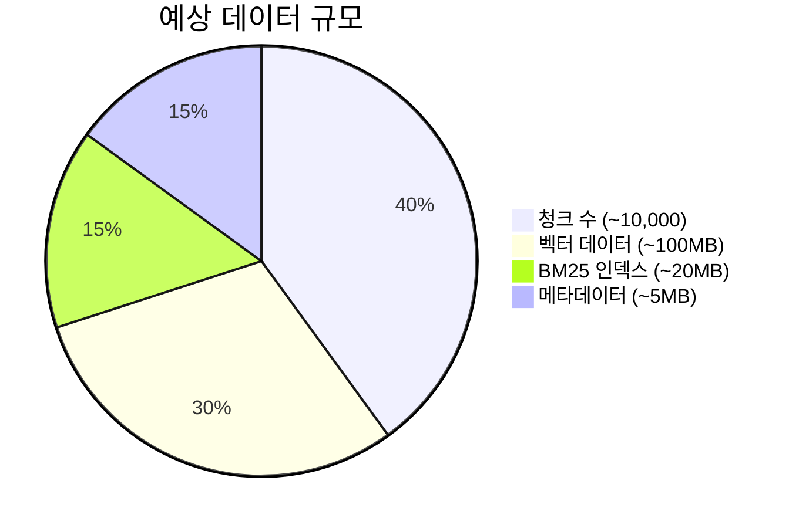

- 50권+ (증가 예정)
- 1 사용자
- ~100-200MB 총 데이터

### 5.2 Extension Points

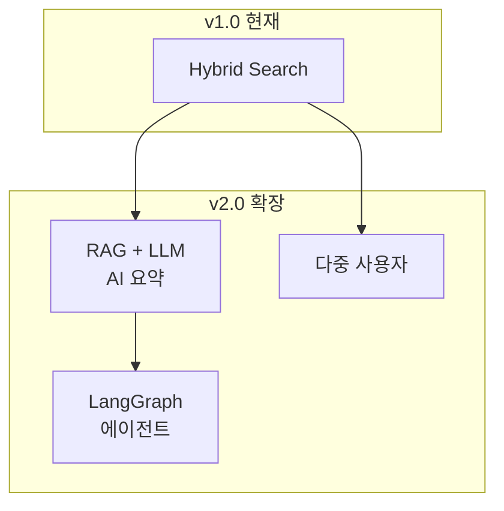

### 5.3 RAG Extension Architecture (v2.0)

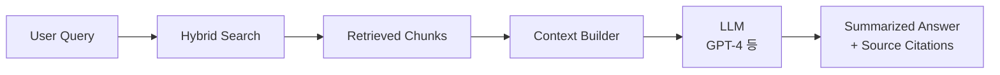

---

## 6. Monitoring & Operations

### 6.1 Logging Strategy

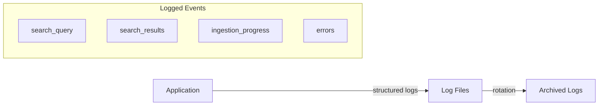

### 6.2 Backup Strategy

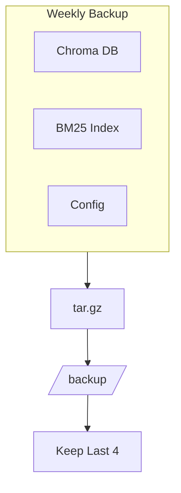

---

## 7. API Specifications

### 7.1 Storm Parse API

#### Upload Request
```http
POST https://storm-apis.sionic.im/parse-router/api/v2/parse/by-file
Authorization: Bearer {JWT_TOKEN}
Content-Type: multipart/form-data

file: {binary}
language: "ko"
deleteOriginFile: true
```

#### Upload Response
```json
{
  "jobId": "defa_be5e9d960e8a45e39cf33069f1fae8d2",
  "state": "REQUESTED",
  "requestedAt": "2025-12-04T00:00:00Z"
}
```

#### Result Query
```http
GET https://storm-apis.sionic.im/parse-router/api/v2/parse/job/{jobId}
Authorization: Bearer {JWT_TOKEN}
```

#### Result Response (Completed)
```json
{
  "jobId": "...",
  "state": "COMPLETED",
  "requestedAt": "...",
  "completedAt": "...",
  "pages": [
    {
      "pageNumber": 1,
      "content": "### Chapter 1\n\n본문 내용..."
    }
  ]
}
```

