# Tech Stack & Project Structure

> **Role**: Architect
> **Created**: 2025-12-04
> **Updated**: 2025-12-04
> **Version**: 1.2

---

## 1. Technology Stack

### 1.1 Core Stack Overview

```mermaid
flowchart TB
    subgraph Runtime["🐍 Runtime"]
        Python["Python 3.12+"]
    end

    subgraph Framework["🌐 Framework"]
        Streamlit["Streamlit 1.51.0"]
    end

    subgraph AI["🤖 AI/ML"]
        LangChain["LangChain 1.1.0"]
        LangGraph["LangGraph 1.0.4"]
        OpenAI["OpenAI API"]
    end

    subgraph Storage["💾 Storage"]
        Chroma["ChromaDB 1.3.5"]
        BM25["rank_bm25"]
    end

    subgraph External["🔌 External APIs"]
        Storm["Storm Parse API"]
    end

    subgraph Infra["☁️ Infrastructure"]
        Docker["Docker + Compose"]
        Nginx["Nginx"]
        Oracle["Oracle Cloud ARM"]
    end

    Python --> Framework
    Python --> AI
    Python --> Storage
    Python --> External
    Framework --> Infra
```



### 1.2 Detailed Dependencies

#### Core Dependencies

```toml
# pyproject.toml

[project]
name = "bookbrain"
version = "1.0.0"
requires-python = ">=3.12"

dependencies = [
    # Web UI
    "streamlit>=1.51.0",

    # Vector Database
    "chromadb>=1.3.5",

    # AI/ML Framework
    "langchain>=1.1.0",
    "langchain-openai>=1.1.0",
    "langchain-community>=0.4.1",
    "langchain-chroma>=1.0.0",
    "langgraph>=1.0.4",

    # Embeddings & Tokenization
    "openai>=2.8.1",
    "tiktoken>=0.12.0",

    # BM25 Search
    "rank-bm25>=0.2.2",

    # HTTP Client (Storm Parse API)
    "httpx>=0.28.1",
    "aiofiles>=25.1.0",

    # Utilities
    "python-dotenv>=1.2.1",
    "pydantic>=2.12.5",
    "pydantic-settings>=2.12.0",
    "tenacity>=9.1.2",

    # CLI & Progress
    "typer>=0.20.0",
    "rich>=14.2.0",
]

[project.optional-dependencies]
dev = [
    "pytest>=9.0.1",
    "pytest-asyncio>=1.3.0",
    "pytest-cov>=7.0.0",
    "ruff>=0.14.7",
    "mypy>=1.19.0",
    "pre-commit>=4.5.0",
]

# Korean NLP (optional)
ko = [
    "konlpy>=0.6.0",
]
```

#### Version Selection Rationale (Target Versions)

> 프로젝트 시작 시점의 최신 안정 버전 사용 예정

| Package | Version | Reason |
|---------|---------|--------|
| **Python** | 3.12+ | 최신 성능 개선, ARM 호환, typing 개선 |
| **Streamlit** | 1.40+ | 안정적인 컴포넌트 지원 |
| **ChromaDB** | 0.5+ | 벡터 DB, 성능 개선 |
| **LangChain** | 0.3+ | RAG 프레임워크 (v2.0에서 활용) |
| **LangGraph** | 0.2+ | Agent 구현용 (v3.0에서 활용) |
| **OpenAI SDK** | 1.50+ | 임베딩 API |
| **tiktoken** | 0.8+ | 토큰 카운팅 |
| **httpx** | 0.27+ | Storm Parse API 호출용, async 지원 |
| **pydantic** | 2.9+ | 타입 검증 표준 |
| **Typer** | 0.12+ | CLI 빌더, Rich 통합 |
| **Rich** | 13.9+ | 터미널 UI, 진행률 표시 |
| **Ruff** | 0.7+ | 초고속 린터/포매터 |
| **mypy** | 1.13+ | 정적 타입 체커 |

### 1.3 External Services


| Service | Purpose | Endpoint |
|---------|---------|----------|
| **Storm Parse** | PDF → Structured Markdown | `storm-apis.sionic.im/parse-router/api/v2` |
| **OpenAI** | Text Embedding | `api.openai.com/v1/embeddings` |
| **Upstage** | Backup Document Parsing | `api.upstage.ai/v1/document-ai` |

---

## 2. Project Structure

### 2.1 Directory Layout

```
bookbrain/
├── 📁 docs/                      # BMAD 문서
│   ├── project-brief.md
│   ├── prd.md
│   ├── architecture.md
│   ├── tech-stack.md             # (현재 문서)
│   └── 📁 stories/
│       ├── epic-1-ingestion.md
│       ├── epic-2-search.md
│       ├── epic-3-ui.md
│       └── epic-4-deployment.md
│
├── 📁 src/                       # 소스 코드
│   ├── 📁 bookbrain/             # 메인 패키지
│   │   ├── __init__.py
│   │   ├── config.py             # 설정 관리
│   │   │
│   │   ├── 📁 ingestion/         # 데이터 수집 모듈
│   │   │   ├── __init__.py
│   │   │   ├── storm_client.py   # Storm Parse API 클라이언트
│   │   │   ├── parser.py         # 파싱 결과 처리
│   │   │   ├── chunker.py        # 텍스트 청킹
│   │   │   ├── embedder.py       # 임베딩 생성
│   │   │   └── pipeline.py       # 전체 파이프라인
│   │   │
│   │   ├── 📁 search/            # 검색 모듈
│   │   │   ├── __init__.py
│   │   │   ├── vector_search.py  # Chroma 벡터 검색
│   │   │   ├── bm25_search.py    # BM25 키워드 검색
│   │   │   ├── hybrid.py         # 하이브리드 검색 (RRF)
│   │   │   └── models.py         # Pydantic 모델
│   │   │
│   │   ├── 📁 storage/           # 데이터 저장소
│   │   │   ├── __init__.py
│   │   │   ├── chroma_store.py   # Chroma 클라이언트
│   │   │   └── bm25_store.py     # BM25 인덱스 관리
│   │   │
│   │   └── 📁 utils/             # 유틸리티
│   │       ├── __init__.py
│   │       ├── text_utils.py     # 텍스트 처리
│   │       └── highlight.py      # 검색어 하이라이트
│   │
│   └── 📁 ui/                    # Streamlit UI
│       ├── app.py                # 메인 앱 진입점
│       ├── 📁 components/
│       │   ├── search_bar.py
│       │   ├── result_card.py
│       │   └── sidebar.py
│       └── 📁 pages/             # (선택) 멀티페이지
│           └── settings.py
│
├── 📁 scripts/                   # CLI 스크립트
│   ├── ingest.py                 # python scripts/ingest.py --pdf-dir ./pdfs
│   ├── search_cli.py             # 테스트용 CLI 검색
│   └── backup.sh                 # DB 백업
│
├── 📁 data/                      # 데이터 디렉토리 (gitignore)
│   ├── 📁 pdfs/                  # 원본 PDF 파일
│   ├── 📁 parsed/                # Storm Parse 결과 캐시
│   ├── 📁 chroma/                # Chroma DB 파일
│   └── bm25_index.pkl            # BM25 인덱스
│
├── 📁 tests/                     # 테스트
│   ├── __init__.py
│   ├── conftest.py
│   ├── 📁 unit/
│   │   ├── test_chunker.py
│   │   ├── test_storm_client.py
│   │   ├── test_search.py
│   │   └── test_hybrid.py
│   └── 📁 integration/
│       └── test_pipeline.py
│
├── 📁 docker/                    # Docker 설정
│   ├── Dockerfile
│   ├── Dockerfile.dev
│   └── nginx/
│       ├── nginx.conf
│       └── .htpasswd
│
├── 📄 .env.example               # 환경변수 템플릿
├── 📄 .gitignore
├── 📄 docker-compose.yml
├── 📄 docker-compose.dev.yml
├── 📄 pyproject.toml             # 프로젝트 설정
├── 📄 README.md
└── 📄 Makefile                   # 편의 명령어
```

### 2.2 Module Responsibilities

#### `src/bookbrain/ingestion/`

```python
# storm_client.py
class StormParseClient:
    """Storm Parse API 클라이언트"""
    async def upload_pdf(self, pdf_path: Path) -> str:  # returns jobId
    async def poll_result(self, job_id: str) -> ParseResult
    async def parse_pdf(self, pdf_path: Path) -> ParseResult  # combined

# parser.py
class ParseResultProcessor:
    """파싱 결과에서 메타데이터 추출"""
    def extract_metadata(self, result: ParseResult) -> BookMetadata
    def extract_chapters(self, content: str) -> List[Chapter]

# chunker.py
class TextChunker:
    """텍스트를 검색 가능한 청크로 분할"""
    def chunk(self, pages: List[Page]) -> List[Chunk]

# embedder.py
class Embedder:
    """청크를 벡터로 변환"""
    async def embed_batch(self, chunks: List[Chunk]) -> List[EmbeddedChunk]
    async def embed_query(self, query: str) -> List[float]

# pipeline.py
class IngestionPipeline:
    """전체 수집 파이프라인 오케스트레이션"""
    async def run(self, pdf_dir: Path) -> IngestionReport
```

#### `src/bookbrain/search/`

```python
# vector_search.py
class VectorSearcher:
    """Chroma 기반 벡터 유사도 검색"""
    def search(self, query: str, top_k: int) -> List[SearchResult]

# bm25_search.py
class BM25Searcher:
    """BM25 기반 키워드 검색"""
    def search(self, query: str, top_k: int) -> List[SearchResult]

# hybrid.py
class HybridSearcher:
    """벡터 + BM25 통합 검색"""
    async def search(
        self,
        query: str,
        top_k: int,
        mode: SearchMode = SearchMode.HYBRID
    ) -> SearchResponse

    def _rrf_fusion(
        self,
        vector_results: List[SearchResult],
        bm25_results: List[SearchResult]
    ) -> List[SearchResult]

# models.py
class SearchResult(BaseModel):
    id: str
    text: str
    score: float
    score_vector: Optional[float] = None
    score_bm25: Optional[float] = None
    metadata: ChunkMetadata

    @property
    def source(self) -> str:
        """출처 포맷팅"""
        chapter = f", {self.metadata.chapter}" if self.metadata.chapter else ""
        return f"{self.metadata.book_title}{chapter}, p.{self.metadata.page_start}"
```

---

## 3. Configuration Management

### 3.1 Environment Variables

```bash
# .env.example

# === External APIs ===
# OpenAI
OPENAI_API_KEY=sk-your-key-here

# Storm Parse API
STORM_API_KEY=your-storm-api-key
STORM_API_BASE_URL=https://storm-apis.sionic.im/parse-router

# Upstage (Backup)
UPSTAGE_API_KEY=your-upstage-key

# === Chroma ===
CHROMA_HOST=localhost
CHROMA_PORT=8000

# === App Settings ===
APP_ENV=development  # development | production
LOG_LEVEL=INFO

# === Search Defaults ===
DEFAULT_TOP_K=10
DEFAULT_SEARCH_MODE=hybrid  # hybrid | vector | keyword

# === Chunking ===
CHUNK_SIZE=800
CHUNK_OVERLAP=200

# === Auth (Production) ===
BASIC_AUTH_USER=admin
BASIC_AUTH_PASS=changeme
```

### 3.2 Config Class

```python
# src/bookbrain/config.py

from pydantic_settings import BaseSettings, SettingsConfigDict

class Settings(BaseSettings):
    model_config = SettingsConfigDict(
        env_file=".env",
        env_file_encoding="utf-8",
        extra="ignore"
    )

    # External APIs
    openai_api_key: str
    storm_api_key: str
    storm_api_base_url: str = "https://storm-apis.sionic.im/parse-router"
    upstage_api_key: str | None = None

    # Embedding
    embedding_model: str = "text-embedding-3-small"
    embedding_dimension: int = 1536

    # Chroma
    chroma_host: str = "localhost"
    chroma_port: int = 8000
    chroma_collection: str = "bookbrain"

    # Search
    default_top_k: int = 10
    default_search_mode: str = "hybrid"
    rrf_k: int = 60

    # Chunking
    chunk_size: int = 800
    chunk_overlap: int = 200

    # Paths
    data_dir: str = "./data"
    pdf_dir: str = "./data/pdfs"
    parsed_dir: str = "./data/parsed"


settings = Settings()
```

---

## 4. Development Workflow

### 4.1 Makefile Commands

```makefile
# Makefile

.PHONY: install dev test lint run ingest docker-up docker-down

# === Setup ===
install:
	uv pip install -e ".[dev]"

install-ko:
	uv pip install -e ".[dev,ko]"

# === Development ===
dev:
	streamlit run src/ui/app.py --server.runOnSave true

run:
	streamlit run src/ui/app.py

# === Data Ingestion ===
ingest:
	python scripts/ingest.py --pdf-dir ./data/pdfs

ingest-single:
	python scripts/ingest.py --pdf ./data/pdfs/$(PDF)

ingest-dry:
	python scripts/ingest.py --pdf-dir ./data/pdfs --dry-run

# === Testing ===
test:
	pytest tests/ -v

test-cov:
	pytest tests/ -v --cov=src/bookbrain --cov-report=html

test-unit:
	pytest tests/unit/ -v

test-integration:
	pytest tests/integration/ -v

# === Linting ===
lint:
	ruff check src/ tests/
	mypy src/

format:
	ruff check src/ tests/ --fix
	ruff format src/ tests/

# === Docker ===
docker-up:
	docker compose up -d

docker-down:
	docker compose down

docker-logs:
	docker compose logs -f

docker-build:
	docker compose build --no-cache

# === Backup ===
backup:
	./scripts/backup.sh
```

### 4.2 Git Workflow


### 4.3 Pre-commit Hooks

```yaml
# .pre-commit-config.yaml
repos:
  - repo: https://github.com/astral-sh/ruff-pre-commit
    rev: v0.14.7
    hooks:
      - id: ruff
        args: [--fix]
      - id: ruff-format

  - repo: https://github.com/pre-commit/mirrors-mypy
    rev: v1.19.0
    hooks:
      - id: mypy
        additional_dependencies: [pydantic]
```

---

## 5. Deployment Configuration

### 5.1 Dockerfile

```dockerfile
# docker/Dockerfile

FROM python:3.12-slim AS builder

WORKDIR /app

# Install build deps
RUN apt-get update && apt-get install -y \
    build-essential \
    && rm -rf /var/lib/apt/lists/*

# Install uv for faster installs
RUN pip install uv

# Install Python deps
COPY pyproject.toml .
RUN uv pip install --system .

# === Runtime Stage ===
FROM python:3.12-slim

WORKDIR /app

# Copy installed packages
COPY --from=builder /usr/local/lib/python3.12/site-packages /usr/local/lib/python3.12/site-packages
COPY --from=builder /usr/local/bin /usr/local/bin

# Copy app code
COPY src/ ./src/
COPY scripts/ ./scripts/

# Create data directory
RUN mkdir -p /app/data

# Health check
HEALTHCHECK --interval=30s --timeout=10s --start-period=5s --retries=3 \
    CMD curl -f http://localhost:8501/_stcore/health || exit 1

EXPOSE 8501

CMD ["streamlit", "run", "src/ui/app.py", \
     "--server.address", "0.0.0.0", \
     "--server.port", "8501", \
     "--server.headless", "true"]
```

### 5.2 Docker Compose

```yaml
# docker-compose.yml
version: "3.8"

services:
  app:
    build:
      context: .
      dockerfile: docker/Dockerfile
    container_name: bookbrain-app
    restart: unless-stopped
    ports:
      - "8501:8501"
    environment:
      - OPENAI_API_KEY=${OPENAI_API_KEY}
      - STORM_API_KEY=${STORM_API_KEY}
      - CHROMA_HOST=chroma
      - CHROMA_PORT=8000
    volumes:
      - ./data:/app/data
    depends_on:
      chroma:
        condition: service_healthy

  chroma:
    image: chromadb/chroma:1.3.5
    container_name: bookbrain-chroma
    restart: unless-stopped
    ports:
      - "8000:8000"
    volumes:
      - chroma_data:/chroma/chroma
    environment:
      - ANONYMIZED_TELEMETRY=false
    healthcheck:
      test: ["CMD", "curl", "-f", "http://localhost:8000/api/v1/heartbeat"]
      interval: 10s
      timeout: 5s
      retries: 5

volumes:
  chroma_data:
```

### 5.3 Nginx Configuration

```nginx
# docker/nginx/nginx.conf
events {
    worker_connections 1024;
}

http {
    upstream streamlit {
        server app:8501;
    }

    # HTTP → HTTPS redirect
    server {
        listen 80;
        server_name your-domain.com;

        location /.well-known/acme-challenge/ {
            root /var/www/certbot;
        }

        location / {
            return 301 https://$host$request_uri;
        }
    }

    # HTTPS server
    server {
        listen 443 ssl http2;
        server_name your-domain.com;

        ssl_certificate /etc/letsencrypt/live/your-domain.com/fullchain.pem;
        ssl_certificate_key /etc/letsencrypt/live/your-domain.com/privkey.pem;
        ssl_protocols TLSv1.2 TLSv1.3;

        # Basic Auth
        auth_basic "BookBrain";
        auth_basic_user_file /etc/nginx/.htpasswd;

        # Streamlit proxy
        location / {
            proxy_pass http://streamlit;
            proxy_http_version 1.1;
            proxy_set_header Host $host;
            proxy_set_header X-Real-IP $remote_addr;
            proxy_set_header X-Forwarded-For $proxy_add_x_forwarded_for;
            proxy_set_header X-Forwarded-Proto $scheme;
            proxy_read_timeout 86400;
        }

        # WebSocket for Streamlit
        location /_stcore/stream {
            proxy_pass http://streamlit/_stcore/stream;
            proxy_http_version 1.1;
            proxy_set_header Upgrade $http_upgrade;
            proxy_set_header Connection "upgrade";
            proxy_read_timeout 86400;
        }
    }
}
```

---

## 6. API Client Implementations

### 6.1 Storm Parse Client

```python
# src/bookbrain/ingestion/storm_client.py

import httpx
import aiofiles
from pathlib import Path
from tenacity import retry, stop_after_attempt, wait_exponential
from pydantic import BaseModel

class ParsePage(BaseModel):
    pageNumber: int
    content: str

class ParseResult(BaseModel):
    jobId: str
    state: str
    pages: list[ParsePage] | None = None

class StormParseClient:
    def __init__(self, api_key: str, base_url: str):
        self.api_key = api_key
        self.base_url = base_url
        self.client = httpx.AsyncClient(timeout=60.0)

    async def upload_pdf(self, pdf_path: Path) -> str:
        """PDF 업로드, jobId 반환"""
        headers = {"Authorization": f"Bearer {self.api_key}"}

        async with aiofiles.open(pdf_path, "rb") as f:
            content = await f.read()

        files = {"file": (pdf_path.name, content, "application/pdf")}
        data = {"language": "ko", "deleteOriginFile": "true"}

        response = await self.client.post(
            f"{self.base_url}/api/v2/parse/by-file",
            headers=headers,
            files=files,
            data=data
        )
        response.raise_for_status()
        return response.json()["jobId"]

    @retry(stop=stop_after_attempt(60), wait=wait_exponential(min=2, max=30))
    async def poll_result(self, job_id: str) -> ParseResult:
        """결과 폴링 (COMPLETED까지)"""
        headers = {"Authorization": f"Bearer {self.api_key}"}

        response = await self.client.get(
            f"{self.base_url}/api/v2/parse/job/{job_id}",
            headers=headers
        )
        response.raise_for_status()
        result = ParseResult(**response.json())

        if result.state != "COMPLETED":
            raise Exception(f"Not completed: {result.state}")

        return result

    async def parse_pdf(self, pdf_path: Path) -> ParseResult:
        """PDF 파싱 전체 프로세스"""
        job_id = await self.upload_pdf(pdf_path)
        return await self.poll_result(job_id)
```

---

## 7. Version Reference

> 개발 시작 시점에 최신 안정 버전 확인 후 사용

| Category | Package | Min Version | PyPI Link |
|----------|---------|-------------|-----------|
| **Runtime** | Python | 3.12+ | - |
| **Web UI** | streamlit | 1.40+ | [PyPI](https://pypi.org/project/streamlit/) |
| **Vector DB** | chromadb | 0.5+ | [PyPI](https://pypi.org/project/chromadb/) |
| **AI Framework** | langchain | 0.3+ | [PyPI](https://pypi.org/project/langchain/) |
| | langchain-openai | 0.2+ | [PyPI](https://pypi.org/project/langchain-openai/) |
| | langchain-community | 0.3+ | [PyPI](https://pypi.org/project/langchain-community/) |
| | langgraph | 0.2+ | [PyPI](https://pypi.org/project/langgraph/) |
| **OpenAI** | openai | 1.50+ | [PyPI](https://pypi.org/project/openai/) |
| | tiktoken | 0.8+ | [PyPI](https://pypi.org/project/tiktoken/) |
| **Search** | rank-bm25 | 0.2+ | [PyPI](https://pypi.org/project/rank-bm25/) |
| **HTTP** | httpx | 0.27+ | [PyPI](https://pypi.org/project/httpx/) |
| | aiofiles | 24.1+ | [PyPI](https://pypi.org/project/aiofiles/) |
| **Config** | python-dotenv | 1.0+ | [PyPI](https://pypi.org/project/python-dotenv/) |
| | pydantic | 2.9+ | [PyPI](https://pypi.org/project/pydantic/) |
| | pydantic-settings | 2.5+ | [PyPI](https://pypi.org/project/pydantic-settings/) |
| **Retry** | tenacity | 9.0+ | [PyPI](https://pypi.org/project/tenacity/) |
| **CLI** | typer | 0.12+ | [PyPI](https://pypi.org/project/typer/) |
| | rich | 13.9+ | [PyPI](https://pypi.org/project/rich/) |
| **Testing** | pytest | 8.3+ | [PyPI](https://pypi.org/project/pytest/) |
| | pytest-asyncio | 0.24+ | [PyPI](https://pypi.org/project/pytest-asyncio/) |
| | pytest-cov | 5.0+ | [PyPI](https://pypi.org/project/pytest-cov/) |
| **Linting** | ruff | 0.7+ | [PyPI](https://pypi.org/project/ruff/) |
| | mypy | 1.13+ | [PyPI](https://pypi.org/project/mypy/) |
| **Git Hooks** | pre-commit | 4.0+ | [PyPI](https://pypi.org/project/pre-commit/) |

