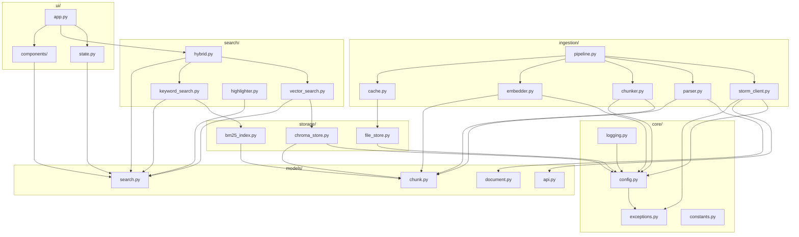

# Implementation Specification

> **Role**: Technical Lead / Senior Developer
> **Created**: 2025-12-04
> **Updated**: 2025-12-04
> **Version**: 1.0
> **Status**: Draft

---

## 1. Document Purpose

이 문서는 **LLM(AI)이 코드를 정확하게 생성**할 수 있도록 구현 수준의 상세 명세를 제공합니다.

### 1.1 이 문서의 목표

- 모든 클래스/함수의 **시그니처**와 **타입** 정의
- **Pydantic 모델**로 데이터 구조 확정
- **에러 처리** 시나리오와 전략 명시
- **모듈 간 의존성** 명확화
- **설정/환경변수** 스키마 정의

### 1.2 문서 구조

```
1. Document Purpose (현재)
2. Module Architecture - 모듈별 책임과 의존성
3. Data Models - Pydantic 모델 전체 정의
4. Service Interfaces - 클래스/함수 시그니처
5. External API Contracts - Storm Parse, OpenAI 상세
6. Storage Layer - ChromaDB, BM25, 파일 저장
7. Error Handling - 예외 계층, 재시도 전략
8. Configuration - 환경변수, Settings 클래스
9. UI State Management - Streamlit 상태 관리
10. Testing Specifications - 테스트 구조, 픽스처
11. Code Conventions - 코딩 스타일 가이드
```

---

## 2. Module Architecture

### 2.1 패키지 구조 (상세)

```
src/
└── bookbrain/
    ├── __init__.py              # 패키지 메타데이터, 버전
    ├── main.py                  # CLI 진입점 (typer)
    │
    ├── core/                    # 핵심 공통 모듈
    │   ├── __init__.py
    │   ├── config.py            # Settings 클래스 (pydantic-settings)
    │   ├── exceptions.py        # 커스텀 예외 계층
    │   ├── logging.py           # 로깅 설정 (structlog)
    │   └── constants.py         # 상수 정의
    │
    ├── models/                  # Pydantic 데이터 모델
    │   ├── __init__.py          # 모든 모델 re-export
    │   ├── document.py          # Book, Page, Chapter 모델
    │   ├── chunk.py             # Chunk, ChunkMetadata 모델
    │   ├── search.py            # SearchQuery, SearchResult 모델
    │   └── api.py               # API 요청/응답 모델
    │
    ├── ingestion/               # 데이터 수집 파이프라인
    │   ├── __init__.py
    │   ├── storm_client.py      # Storm Parse API 클라이언트
    │   ├── parser.py            # 파싱 결과 처리기
    │   ├── chunker.py           # 텍스트 청킹
    │   ├── embedder.py          # 임베딩 생성
    │   ├── pipeline.py          # 전체 파이프라인 오케스트레이션
    │   └── cache.py             # 파싱 결과 캐싱
    │
    ├── storage/                 # 저장소 레이어
    │   ├── __init__.py
    │   ├── chroma_store.py      # ChromaDB 벡터 저장소
    │   ├── bm25_index.py        # BM25 인덱스
    │   └── file_store.py        # 로컬 파일 저장 (캐시, 백업)
    │
    ├── search/                  # 검색 엔진
    │   ├── __init__.py
    │   ├── vector_search.py     # 벡터 유사도 검색
    │   ├── keyword_search.py    # BM25 키워드 검색
    │   ├── hybrid.py            # 하이브리드 검색 + RRF
    │   ├── reranker.py          # 결과 재정렬 (선택적)
    │   └── highlighter.py       # 검색어 하이라이트
    │
    ├── ui/                      # Streamlit UI
    │   ├── __init__.py
    │   ├── app.py               # 메인 앱 진입점
    │   ├── state.py             # Session state 관리
    │   ├── styles.py            # Custom CSS
    │   └── components/          # UI 컴포넌트
    │       ├── __init__.py
    │       ├── search_bar.py
    │       ├── search_options.py
    │       ├── result_card.py
    │       ├── sidebar.py
    │       └── export.py
    │
    └── utils/                   # 유틸리티
        ├── __init__.py
        ├── text.py              # 텍스트 처리 유틸
        ├── async_utils.py       # 비동기 헬퍼
        └── validators.py        # 검증 유틸

tests/
├── __init__.py
├── conftest.py                  # pytest 픽스처
├── unit/                        # 단위 테스트
│   ├── test_chunker.py
│   ├── test_embedder.py
│   ├── test_search.py
│   └── ...
├── integration/                 # 통합 테스트
│   ├── test_pipeline.py
│   ├── test_storage.py
│   └── ...
└── fixtures/                    # 테스트 데이터
    ├── sample_pdf.pdf
    ├── parsed_result.json
    └── chunks.json
```

### 2.2 모듈 의존성 그래프



### 2.3 모듈별 책임 정의

| 모듈 | 책임 | 의존 모듈 | 외부 의존성 |
|------|------|----------|------------|
| `core/config.py` | 환경변수 로드, Settings 싱글톤 | - | pydantic-settings |
| `core/exceptions.py` | 커스텀 예외 클래스 정의 | - | - |
| `core/logging.py` | 구조화 로깅 설정 | config | structlog |
| `models/*` | 데이터 전송 객체 정의 | - | pydantic |
| `ingestion/storm_client.py` | Storm Parse API 통신 | config, exceptions, api models | httpx, tenacity |
| `ingestion/parser.py` | 파싱 결과 → 구조화 데이터 | document models, chunk models | - |
| `ingestion/chunker.py` | 텍스트 분할 | chunk models, config | langchain |
| `ingestion/embedder.py` | 벡터 임베딩 생성 | chunk models, config | openai |
| `ingestion/pipeline.py` | 전체 수집 흐름 조율 | 모든 ingestion 모듈 | - |
| `storage/chroma_store.py` | 벡터 CRUD | chunk models, config | chromadb |
| `storage/bm25_index.py` | BM25 인덱스 관리 | chunk models | rank_bm25, pickle |
| `search/vector_search.py` | 벡터 유사도 검색 | chroma_store, search models | - |
| `search/keyword_search.py` | 키워드 검색 | bm25_index, search models | - |
| `search/hybrid.py` | RRF 기반 통합 검색 | vector_search, keyword_search | - |
| `ui/app.py` | Streamlit 앱 메인 | state, hybrid, components | streamlit |

---

## 3. Data Models

모든 데이터 모델은 **Pydantic v2**를 사용합니다.

### 3.1 Core Models (`models/document.py`)

```python
"""
책, 페이지, 챕터 관련 도메인 모델
"""
from datetime import datetime
from typing import Optional
from pydantic import BaseModel, Field, ConfigDict


class Chapter(BaseModel):
    """책의 챕터 정보"""
    model_config = ConfigDict(frozen=True)

    title: str = Field(
        ...,
        description="챕터 제목",
        examples=["1장 - 자바 8, 9, 10, 11: 무슨 일이 일어나고 있는가?"]
    )
    level: int = Field(
        default=1,
        ge=1,
        le=4,
        description="챕터 깊이 (1=장, 2=절, 3=항, 4=목)"
    )
    start_page: Optional[int] = Field(
        default=None,
        ge=1,
        description="챕터 시작 페이지"
    )


class ParsedPage(BaseModel):
    """Storm Parse API에서 반환된 단일 페이지"""
    model_config = ConfigDict(frozen=True)

    page_number: int = Field(
        ...,
        ge=1,
        description="페이지 번호 (1-indexed)"
    )
    content: str = Field(
        ...,
        min_length=1,
        description="마크다운 형식의 페이지 내용"
    )
    chapter_title: Optional[str] = Field(
        default=None,
        description="이 페이지가 속한 챕터 제목 (파싱 시 추출)"
    )


class Book(BaseModel):
    """책 메타데이터"""
    model_config = ConfigDict(frozen=True)

    id: str = Field(
        ...,
        pattern=r"^[a-z0-9_-]+$",
        description="책 고유 ID (파일명 기반, lowercase, 특수문자 제거)",
        examples=["modern_java_in_action"]
    )
    title: str = Field(
        ...,
        min_length=1,
        max_length=200,
        description="책 제목",
        examples=["모던 자바 인 액션"]
    )
    file_name: str = Field(
        ...,
        pattern=r"^.+\.pdf$",
        description="원본 PDF 파일명",
        examples=["모던자바인액션.pdf"]
    )
    file_hash: str = Field(
        ...,
        pattern=r"^[a-f0-9]{64}$",
        description="파일 SHA-256 해시 (중복 체크용)"
    )
    total_pages: int = Field(
        ...,
        ge=1,
        description="총 페이지 수"
    )
    chapters: list[Chapter] = Field(
        default_factory=list,
        description="챕터 목록"
    )
    language: str = Field(
        default="ko",
        pattern=r"^[a-z]{2}$",
        description="책 언어 코드 (ISO 639-1)"
    )
    created_at: datetime = Field(
        default_factory=datetime.now,
        description="등록 시각"
    )
    total_chunks: int = Field(
        default=0,
        ge=0,
        description="총 청크 수 (인제스천 완료 시 설정)"
    )

    def with_chunk_count(self, count: int) -> "Book":
        """
        청크 수가 설정된 새 Book 인스턴스 반환

        Note:
            Book은 frozen=True이므로 인제스천 완료 후
            이 메서드로 total_chunks가 설정된 새 인스턴스를 생성합니다.
        """
        return Book(**{**self.model_dump(), "total_chunks": count})
```

### 3.2 Chunk Models (`models/chunk.py`)

```python
"""
텍스트 청크 관련 모델
"""
from typing import Optional
from pydantic import BaseModel, Field, ConfigDict, field_validator
import hashlib


class ChunkMetadata(BaseModel):
    """
    청크의 메타데이터

    ChromaDB의 metadata 필드에 저장됩니다.
    모든 필드는 primitive 타입이어야 합니다 (str, int, float, bool).
    """
    model_config = ConfigDict(frozen=True)

    book_id: str = Field(
        ...,
        description="책 고유 ID"
    )
    book_title: str = Field(
        ...,
        description="책 제목 (검색 결과 표시용)"
    )
    book_file: str = Field(
        ...,
        description="원본 PDF 파일명"
    )
    chapter: Optional[str] = Field(
        default=None,
        description="챕터 제목"
    )
    page_start: int = Field(
        ...,
        ge=1,
        description="청크 시작 페이지"
    )
    page_end: int = Field(
        ...,
        ge=1,
        description="청크 끝 페이지"
    )
    chunk_index: int = Field(
        ...,
        ge=0,
        description="책 내 청크 순서 인덱스"
    )
    content_type: str = Field(
        default="text",
        pattern=r"^(text|code|table|mixed)$",
        description="콘텐츠 유형"
    )

    @field_validator('page_end')
    @classmethod
    def page_end_gte_start(cls, v: int, info) -> int:
        if 'page_start' in info.data and v < info.data['page_start']:
            raise ValueError('page_end must be >= page_start')
        return v

    def to_chroma_metadata(self) -> dict:
        """ChromaDB 저장용 딕셔너리 변환"""
        return {
            "book_id": self.book_id,
            "book_title": self.book_title,
            "book_file": self.book_file,
            "chapter": self.chapter or "",
            "page_start": self.page_start,
            "page_end": self.page_end,
            "chunk_index": self.chunk_index,
            "content_type": self.content_type,
        }


class Chunk(BaseModel):
    """
    검색/저장의 기본 단위인 텍스트 청크
    """
    model_config = ConfigDict(frozen=True)

    id: str = Field(
        ...,
        description="청크 고유 ID (book_id + chunk_index 기반 해시)"
    )
    text: str = Field(
        ...,
        min_length=10,
        max_length=10000,
        description="청크 텍스트 내용"
    )
    metadata: ChunkMetadata = Field(
        ...,
        description="청크 메타데이터"
    )
    embedding: Optional[list[float]] = Field(
        default=None,
        description="임베딩 벡터 (1536 dimensions for text-embedding-3-small)"
    )

    @field_validator('embedding')
    @classmethod
    def validate_embedding_dimension(cls, v: Optional[list[float]]) -> Optional[list[float]]:
        if v is not None and len(v) != 1536:
            raise ValueError(f'Embedding must have 1536 dimensions, got {len(v)}')
        return v

    @classmethod
    def generate_id(cls, book_id: str, chunk_index: int) -> str:
        """결정적 청크 ID 생성"""
        raw = f"{book_id}::{chunk_index}"
        return hashlib.sha256(raw.encode()).hexdigest()[:16]


class ChunkBatch(BaseModel):
    """임베딩 생성을 위한 청크 배치"""
    model_config = ConfigDict(frozen=True)

    chunks: list[Chunk] = Field(
        ...,
        min_length=1,
        max_length=100,
        description="청크 목록 (최대 100개)"
    )

    @property
    def texts(self) -> list[str]:
        """임베딩 API 호출용 텍스트 목록"""
        return [c.text for c in self.chunks]

    @property
    def ids(self) -> list[str]:
        """청크 ID 목록"""
        return [c.id for c in self.chunks]
```

### 3.3 Search Models (`models/search.py`)

```python
"""
검색 관련 모델
"""
from enum import Enum
from typing import Optional
from pydantic import BaseModel, Field, ConfigDict


class SearchMode(str, Enum):
    """검색 모드"""
    HYBRID = "hybrid"      # 벡터 + 키워드 결합
    VECTOR = "vector"      # 벡터 검색만
    KEYWORD = "keyword"    # 키워드 검색만


class SearchQuery(BaseModel):
    """검색 쿼리"""
    model_config = ConfigDict(frozen=True)

    text: str = Field(
        ...,
        min_length=1,
        max_length=500,
        description="검색 쿼리 텍스트"
    )
    mode: SearchMode = Field(
        default=SearchMode.HYBRID,
        description="검색 모드"
    )
    top_k: int = Field(
        default=10,
        ge=1,
        le=100,
        description="반환할 결과 수"
    )
    book_filter: Optional[list[str]] = Field(
        default=None,
        description="검색 대상 책 ID 목록 (None이면 전체)"
    )
    vector_weight: float = Field(
        default=0.5,
        ge=0.0,
        le=1.0,
        description="하이브리드 검색 시 벡터 가중치 (1-weight = 키워드 가중치)"
    )


class SearchResult(BaseModel):
    """단일 검색 결과"""
    model_config = ConfigDict(frozen=True)

    chunk_id: str = Field(
        ...,
        description="청크 ID"
    )
    text: str = Field(
        ...,
        description="청크 텍스트"
    )
    score: float = Field(
        ...,
        ge=0.0,
        description="최종 통합 점수"
    )
    score_vector: Optional[float] = Field(
        default=None,
        ge=0.0,
        le=1.0,
        description="벡터 유사도 점수 (코사인)"
    )
    score_bm25: Optional[float] = Field(
        default=None,
        ge=0.0,
        description="BM25 점수"
    )
    rank_vector: Optional[int] = Field(
        default=None,
        ge=1,
        description="벡터 검색 순위"
    )
    rank_bm25: Optional[int] = Field(
        default=None,
        ge=1,
        description="BM25 검색 순위"
    )

    # 메타데이터 (ChunkMetadata에서 추출)
    book_id: str
    book_title: str
    chapter: Optional[str] = None
    page_start: int
    page_end: int

    # 하이라이트된 텍스트 (UI 표시용)
    highlighted_text: Optional[str] = Field(
        default=None,
        description="검색어가 <mark> 태그로 감싸진 텍스트"
    )


class SearchResponse(BaseModel):
    """검색 응답"""
    model_config = ConfigDict(frozen=True)

    query: SearchQuery = Field(
        ...,
        description="원본 쿼리"
    )
    results: list[SearchResult] = Field(
        default_factory=list,
        description="검색 결과 목록 (점수 내림차순)"
    )
    total_found: int = Field(
        default=0,
        ge=0,
        description="총 매칭 수 (top_k 적용 전)"
    )
    search_time_ms: float = Field(
        ...,
        ge=0.0,
        description="검색 소요 시간 (밀리초)"
    )


class LibraryStats(BaseModel):
    """라이브러리 통계"""
    model_config = ConfigDict(frozen=True)

    total_books: int = Field(ge=0)
    total_chunks: int = Field(ge=0)
    total_pages: int = Field(ge=0)
    books: list[dict] = Field(
        default_factory=list,
        description="책별 통계 [{id, title, chunks, pages}, ...]"
    )
```

### 3.4 API Models (`models/api.py`)

```python
"""
외부 API 통신용 모델 (Storm Parse, OpenAI)
"""
from datetime import datetime
from enum import Enum
from typing import Optional
from pydantic import BaseModel, Field, ConfigDict


# ============ Storm Parse API Models ============

class StormJobState(str, Enum):
    """Storm Parse 작업 상태"""
    REQUESTED = "REQUESTED"
    ACCEPTED = "ACCEPTED"
    PROCESSED = "PROCESSED"
    COMPLETED = "COMPLETED"
    FAILED = "FAILED"


class StormUploadRequest(BaseModel):
    """Storm Parse 업로드 요청 파라미터"""
    model_config = ConfigDict(frozen=True)

    language: str = Field(
        default="ko",
        description="문서 언어"
    )
    delete_origin_file: bool = Field(
        default=True,
        alias="deleteOriginFile",
        description="처리 후 원본 삭제 여부"
    )


class StormUploadResponse(BaseModel):
    """Storm Parse 업로드 응답"""
    model_config = ConfigDict(frozen=True, populate_by_name=True)

    job_id: str = Field(
        ...,
        alias="jobId",
        description="작업 ID"
    )
    state: StormJobState = Field(
        ...,
        description="작업 상태"
    )
    requested_at: datetime = Field(
        ...,
        alias="requestedAt",
        description="요청 시각"
    )


class StormPageResult(BaseModel):
    """Storm Parse 페이지 결과"""
    model_config = ConfigDict(frozen=True, populate_by_name=True)

    page_number: int = Field(
        ...,
        alias="pageNumber",
        ge=1
    )
    content: str = Field(
        ...,
        description="마크다운 콘텐츠"
    )


class StormJobResponse(BaseModel):
    """Storm Parse 작업 조회 응답"""
    model_config = ConfigDict(frozen=True, populate_by_name=True)

    job_id: str = Field(..., alias="jobId")
    state: StormJobState
    requested_at: datetime = Field(..., alias="requestedAt")
    completed_at: Optional[datetime] = Field(None, alias="completedAt")
    pages: Optional[list[StormPageResult]] = Field(
        default=None,
        description="완료 시 페이지 결과 목록"
    )
    error_message: Optional[str] = Field(
        default=None,
        alias="errorMessage",
        description="실패 시 에러 메시지"
    )


# ============ OpenAI API Models ============

class EmbeddingRequest(BaseModel):
    """OpenAI 임베딩 요청"""
    model_config = ConfigDict(frozen=True)

    model: str = Field(
        default="text-embedding-3-small",
        description="임베딩 모델"
    )
    input: list[str] = Field(
        ...,
        min_length=1,
        max_length=100,
        description="임베딩할 텍스트 목록"
    )
    dimensions: Optional[int] = Field(
        default=None,
        description="출력 차원 (None이면 모델 기본값)"
    )


class EmbeddingData(BaseModel):
    """단일 임베딩 결과"""
    model_config = ConfigDict(frozen=True)

    index: int = Field(..., ge=0)
    embedding: list[float]


class EmbeddingResponse(BaseModel):
    """OpenAI 임베딩 응답"""
    model_config = ConfigDict(frozen=True)

    data: list[EmbeddingData]
    model: str
    usage: dict  # {"prompt_tokens": int, "total_tokens": int}
```

---

## 4. Service Interfaces

각 서비스 클래스의 **전체 인터페이스**를 정의합니다.

### 4.1 Storm Parse Client (`ingestion/storm_client.py`)

```python
"""
Storm Parse API 클라이언트

외부 의존성:
- httpx: HTTP 클라이언트
- tenacity: 재시도 로직

에러 처리:
- 429 (Rate Limit): 60초 대기 후 재시도 (최대 3회)
- 5xx (Server Error): 지수 백오프 재시도 (최대 3회)
- 4xx (Client Error): 즉시 예외 발생, 재시도 없음
"""
from pathlib import Path
from typing import AsyncIterator

import httpx
from tenacity import (
    retry,
    stop_after_attempt,
    wait_exponential,
    retry_if_exception_type,
)

from bookbrain.core.config import Settings
from bookbrain.core.exceptions import (
    StormAPIError,
    StormRateLimitError,
    StormParseError,
)
from bookbrain.models.api import (
    StormUploadResponse,
    StormJobResponse,
    StormJobState,
    StormPageResult,
)


class StormClient:
    """Storm Parse API 클라이언트"""

    BASE_URL = "https://storm-apis.sionic.im/parse-router"
    UPLOAD_ENDPOINT = "/api/v2/parse/by-file"
    JOB_ENDPOINT = "/api/v2/parse/job/{job_id}"

    # 폴링 설정
    POLL_INTERVAL_SECONDS = 2.0
    POLL_MAX_ATTEMPTS = 300  # 최대 10분 대기

    def __init__(self, settings: Settings):
        """
        Args:
            settings: 앱 설정 (API 키 포함)
        """
        self._settings = settings
        self._client: httpx.AsyncClient | None = None

    async def __aenter__(self) -> "StormClient":
        """비동기 컨텍스트 매니저 진입"""
        self._client = httpx.AsyncClient(
            base_url=self.BASE_URL,
            headers={
                "Authorization": f"Bearer {self._settings.storm_api_key}",
            },
            timeout=httpx.Timeout(30.0, connect=10.0),
        )
        return self

    async def __aexit__(self, exc_type, exc_val, exc_tb) -> None:
        """비동기 컨텍스트 매니저 종료"""
        if self._client:
            await self._client.aclose()
            self._client = None

    @retry(
        stop=stop_after_attempt(3),
        wait=wait_exponential(multiplier=1, min=4, max=60),
        retry=retry_if_exception_type((httpx.HTTPStatusError,)),
    )
    async def upload_pdf(
        self,
        file_path: Path,
        language: str = "ko",
    ) -> StormUploadResponse:
        """
        PDF 파일을 Storm Parse에 업로드

        Args:
            file_path: PDF 파일 경로
            language: 문서 언어 코드 ("ko", "en", ...)

        Returns:
            StormUploadResponse: 업로드 응답 (job_id 포함)

        Raises:
            FileNotFoundError: 파일이 존재하지 않음
            StormAPIError: API 호출 실패
            StormRateLimitError: Rate limit 초과
        """
        if not file_path.exists():
            raise FileNotFoundError(f"PDF file not found: {file_path}")

        if not file_path.suffix.lower() == ".pdf":
            raise ValueError(f"Not a PDF file: {file_path}")

        async with aiofiles.open(file_path, "rb") as f:
            content = await f.read()

        files = {"file": (file_path.name, content, "application/pdf")}
        data = {"language": language, "deleteOriginFile": "true"}

        response = await self._client.post(
            self.UPLOAD_ENDPOINT,
            files=files,
            data=data,
        )

        self._handle_response_errors(response)
        return StormUploadResponse.model_validate(response.json())

    async def get_job_status(self, job_id: str) -> StormJobResponse:
        """
        작업 상태 조회

        Args:
            job_id: 작업 ID

        Returns:
            StormJobResponse: 작업 상태 및 결과
        """
        response = await self._client.get(
            self.JOB_ENDPOINT.format(job_id=job_id)
        )
        self._handle_response_errors(response)
        return StormJobResponse.model_validate(response.json())

    async def wait_for_completion(
        self,
        job_id: str,
        callback: callable | None = None,
    ) -> StormJobResponse:
        """
        작업 완료까지 폴링 대기

        Args:
            job_id: 작업 ID
            callback: 상태 변경 시 호출할 콜백 함수
                      signature: (state: StormJobState, attempt: int) -> None

        Returns:
            StormJobResponse: 완료된 작업 응답

        Raises:
            StormParseError: 파싱 실패
            TimeoutError: 최대 대기 시간 초과
        """
        import asyncio

        for attempt in range(self.POLL_MAX_ATTEMPTS):
            response = await self.get_job_status(job_id)

            if callback:
                callback(response.state, attempt)

            if response.state == StormJobState.COMPLETED:
                return response

            if response.state == StormJobState.FAILED:
                raise StormParseError(
                    f"Storm Parse failed: {response.error_message}"
                )

            await asyncio.sleep(self.POLL_INTERVAL_SECONDS)

        raise TimeoutError(
            f"Storm Parse timeout after {self.POLL_MAX_ATTEMPTS * self.POLL_INTERVAL_SECONDS}s"
        )

    async def parse_pdf(
        self,
        file_path: Path,
        language: str = "ko",
        progress_callback: callable | None = None,
    ) -> list[StormPageResult]:
        """
        PDF 파싱 전체 플로우 (업로드 → 대기 → 결과)

        편의 메서드: upload_pdf + wait_for_completion

        Args:
            file_path: PDF 파일 경로
            language: 문서 언어
            progress_callback: 진행 상황 콜백

        Returns:
            list[StormPageResult]: 페이지별 파싱 결과
        """
        upload_response = await self.upload_pdf(file_path, language)

        job_response = await self.wait_for_completion(
            upload_response.job_id,
            callback=progress_callback,
        )

        return job_response.pages or []

    def _handle_response_errors(self, response: httpx.Response) -> None:
        """HTTP 응답 에러 처리"""
        if response.status_code == 429:
            raise StormRateLimitError("Storm API rate limit exceeded")

        if response.status_code >= 400:
            raise StormAPIError(
                f"Storm API error: {response.status_code} - {response.text}"
            )
```

### 4.2 Text Chunker (`ingestion/chunker.py`)

```python
"""
텍스트 청킹 모듈

외부 의존성:
- langchain.text_splitter.RecursiveCharacterTextSplitter
- tiktoken: 토큰 카운팅

청킹 전략:
1. 마크다운 헤더 기준 우선 분할
2. 코드 블록 보존
3. 문단 → 문장 → 단어 순 폴백
"""
from typing import Iterator

from langchain.text_splitter import RecursiveCharacterTextSplitter
import tiktoken

from bookbrain.core.config import Settings
from bookbrain.models.document import ParsedPage
from bookbrain.models.chunk import Chunk, ChunkMetadata


class TextChunker:
    """텍스트 청킹 처리기"""

    # 마크다운 구조를 고려한 분할자 우선순위
    DEFAULT_SEPARATORS = [
        "\n## ",      # H2 헤더
        "\n### ",     # H3 헤더
        "\n#### ",    # H4 헤더
        "\n\n",       # 빈 줄 (문단)
        "\n",         # 줄바꿈
        "```\n",      # 코드 블록 끝
        "\n```",      # 코드 블록 시작
        ". ",         # 문장 끝
        ", ",         # 절 구분
        " ",          # 단어
        "",           # 문자 (최후 수단)
    ]

    def __init__(
        self,
        settings: Settings,
        chunk_size: int | None = None,
        chunk_overlap: int | None = None,
        separators: list[str] | None = None,
    ):
        """
        Args:
            settings: 앱 설정
            chunk_size: 청크 크기 (토큰), None이면 설정값 사용
            chunk_overlap: 오버랩 크기 (토큰), None이면 설정값 사용
            separators: 분할자 목록, None이면 기본값 사용
        """
        self._settings = settings
        self._chunk_size = chunk_size or settings.chunk_size
        self._chunk_overlap = chunk_overlap or settings.chunk_overlap
        self._separators = separators or self.DEFAULT_SEPARATORS

        # tiktoken 인코더 (OpenAI 모델용)
        self._tokenizer = tiktoken.encoding_for_model("gpt-4")

        # LangChain 스플리터
        self._splitter = RecursiveCharacterTextSplitter(
            chunk_size=self._chunk_size,
            chunk_overlap=self._chunk_overlap,
            separators=self._separators,
            length_function=self._count_tokens,
            keep_separator=True,
            add_start_index=True,
        )

    def _count_tokens(self, text: str) -> int:
        """텍스트의 토큰 수 계산"""
        return len(self._tokenizer.encode(text))

    def chunk_pages(
        self,
        pages: list[ParsedPage],
        book_id: str,
        book_title: str,
        book_file: str,
    ) -> Iterator[Chunk]:
        """
        페이지 목록을 청크로 분할

        Args:
            pages: ParsedPage 목록
            book_id: 책 ID
            book_title: 책 제목
            book_file: 원본 파일명

        Yields:
            Chunk: 생성된 청크

        Note:
            코드 블록 보호(Protection) 전략:
            1. Protect: 코드 블록을 플레이스홀더로 치환
            2. Split: 청킹 실행 (코드 블록이 중간에 잘리지 않음)
            3. Restore: 플레이스홀더를 원본 코드로 복원

            상세 구현은 06-ingestion-pipeline-spec.md 참조
        """
        # 전체 텍스트와 페이지 매핑 구성
        full_text = ""
        page_boundaries: list[tuple[int, int, ParsedPage]] = []  # (start, end, page)

        for page in pages:
            start = len(full_text)
            full_text += page.content + "\n\n"
            end = len(full_text)
            page_boundaries.append((start, end, page))

        # Step 1: 코드 블록 보호 (Protect)
        protected_text, code_blocks = self._protect_code_blocks(full_text)

        # Step 2: 청킹 실행 (Split)
        splits = self._splitter.split_text(protected_text)

        # Step 3: 코드 블록 복원 (Restore) - 아래 루프에서 수행

        chunk_index = 0
        current_pos = 0

        for split_text in splits:
            # Step 3: 코드 블록 복원
            restored_text = self._restore_code_blocks(split_text, code_blocks)

            # 이 청크가 속한 페이지 범위 찾기
            split_start = full_text.find(restored_text, current_pos)
            if split_start == -1:  # 복원된 텍스트로 찾기 실패 시 원본으로 시도
                split_start = max(0, current_pos)
            split_end = split_start + len(restored_text)
            current_pos = split_start + 1

            page_start, page_end = self._find_page_range(
                split_start, split_end, page_boundaries
            )

            # 챕터 추출 (첫 페이지 기준)
            chapter = self._extract_chapter_from_text(restored_text)

            # 콘텐츠 타입 감지
            content_type = self._detect_content_type(restored_text)

            metadata = ChunkMetadata(
                book_id=book_id,
                book_title=book_title,
                book_file=book_file,
                chapter=chapter,
                page_start=page_start,
                page_end=page_end,
                chunk_index=chunk_index,
                content_type=content_type,
            )

            chunk = Chunk(
                id=Chunk.generate_id(book_id, chunk_index),
                text=restored_text.strip(),
                metadata=metadata,
            )

            yield chunk
            chunk_index += 1

    def _protect_code_blocks(self, text: str) -> tuple[str, dict[str, str]]:
        """
        코드 블록을 플레이스홀더로 치환하여 보호

        Args:
            text: 원본 텍스트

        Returns:
            tuple: (보호된 텍스트, {플레이스홀더: 원본 코드} 매핑)

        Note:
            코드 블록이 청킹 중간에 잘리는 것을 방지합니다.
            상세 알고리즘은 06-ingestion-pipeline-spec.md 참조
        """
        import re
        import uuid

        code_blocks: dict[str, str] = {}
        pattern = r'```[\w]*\n.*?```'

        def replacer(match: re.Match) -> str:
            placeholder = f"__CODE_BLOCK_{uuid.uuid4().hex[:8]}__"
            code_blocks[placeholder] = match.group(0)
            return placeholder

        protected = re.sub(pattern, replacer, text, flags=re.DOTALL)
        return protected, code_blocks

    def _restore_code_blocks(self, text: str, code_blocks: dict[str, str]) -> str:
        """
        플레이스홀더를 원본 코드 블록으로 복원

        Args:
            text: 플레이스홀더가 포함된 텍스트
            code_blocks: {플레이스홀더: 원본 코드} 매핑

        Returns:
            str: 복원된 텍스트
        """
        result = text
        for placeholder, original in code_blocks.items():
            result = result.replace(placeholder, original)
        return result

    def _find_page_range(
        self,
        start: int,
        end: int,
        boundaries: list[tuple[int, int, ParsedPage]],
    ) -> tuple[int, int]:
        """텍스트 범위에 해당하는 페이지 범위 찾기"""
        page_start = None
        page_end = None

        for bound_start, bound_end, page in boundaries:
            if bound_start <= start < bound_end:
                page_start = page.page_number
            if bound_start < end <= bound_end:
                page_end = page.page_number
            if page_start and page_end:
                break

        return (
            page_start or boundaries[0][2].page_number,
            page_end or boundaries[-1][2].page_number,
        )

    def _extract_chapter_from_text(self, text: str) -> str | None:
        """텍스트에서 챕터 제목 추출"""
        import re

        # ## 또는 ### 로 시작하는 첫 번째 헤더 찾기
        match = re.search(r'^#{2,3}\s+(.+)$', text, re.MULTILINE)
        if match:
            return match.group(1).strip()
        return None

    def _detect_content_type(self, text: str) -> str:
        """콘텐츠 타입 감지"""
        code_block_count = text.count("```")
        has_table = "|" in text and "-|-" in text

        if code_block_count >= 2:
            if len(text) - text.replace("```", "").count("\n") > len(text) * 0.3:
                return "code"
            return "mixed"
        if has_table:
            return "table"
        return "text"

    @property
    def chunk_size(self) -> int:
        """현재 청크 크기"""
        return self._chunk_size

    @property
    def chunk_overlap(self) -> int:
        """현재 오버랩 크기"""
        return self._chunk_overlap
```

### 4.3 Embedder (`ingestion/embedder.py`)

```python
"""
임베딩 생성 모듈

외부 의존성:
- openai: OpenAI API 클라이언트

배치 처리:
- 최대 100개 텍스트를 한 번에 처리
- Rate limit 시 지수 백오프 재시도
"""
from typing import Iterator
import asyncio

from openai import AsyncOpenAI
from tenacity import (
    retry,
    stop_after_attempt,
    wait_exponential,
    retry_if_exception_type,
)

from bookbrain.core.config import Settings
from bookbrain.core.exceptions import EmbeddingError
from bookbrain.models.chunk import Chunk, ChunkBatch


class Embedder:
    """OpenAI 임베딩 생성기"""

    MODEL = "text-embedding-3-small"
    DIMENSIONS = 1536
    BATCH_SIZE = 100

    def __init__(self, settings: Settings):
        """
        Args:
            settings: 앱 설정 (OpenAI API 키 포함)
        """
        self._settings = settings
        self._client = AsyncOpenAI(api_key=settings.openai_api_key)

    @retry(
        stop=stop_after_attempt(3),
        wait=wait_exponential(multiplier=1, min=4, max=60),
        retry=retry_if_exception_type((Exception,)),  # OpenAI exceptions
    )
    async def embed_texts(self, texts: list[str]) -> list[list[float]]:
        """
        텍스트 목록을 임베딩 벡터로 변환

        Args:
            texts: 임베딩할 텍스트 목록 (최대 100개)

        Returns:
            list[list[float]]: 임베딩 벡터 목록 (입력 순서 유지)

        Raises:
            ValueError: 텍스트가 100개 초과
            EmbeddingError: API 호출 실패
        """
        if len(texts) > self.BATCH_SIZE:
            raise ValueError(f"Maximum {self.BATCH_SIZE} texts per batch")

        if not texts:
            return []

        try:
            response = await self._client.embeddings.create(
                model=self.MODEL,
                input=texts,
                dimensions=self.DIMENSIONS,
            )

            # 인덱스 순서대로 정렬하여 반환
            sorted_data = sorted(response.data, key=lambda x: x.index)
            return [item.embedding for item in sorted_data]

        except Exception as e:
            raise EmbeddingError(f"Embedding failed: {e}") from e

    async def embed_chunks(
        self,
        chunks: Iterator[Chunk],
        batch_size: int | None = None,
    ) -> Iterator[Chunk]:
        """
        청크 목록에 임베딩 추가

        Args:
            chunks: 청크 이터레이터
            batch_size: 배치 크기 (기본: BATCH_SIZE)

        Yields:
            Chunk: 임베딩이 추가된 청크
        """
        batch_size = batch_size or self.BATCH_SIZE
        batch: list[Chunk] = []

        for chunk in chunks:
            batch.append(chunk)

            if len(batch) >= batch_size:
                async for embedded_chunk in self._process_batch(batch):
                    yield embedded_chunk
                batch = []

        # 남은 배치 처리
        if batch:
            async for embedded_chunk in self._process_batch(batch):
                yield embedded_chunk

    async def _process_batch(
        self,
        batch: list[Chunk],
    ) -> Iterator[Chunk]:
        """배치 처리"""
        texts = [c.text for c in batch]
        embeddings = await self.embed_texts(texts)

        for chunk, embedding in zip(batch, embeddings):
            # Pydantic frozen model이므로 새 객체 생성
            yield Chunk(
                id=chunk.id,
                text=chunk.text,
                metadata=chunk.metadata,
                embedding=embedding,
            )

    async def embed_query(self, query: str) -> list[float]:
        """
        검색 쿼리 임베딩 (단일 텍스트)

        Args:
            query: 검색 쿼리

        Returns:
            list[float]: 쿼리 임베딩 벡터
        """
        embeddings = await self.embed_texts([query])
        return embeddings[0]
```

### 4.4 ChromaDB Store (`storage/chroma_store.py`)

```python
"""
ChromaDB 벡터 저장소

외부 의존성:
- chromadb: 벡터 DB 클라이언트

저장소 구조:
- Collection: "bookbrain_v1"
- Distance: cosine
- Metadata: ChunkMetadata.to_chroma_metadata()
"""
from pathlib import Path
from typing import Optional

import chromadb
from chromadb.config import Settings as ChromaSettings

from bookbrain.core.config import Settings
from bookbrain.core.exceptions import StorageError
from bookbrain.models.chunk import Chunk, ChunkMetadata
from bookbrain.models.search import SearchResult


class ChromaStore:
    """ChromaDB 벡터 저장소"""

    COLLECTION_NAME = "bookbrain_v1"
    DISTANCE_FUNCTION = "cosine"

    def __init__(self, settings: Settings):
        """
        Args:
            settings: 앱 설정 (데이터 디렉토리 포함)
        """
        self._settings = settings
        self._client: chromadb.Client | None = None
        self._collection: chromadb.Collection | None = None

    def initialize(self) -> None:
        """저장소 초기화 (동기)"""
        persist_dir = Path(self._settings.data_dir) / "chroma"
        persist_dir.mkdir(parents=True, exist_ok=True)

        self._client = chromadb.PersistentClient(
            path=str(persist_dir),
            settings=ChromaSettings(
                anonymized_telemetry=False,
                allow_reset=False,
            ),
        )

        self._collection = self._client.get_or_create_collection(
            name=self.COLLECTION_NAME,
            metadata={"hnsw:space": self.DISTANCE_FUNCTION},
        )

    def add_chunks(self, chunks: list[Chunk]) -> int:
        """
        청크 추가 (upsert)

        Args:
            chunks: 추가할 청크 목록 (임베딩 필수)

        Returns:
            int: 추가된 청크 수

        Raises:
            ValueError: 임베딩이 없는 청크 존재
            StorageError: 저장 실패
        """
        if not chunks:
            return 0

        # 임베딩 검증
        for chunk in chunks:
            if chunk.embedding is None:
                raise ValueError(f"Chunk {chunk.id} has no embedding")

        try:
            self._collection.upsert(
                ids=[c.id for c in chunks],
                embeddings=[c.embedding for c in chunks],
                documents=[c.text for c in chunks],
                metadatas=[c.metadata.to_chroma_metadata() for c in chunks],
            )
            return len(chunks)

        except Exception as e:
            raise StorageError(f"Failed to add chunks: {e}") from e

    def search(
        self,
        query_embedding: list[float],
        top_k: int = 10,
        book_filter: list[str] | None = None,
    ) -> list[tuple[str, float, str, dict]]:
        """
        벡터 유사도 검색

        Args:
            query_embedding: 쿼리 임베딩 벡터
            top_k: 반환할 결과 수
            book_filter: 필터링할 책 ID 목록

        Returns:
            list[tuple]: (chunk_id, distance, text, metadata) 목록
                         distance는 코사인 거리 (0~2, 낮을수록 유사)
        """
        where_filter = None
        if book_filter:
            where_filter = {"book_id": {"$in": book_filter}}

        results = self._collection.query(
            query_embeddings=[query_embedding],
            n_results=top_k,
            where=where_filter,
            include=["documents", "metadatas", "distances"],
        )

        # 결과 언패킹
        ids = results["ids"][0] if results["ids"] else []
        distances = results["distances"][0] if results["distances"] else []
        documents = results["documents"][0] if results["documents"] else []
        metadatas = results["metadatas"][0] if results["metadatas"] else []

        return list(zip(ids, distances, documents, metadatas))

    def get_chunk(self, chunk_id: str) -> Chunk | None:
        """단일 청크 조회"""
        result = self._collection.get(
            ids=[chunk_id],
            include=["documents", "metadatas", "embeddings"],
        )

        if not result["ids"]:
            return None

        return Chunk(
            id=result["ids"][0],
            text=result["documents"][0],
            metadata=ChunkMetadata(**result["metadatas"][0]),
            embedding=result["embeddings"][0] if result["embeddings"] else None,
        )

    def delete_book(self, book_id: str) -> int:
        """
        책의 모든 청크 삭제

        Args:
            book_id: 삭제할 책 ID

        Returns:
            int: 삭제된 청크 수
        """
        # 먼저 해당 책의 청크 ID 조회
        results = self._collection.get(
            where={"book_id": book_id},
            include=[],
        )

        if not results["ids"]:
            return 0

        self._collection.delete(ids=results["ids"])
        return len(results["ids"])

    def get_stats(self) -> dict:
        """저장소 통계"""
        count = self._collection.count()

        # 책별 통계
        # ChromaDB는 aggregation을 지원하지 않으므로 메타데이터로 계산
        all_metadata = self._collection.get(include=["metadatas"])

        book_stats = {}
        for meta in all_metadata["metadatas"]:
            book_id = meta["book_id"]
            if book_id not in book_stats:
                book_stats[book_id] = {
                    "id": book_id,
                    "title": meta["book_title"],
                    "chunks": 0,
                }
            book_stats[book_id]["chunks"] += 1

        return {
            "total_chunks": count,
            "total_books": len(book_stats),
            "books": list(book_stats.values()),
        }

    def clear(self) -> None:
        """모든 데이터 삭제 (테스트용)"""
        self._client.delete_collection(self.COLLECTION_NAME)
        self._collection = self._client.create_collection(
            name=self.COLLECTION_NAME,
            metadata={"hnsw:space": self.DISTANCE_FUNCTION},
        )
```

### 4.5 BM25 Index (`storage/bm25_index.py`)

```python
"""
BM25 키워드 검색 인덱스

외부 의존성:
- rank_bm25: BM25 알고리즘 구현
- pickle: 인덱스 직렬화

인덱스 구조:
- 토큰화된 문서 목록
- 청크 ID 매핑
- BM25Okapi 인덱스
"""
from pathlib import Path
import pickle
from typing import Optional

from rank_bm25 import BM25Okapi

from bookbrain.core.config import Settings
from bookbrain.core.exceptions import StorageError
from bookbrain.models.chunk import Chunk


class BM25Index:
    """BM25 키워드 검색 인덱스"""

    INDEX_FILE = "bm25_index.pkl"

    def __init__(self, settings: Settings):
        """
        Args:
            settings: 앱 설정
        """
        self._settings = settings
        self._index_path = Path(settings.data_dir) / self.INDEX_FILE

        # 인덱스 데이터
        self._bm25: BM25Okapi | None = None
        self._chunk_ids: list[str] = []
        self._chunk_texts: list[str] = []
        self._tokenized_docs: list[list[str]] = []

    def build(self, chunks: list[Chunk]) -> None:
        """
        인덱스 빌드 (전체 재구축)

        Args:
            chunks: 인덱싱할 청크 목록
        """
        self._chunk_ids = [c.id for c in chunks]
        self._chunk_texts = [c.text for c in chunks]
        self._tokenized_docs = [self._tokenize(c.text) for c in chunks]

        self._bm25 = BM25Okapi(self._tokenized_docs)

    def add_chunks(self, chunks: list[Chunk]) -> None:
        """
        청크 추가 (증분 빌드)

        Note: BM25Okapi는 증분 추가를 지원하지 않으므로
              전체 재구축이 필요합니다.
        """
        # 기존 데이터에 추가
        for chunk in chunks:
            if chunk.id not in self._chunk_ids:
                self._chunk_ids.append(chunk.id)
                self._chunk_texts.append(chunk.text)
                self._tokenized_docs.append(self._tokenize(chunk.text))

        # 인덱스 재구축
        self._bm25 = BM25Okapi(self._tokenized_docs)

    def search(
        self,
        query: str,
        top_k: int = 10,
        book_filter: list[str] | None = None,
        chunk_metadata: dict[str, ChunkMetadata] | None = None,
    ) -> list[tuple[str, float, str]]:
        """
        BM25 검색

        Args:
            query: 검색 쿼리
            top_k: 반환할 결과 수
            book_filter: 필터링할 책 ID 목록
            chunk_metadata: 청크 메타데이터 (book_filter 적용 시 필요)

        Returns:
            list[tuple]: (chunk_id, score, text) 목록

        Note:
            rank_bm25 라이브러리는 자체 필터링을 지원하지 않으므로
            Post-Filtering 전략을 사용합니다:
            1. top_k * 5 만큼 결과를 가져옴
            2. book_filter에 해당하지 않는 결과 제외
            3. 최종 top_k 개만 반환
        """
        if self._bm25 is None:
            return []

        tokenized_query = self._tokenize(query)
        scores = self._bm25.get_scores(tokenized_query)

        # Post-Filtering 전략: 필터 있으면 더 많이 가져옴
        fetch_k = top_k * 5 if book_filter else top_k

        # 점수 기준 정렬
        scored_indices = sorted(
            enumerate(scores),
            key=lambda x: x[1],
            reverse=True,
        )[:fetch_k]

        results = []
        for idx, score in scored_indices:
            if score <= 0:
                continue

            chunk_id = self._chunk_ids[idx]

            # Post-Filtering: book_filter 적용
            if book_filter and chunk_metadata:
                meta = chunk_metadata.get(chunk_id)
                if meta and meta.book_id not in book_filter:
                    continue

            results.append((
                chunk_id,
                score,
                self._chunk_texts[idx],
            ))

            # 충분한 결과 수집 시 종료
            if len(results) >= top_k:
                break

        return results

    def _tokenize(self, text: str) -> list[str]:
        """
        텍스트 토큰화

        한글 + 영어 혼합 처리:
        - 공백 기준 분할
        - 소문자 변환
        - 특수문자 제거
        """
        import re

        # 특수문자 제거 (한글, 영문, 숫자, 공백만 유지)
        text = re.sub(r'[^\w\s가-힣]', ' ', text.lower())

        # 공백 기준 분할
        tokens = text.split()

        # 빈 토큰 제거
        return [t for t in tokens if t]

    def save(self) -> None:
        """인덱스 저장"""
        self._index_path.parent.mkdir(parents=True, exist_ok=True)

        data = {
            "chunk_ids": self._chunk_ids,
            "chunk_texts": self._chunk_texts,
            "tokenized_docs": self._tokenized_docs,
        }

        with open(self._index_path, "wb") as f:
            pickle.dump(data, f)

    def load(self) -> bool:
        """
        인덱스 로드

        Returns:
            bool: 로드 성공 여부
        """
        if not self._index_path.exists():
            return False

        try:
            with open(self._index_path, "rb") as f:
                data = pickle.load(f)

            self._chunk_ids = data["chunk_ids"]
            self._chunk_texts = data["chunk_texts"]
            self._tokenized_docs = data["tokenized_docs"]
            self._bm25 = BM25Okapi(self._tokenized_docs)

            return True

        except Exception:
            return False

    def delete_book(self, book_id: str) -> int:
        """
        책 삭제 (재인덱싱 필요)

        Note: chunk_id에서 book_id를 추출할 수 없으므로
              외부에서 해당 청크 ID 목록을 전달받아야 함
        """
        raise NotImplementedError(
            "Use rebuild with filtered chunks instead"
        )

    @property
    def count(self) -> int:
        """인덱싱된 청크 수"""
        return len(self._chunk_ids)
```

### 4.6 Hybrid Searcher (`search/hybrid.py`)

```python
"""
하이브리드 검색 엔진

검색 전략:
1. 벡터 검색 (ChromaDB)
2. 키워드 검색 (BM25)
3. RRF (Reciprocal Rank Fusion)로 통합
"""
import time
from typing import Optional

from bookbrain.core.config import Settings
from bookbrain.storage.chroma_store import ChromaStore
from bookbrain.storage.bm25_index import BM25Index
from bookbrain.ingestion.embedder import Embedder
from bookbrain.search.highlighter import Highlighter
from bookbrain.models.search import (
    SearchQuery,
    SearchResult,
    SearchResponse,
    SearchMode,
)


class HybridSearcher:
    """하이브리드 검색 엔진"""

    # RRF 상수 (랭킹 스무딩)
    RRF_K = 60

    def __init__(
        self,
        settings: Settings,
        chroma_store: ChromaStore,
        bm25_index: BM25Index,
        embedder: Embedder,
    ):
        """
        Args:
            settings: 앱 설정
            chroma_store: 벡터 저장소
            bm25_index: BM25 인덱스
            embedder: 임베딩 생성기
        """
        self._settings = settings
        self._chroma = chroma_store
        self._bm25 = bm25_index
        self._embedder = embedder
        self._highlighter = Highlighter()

    async def search(self, query: SearchQuery) -> SearchResponse:
        """
        검색 실행

        Args:
            query: 검색 쿼리

        Returns:
            SearchResponse: 검색 결과
        """
        start_time = time.perf_counter()

        results: list[SearchResult] = []

        if query.mode == SearchMode.VECTOR:
            results = await self._vector_search(query)
        elif query.mode == SearchMode.KEYWORD:
            results = self._keyword_search(query)
        else:  # HYBRID
            results = await self._hybrid_search(query)

        # 하이라이트 적용
        for result in results:
            result = result.model_copy(update={
                "highlighted_text": self._highlighter.highlight(
                    result.text, query.text
                )
            })

        elapsed_ms = (time.perf_counter() - start_time) * 1000

        return SearchResponse(
            query=query,
            results=results[:query.top_k],
            total_found=len(results),
            search_time_ms=elapsed_ms,
        )

    async def _vector_search(
        self,
        query: SearchQuery,
    ) -> list[SearchResult]:
        """벡터 검색"""
        query_embedding = await self._embedder.embed_query(query.text)

        raw_results = self._chroma.search(
            query_embedding=query_embedding,
            top_k=query.top_k * 2,  # 여유롭게 가져옴
            book_filter=query.book_filter,
        )

        results = []
        for rank, (chunk_id, distance, text, metadata) in enumerate(raw_results, 1):
            # 코사인 거리 → 유사도 변환 (0~2 → 1~0)
            similarity = 1 - (distance / 2)

            results.append(SearchResult(
                chunk_id=chunk_id,
                text=text,
                score=similarity,
                score_vector=similarity,
                rank_vector=rank,
                book_id=metadata["book_id"],
                book_title=metadata["book_title"],
                chapter=metadata.get("chapter"),
                page_start=metadata["page_start"],
                page_end=metadata["page_end"],
            ))

        return results

    def _keyword_search(
        self,
        query: SearchQuery,
    ) -> list[SearchResult]:
        """키워드 검색"""
        raw_results = self._bm25.search(
            query=query.text,
            top_k=query.top_k * 2,
            book_filter=query.book_filter,
        )

        # BM25는 메타데이터를 저장하지 않으므로 ChromaDB에서 조회
        results = []
        for rank, (chunk_id, score, text) in enumerate(raw_results, 1):
            chunk = self._chroma.get_chunk(chunk_id)
            if chunk is None:
                continue

            results.append(SearchResult(
                chunk_id=chunk_id,
                text=text,
                score=score,
                score_bm25=score,
                rank_bm25=rank,
                book_id=chunk.metadata.book_id,
                book_title=chunk.metadata.book_title,
                chapter=chunk.metadata.chapter,
                page_start=chunk.metadata.page_start,
                page_end=chunk.metadata.page_end,
            ))

        return results

    async def _hybrid_search(
        self,
        query: SearchQuery,
    ) -> list[SearchResult]:
        """
        하이브리드 검색 (RRF)

        RRF 공식: score(d) = Σ 1 / (k + rank(d))
        """
        # 병렬로 두 검색 실행
        import asyncio

        vector_task = asyncio.create_task(self._vector_search(query))
        keyword_results = self._keyword_search(query)
        vector_results = await vector_task

        # 결과 통합
        combined: dict[str, SearchResult] = {}

        # 벡터 결과 RRF 점수 계산
        for result in vector_results:
            rrf_score = 1 / (self.RRF_K + result.rank_vector)
            combined[result.chunk_id] = result.model_copy(update={
                "score": rrf_score,
            })

        # 키워드 결과 RRF 점수 추가
        for result in keyword_results:
            rrf_score = 1 / (self.RRF_K + result.rank_bm25)

            if result.chunk_id in combined:
                # 기존 결과에 BM25 점수 추가
                existing = combined[result.chunk_id]
                combined[result.chunk_id] = existing.model_copy(update={
                    "score": existing.score + rrf_score,
                    "score_bm25": result.score_bm25,
                    "rank_bm25": result.rank_bm25,
                })
            else:
                combined[result.chunk_id] = result.model_copy(update={
                    "score": rrf_score,
                })

        # 점수 기준 정렬
        sorted_results = sorted(
            combined.values(),
            key=lambda x: x.score,
            reverse=True,
        )

        return sorted_results

    def get_stats(self) -> dict:
        """라이브러리 통계"""
        chroma_stats = self._chroma.get_stats()
        return {
            "total_books": chroma_stats["total_books"],
            "total_chunks": chroma_stats["total_chunks"],
            "books": chroma_stats["books"],
        }
```

---

## 5. External API Contracts

### 5.1 Storm Parse API

| 항목 | 값 |
|------|------|
| Base URL | `https://storm-apis.sionic.im/parse-router` |
| 인증 | `Authorization: Bearer {JWT_TOKEN}` |
| Content-Type | `multipart/form-data` (업로드), `application/json` (조회) |

#### 5.1.1 Upload Endpoint

```http
POST /api/v2/parse/by-file
Content-Type: multipart/form-data

file: <binary>
language: "ko"
deleteOriginFile: "true"
```

**Response (201 Created):**
```json
{
  "jobId": "defa_be5e9d960e8a45e39cf33069f1fae8d2",
  "state": "REQUESTED",
  "requestedAt": "2025-12-04T00:00:00Z"
}
```

#### 5.1.2 Job Status Endpoint

```http
GET /api/v2/parse/job/{jobId}
```

**Response (200 OK) - In Progress:**
```json
{
  "jobId": "defa_...",
  "state": "PROCESSED",
  "requestedAt": "...",
  "completedAt": null,
  "pages": null
}
```

**Response (200 OK) - Completed:**
```json
{
  "jobId": "defa_...",
  "state": "COMPLETED",
  "requestedAt": "...",
  "completedAt": "...",
  "pages": [
    {
      "pageNumber": 1,
      "content": "## Chapter 1\n\n본문 내용..."
    },
    {
      "pageNumber": 2,
      "content": "### 1.1 소제목\n\n..."
    }
  ]
}
```

#### 5.1.3 상태 전이

```
REQUESTED → ACCEPTED → PROCESSED → COMPLETED
                                 ↘ FAILED
```

### 5.2 OpenAI Embeddings API

| 항목 | 값 |
|------|------|
| Endpoint | `https://api.openai.com/v1/embeddings` |
| 인증 | `Authorization: Bearer {API_KEY}` |
| Model | `text-embedding-3-small` |
| Dimensions | 1536 |
| Max Batch | 100 texts |

#### 5.2.1 Request

```json
{
  "model": "text-embedding-3-small",
  "input": ["text1", "text2", "..."],
  "dimensions": 1536
}
```

#### 5.2.2 Response

```json
{
  "object": "list",
  "data": [
    {
      "object": "embedding",
      "index": 0,
      "embedding": [0.0023, -0.0045, ...]
    },
    ...
  ],
  "model": "text-embedding-3-small",
  "usage": {
    "prompt_tokens": 8,
    "total_tokens": 8
  }
}
```

---

## 6. Error Handling

### 6.1 예외 계층 (`core/exceptions.py`)

```python
"""
커스텀 예외 계층

계층 구조:
BookBrainError (base)
├── ConfigurationError
├── IngestionError
│   ├── StormAPIError
│   │   └── StormRateLimitError
│   ├── StormParseError
│   └── EmbeddingError
├── StorageError
│   ├── ChromaError
│   └── BM25Error
└── SearchError
"""


class BookBrainError(Exception):
    """BookBrain 기본 예외"""

    def __init__(self, message: str, cause: Exception | None = None):
        super().__init__(message)
        self.message = message
        self.cause = cause


class ConfigurationError(BookBrainError):
    """설정 관련 오류"""
    pass


class IngestionError(BookBrainError):
    """데이터 수집 관련 오류"""
    pass


class StormAPIError(IngestionError):
    """Storm Parse API 호출 오류"""

    def __init__(
        self,
        message: str,
        status_code: int | None = None,
        cause: Exception | None = None,
    ):
        super().__init__(message, cause)
        self.status_code = status_code


class StormRateLimitError(StormAPIError):
    """Storm Parse API Rate Limit 초과"""

    def __init__(self, message: str = "Rate limit exceeded"):
        super().__init__(message, status_code=429)


class StormParseError(IngestionError):
    """문서 파싱 실패"""
    pass


class EmbeddingError(IngestionError):
    """임베딩 생성 실패"""
    pass


class StorageError(BookBrainError):
    """저장소 관련 오류"""
    pass


class ChromaError(StorageError):
    """ChromaDB 오류"""
    pass


class BM25Error(StorageError):
    """BM25 인덱스 오류"""
    pass


class SearchError(BookBrainError):
    """검색 관련 오류"""
    pass
```

### 6.2 재시도 전략

| 에러 유형 | 전략 | 최대 시도 | 대기 시간 |
|----------|------|----------|----------|
| HTTP 429 (Rate Limit) | 지수 백오프 | 3회 | 4s → 8s → 16s (max 60s) |
| HTTP 5xx (Server) | 지수 백오프 | 3회 | 4s → 8s → 16s |
| HTTP 4xx (Client) | 재시도 없음 | 1회 | - |
| Network Error | 지수 백오프 | 3회 | 2s → 4s → 8s |
| OpenAI Rate Limit | 지수 백오프 | 5회 | 10s → 20s → 40s (max 120s) |

### 6.3 에러 로깅 전략

```python
# 모든 예외는 구조화 로깅
import structlog

logger = structlog.get_logger()

try:
    result = await storm_client.parse_pdf(file_path)
except StormRateLimitError:
    logger.warning(
        "storm_rate_limit",
        file=str(file_path),
        retry_after=60,
    )
    # 재시도 로직...
except StormAPIError as e:
    logger.error(
        "storm_api_error",
        file=str(file_path),
        status_code=e.status_code,
        message=e.message,
    )
    raise
```

---

## 7. Configuration

### 7.1 환경변수 목록

| 변수명 | 필수 | 기본값 | 설명 |
|--------|------|--------|------|
| `STORM_API_KEY` | ✓ | - | Storm Parse API JWT 토큰 |
| `OPENAI_API_KEY` | ✓ | - | OpenAI API 키 |
| `DATA_DIR` | - | `./data` | 데이터 저장 디렉토리 |
| `LOG_LEVEL` | - | `INFO` | 로그 레벨 |
| `CHUNK_SIZE` | - | `800` | 청크 크기 (토큰) |
| `CHUNK_OVERLAP` | - | `200` | 청크 오버랩 (토큰) |
| `EMBEDDING_MODEL` | - | `text-embedding-3-small` | 임베딩 모델 |
| `EMBEDDING_BATCH_SIZE` | - | `100` | 임베딩 배치 크기 |

### 7.2 Settings 클래스 (`core/config.py`)

```python
"""
앱 설정 (pydantic-settings)

사용법:
    settings = Settings()  # 환경변수에서 자동 로드
    settings = Settings(_env_file=".env.local")  # 특정 파일
"""
from pathlib import Path
from functools import lru_cache

from pydantic import Field, field_validator
from pydantic_settings import BaseSettings, SettingsConfigDict


class Settings(BaseSettings):
    """앱 설정"""

    model_config = SettingsConfigDict(
        env_file=".env",
        env_file_encoding="utf-8",
        case_sensitive=False,
        extra="ignore",
    )

    # === API Keys ===
    storm_api_key: str = Field(
        ...,
        description="Storm Parse API JWT 토큰",
    )
    openai_api_key: str = Field(
        ...,
        description="OpenAI API 키",
    )

    # === Paths ===
    data_dir: Path = Field(
        default=Path("./data"),
        description="데이터 저장 디렉토리",
    )

    # === Logging ===
    log_level: str = Field(
        default="INFO",
        pattern=r"^(DEBUG|INFO|WARNING|ERROR|CRITICAL)$",
    )

    # === Chunking ===
    chunk_size: int = Field(
        default=800,
        ge=100,
        le=2000,
        description="청크 크기 (토큰)",
    )
    chunk_overlap: int = Field(
        default=200,
        ge=0,
        le=500,
        description="청크 오버랩 (토큰)",
    )

    # === Embedding ===
    embedding_model: str = Field(
        default="text-embedding-3-small",
    )
    embedding_batch_size: int = Field(
        default=100,
        ge=1,
        le=100,
    )
    embedding_dimensions: int = Field(
        default=1536,
    )

    # === Search ===
    default_top_k: int = Field(
        default=10,
        ge=1,
        le=100,
    )
    rrf_k: int = Field(
        default=60,
        ge=1,
        description="RRF 상수",
    )

    @field_validator("data_dir", mode="after")
    @classmethod
    def ensure_data_dir_exists(cls, v: Path) -> Path:
        v.mkdir(parents=True, exist_ok=True)
        return v

    @field_validator("chunk_overlap", mode="after")
    @classmethod
    def overlap_less_than_size(cls, v: int, info) -> int:
        if "chunk_size" in info.data and v >= info.data["chunk_size"]:
            raise ValueError("chunk_overlap must be less than chunk_size")
        return v


@lru_cache
def get_settings() -> Settings:
    """싱글톤 Settings 인스턴스"""
    return Settings()
```

### 7.3 .env 예시

```bash
# .env.example

# === Required ===
STORM_API_KEY=your_storm_jwt_token_here
OPENAI_API_KEY=sk-your_openai_key_here

# === Optional ===
DATA_DIR=./data
LOG_LEVEL=INFO

# Chunking
CHUNK_SIZE=800
CHUNK_OVERLAP=200

# Search
DEFAULT_TOP_K=10
```

---

## 8. UI State Management

### 8.1 Session State 스키마 (`ui/state.py`)

```python
"""
Streamlit Session State 관리

모든 UI 상태는 이 모듈을 통해 접근합니다.
직접 st.session_state에 접근하지 마세요.
"""
from dataclasses import dataclass, field
from typing import Optional

import streamlit as st

from bookbrain.models.search import SearchQuery, SearchResponse


@dataclass
class UIState:
    """UI 상태"""

    # 검색 관련
    current_query: Optional[str] = None
    current_results: Optional[SearchResponse] = None
    search_mode: str = "hybrid"
    top_k: int = 10

    # 필터
    selected_books: list[str] = field(default_factory=list)

    # 히스토리
    recent_searches: list[str] = field(default_factory=list)
    max_history: int = 10

    # UI 상태
    is_searching: bool = False
    error_message: Optional[str] = None


def get_state() -> UIState:
    """현재 UI 상태 가져오기"""
    if "ui_state" not in st.session_state:
        st.session_state.ui_state = UIState()
    return st.session_state.ui_state


def update_state(**kwargs) -> None:
    """UI 상태 업데이트"""
    state = get_state()
    for key, value in kwargs.items():
        if hasattr(state, key):
            setattr(state, key, value)


def add_to_history(query: str) -> None:
    """검색 히스토리에 추가"""
    state = get_state()

    # 중복 제거
    if query in state.recent_searches:
        state.recent_searches.remove(query)

    # 앞에 추가
    state.recent_searches.insert(0, query)

    # 최대 개수 유지
    state.recent_searches = state.recent_searches[:state.max_history]


def clear_error() -> None:
    """에러 메시지 초기화"""
    update_state(error_message=None)


def set_error(message: str) -> None:
    """에러 메시지 설정"""
    update_state(error_message=message, is_searching=False)
```

### 8.2 캐싱 전략

```python
# app.py

import streamlit as st
from bookbrain.search.hybrid import HybridSearcher
from bookbrain.core.config import get_settings


@st.cache_resource
def get_searcher() -> HybridSearcher:
    """
    검색 엔진 싱글톤 (앱 수명 동안 유지)

    캐시 무효화: 앱 재시작 시
    """
    settings = get_settings()
    # 초기화 로직...
    return HybridSearcher(settings, ...)


@st.cache_data(ttl=300)  # 5분 캐시
def get_library_stats() -> dict:
    """
    라이브러리 통계 (주기적 갱신)

    캐시 무효화: 5분 후 또는 수동 clear
    """
    searcher = get_searcher()
    return searcher.get_stats()


@st.cache_data(ttl=60)
def search_cached(query: str, mode: str, top_k: int, book_filter: tuple) -> dict:
    """
    검색 결과 캐시

    Note: book_filter는 tuple로 변환해야 hashable
    """
    # 검색 로직...
    pass
```

---

## 9. Testing Specifications

### 9.1 테스트 구조

```
tests/
├── conftest.py              # 공통 픽스처
├── unit/                    # 단위 테스트
│   ├── test_chunker.py
│   ├── test_embedder.py
│   ├── test_bm25_index.py
│   ├── test_hybrid_search.py
│   └── test_models.py
├── integration/             # 통합 테스트
│   ├── test_storm_client.py
│   ├── test_chroma_store.py
│   └── test_pipeline.py
├── e2e/                     # E2E 테스트
│   └── test_search_flow.py
└── fixtures/                # 테스트 데이터
    ├── sample.pdf
    ├── parsed_pages.json
    └── chunks.json
```

### 9.2 픽스처 정의 (`conftest.py`)

```python
"""
Pytest 공통 픽스처
"""
import pytest
from pathlib import Path

from bookbrain.core.config import Settings
from bookbrain.models.chunk import Chunk, ChunkMetadata
from bookbrain.models.document import ParsedPage


@pytest.fixture
def settings() -> Settings:
    """테스트용 설정"""
    return Settings(
        storm_api_key="test_key",
        openai_api_key="test_key",
        data_dir=Path("/tmp/bookbrain_test"),
        chunk_size=200,  # 테스트용 작은 사이즈
        chunk_overlap=50,
    )


@pytest.fixture
def sample_pages() -> list[ParsedPage]:
    """샘플 파싱 결과"""
    return [
        ParsedPage(
            page_number=1,
            content="## Chapter 1\n\n이것은 첫 번째 페이지입니다.",
        ),
        ParsedPage(
            page_number=2,
            content="### 1.1 소제목\n\n두 번째 페이지 내용입니다.",
        ),
    ]


@pytest.fixture
def sample_chunks() -> list[Chunk]:
    """샘플 청크"""
    return [
        Chunk(
            id="chunk_001",
            text="자바 8에서 제공하는 스트림 API는 데이터 처리를 위한 강력한 도구입니다.",
            metadata=ChunkMetadata(
                book_id="modern_java",
                book_title="모던 자바 인 액션",
                book_file="modern_java.pdf",
                chapter="1장",
                page_start=1,
                page_end=1,
                chunk_index=0,
                content_type="text",
            ),
            embedding=[0.1] * 1536,  # 더미 임베딩
        ),
        Chunk(
            id="chunk_002",
            text="람다 표현식을 사용하면 간결한 코드를 작성할 수 있습니다.",
            metadata=ChunkMetadata(
                book_id="modern_java",
                book_title="모던 자바 인 액션",
                book_file="modern_java.pdf",
                chapter="1장",
                page_start=2,
                page_end=2,
                chunk_index=1,
                content_type="text",
            ),
            embedding=[0.2] * 1536,
        ),
    ]


@pytest.fixture
def mock_storm_response() -> dict:
    """Mock Storm Parse API 응답"""
    return {
        "jobId": "test_job_123",
        "state": "COMPLETED",
        "requestedAt": "2025-12-04T00:00:00Z",
        "completedAt": "2025-12-04T00:01:00Z",
        "pages": [
            {"pageNumber": 1, "content": "## Test\n\nContent"},
        ],
    }
```

### 9.3 테스트 예시

```python
# tests/unit/test_chunker.py

import pytest
from bookbrain.ingestion.chunker import TextChunker


class TestTextChunker:
    """TextChunker 단위 테스트"""

    def test_chunk_simple_text(self, settings, sample_pages):
        """간단한 텍스트 청킹"""
        chunker = TextChunker(settings)

        chunks = list(chunker.chunk_pages(
            pages=sample_pages,
            book_id="test_book",
            book_title="테스트 책",
            book_file="test.pdf",
        ))

        assert len(chunks) > 0
        assert all(len(c.text) > 0 for c in chunks)
        assert all(c.metadata.book_id == "test_book" for c in chunks)

    def test_chunk_preserves_code_blocks(self, settings):
        """코드 블록 보존 확인"""
        pages = [
            ParsedPage(
                page_number=1,
                content="```python\ndef hello():\n    print('hello')\n```",
            )
        ]

        chunker = TextChunker(settings)
        chunks = list(chunker.chunk_pages(pages, "test", "Test", "test.pdf"))

        # 코드 블록이 분할되지 않아야 함
        assert any("def hello():" in c.text for c in chunks)

    def test_chunk_metadata_pages(self, settings, sample_pages):
        """페이지 범위 메타데이터 정확성"""
        chunker = TextChunker(settings)
        chunks = list(chunker.chunk_pages(
            sample_pages, "test", "Test", "test.pdf"
        ))

        for chunk in chunks:
            assert chunk.metadata.page_start >= 1
            assert chunk.metadata.page_end >= chunk.metadata.page_start
```

### 9.4 모킹 전략

| 대상 | 모킹 방법 | 이유 |
|------|----------|------|
| Storm Parse API | `httpx.MockTransport` | 외부 API 의존성 제거 |
| OpenAI API | `unittest.mock.patch` | 비용 절감, 속도 향상 |
| ChromaDB | `chromadb.EphemeralClient` | 테스트 격리 |
| 파일 시스템 | `tmp_path` 픽스처 | 테스트 격리 |

```python
# tests/integration/test_storm_client.py

import pytest
import httpx
from unittest.mock import AsyncMock

from bookbrain.ingestion.storm_client import StormClient


@pytest.fixture
def mock_transport(mock_storm_response):
    """Mock HTTP Transport"""
    async def handler(request: httpx.Request):
        if "by-file" in str(request.url):
            return httpx.Response(
                201,
                json={"jobId": "test_123", "state": "REQUESTED", "requestedAt": "..."},
            )
        elif "job" in str(request.url):
            return httpx.Response(200, json=mock_storm_response)
        return httpx.Response(404)

    return httpx.MockTransport(handler)


@pytest.mark.asyncio
async def test_parse_pdf(settings, mock_transport, tmp_path):
    """PDF 파싱 통합 테스트"""
    # 테스트 PDF 생성
    pdf_path = tmp_path / "test.pdf"
    pdf_path.write_bytes(b"%PDF-1.4 test")

    async with StormClient(settings) as client:
        client._client = httpx.AsyncClient(transport=mock_transport)

        pages = await client.parse_pdf(pdf_path)

        assert len(pages) == 1
        assert pages[0].page_number == 1
```

---

## 10. Code Conventions

### 10.1 Python 스타일 가이드

| 항목 | 규칙 |
|------|------|
| 포맷터 | Ruff (Black 호환) |
| 린터 | Ruff |
| 타입 체커 | mypy (strict mode) |
| 줄 길이 | 88자 |
| 따옴표 | 쌍따옴표 (`"`) |
| Import 순서 | isort (Ruff 내장) |

### 10.2 네이밍 컨벤션

| 대상 | 스타일 | 예시 |
|------|--------|------|
| 클래스 | PascalCase | `TextChunker`, `SearchResult` |
| 함수/메서드 | snake_case | `embed_texts`, `get_chunk` |
| 상수 | UPPER_SNAKE | `DEFAULT_CHUNK_SIZE`, `RRF_K` |
| 프라이빗 | `_prefix` | `_client`, `_tokenize` |
| 모듈 | snake_case | `storm_client.py`, `hybrid.py` |

### 10.3 Docstring 규칙

```python
def example_function(
    param1: str,
    param2: int = 10,
) -> list[str]:
    """
    함수 설명 (한 줄)

    더 자세한 설명이 필요한 경우 여기에 작성합니다.
    여러 줄이 될 수 있습니다.

    Args:
        param1: 첫 번째 파라미터 설명
        param2: 두 번째 파라미터 설명 (기본값: 10)

    Returns:
        반환값 설명

    Raises:
        ValueError: param1이 빈 문자열인 경우

    Example:
        >>> example_function("hello", 5)
        ['h', 'e', 'l', 'l', 'o']
    """
    pass
```

### 10.4 타입 힌트 규칙

```python
# 기본 타입
def func(name: str, count: int, ratio: float, enabled: bool) -> None:
    pass

# 컬렉션 (Python 3.9+ 내장 타입 사용)
def func(items: list[str], mapping: dict[str, int]) -> set[str]:
    pass

# Optional
from typing import Optional
def func(value: Optional[str] = None) -> str | None:  # 3.10+ union syntax
    pass

# Callable
from typing import Callable
def func(callback: Callable[[str, int], bool]) -> None:
    pass

# 제너릭
from typing import TypeVar, Generic
T = TypeVar("T")
class Container(Generic[T]):
    def get(self) -> T: ...
```

### 10.5 Import 순서

```python
# 1. 표준 라이브러리
from pathlib import Path
from typing import Optional
import asyncio

# 2. 서드파티 라이브러리
import httpx
from pydantic import BaseModel
import streamlit as st

# 3. 로컬 모듈 (절대 경로)
from bookbrain.core.config import Settings
from bookbrain.models.chunk import Chunk
```

---

## 11. Appendix

### A. 용어 정의

| 용어 | 정의 |
|------|------|
| Chunk | 검색/저장의 기본 단위인 텍스트 조각 |
| Embedding | 텍스트를 고차원 벡터로 변환한 것 |
| RRF | Reciprocal Rank Fusion, 랭킹 기반 점수 통합 |
| BM25 | Best Matching 25, TF-IDF 기반 키워드 검색 |
| Hybrid Search | 벡터 + 키워드 검색 결합 |

### B. 결정 로그

| 일자 | 결정 | 근거 |
|------|------|------|
| 2025-12-04 | Storm Parse API 선택 | VLM 기반 구조 인식, 한글 지원 |
| 2025-12-04 | text-embedding-3-small 선택 | 비용 효율, 충분한 품질 |
| 2025-12-04 | RRF k=60 선택 | 표준 값, 안정적인 결과 |
| 2025-12-04 | chunk_size=800 선택 | 컨텍스트 보존 vs 정밀도 균형 |

### C. 참고 자료

- [Pydantic v2 Documentation](https://docs.pydantic.dev/latest/)
- [ChromaDB Documentation](https://docs.trychroma.com/)
- [LangChain Text Splitters](https://python.langchain.com/docs/modules/data_connection/document_transformers/)
- [OpenAI Embeddings Guide](https://platform.openai.com/docs/guides/embeddings)
- [BM25 Algorithm](https://en.wikipedia.org/wiki/Okapi_BM25)

