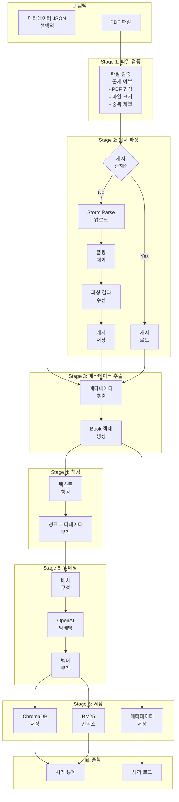
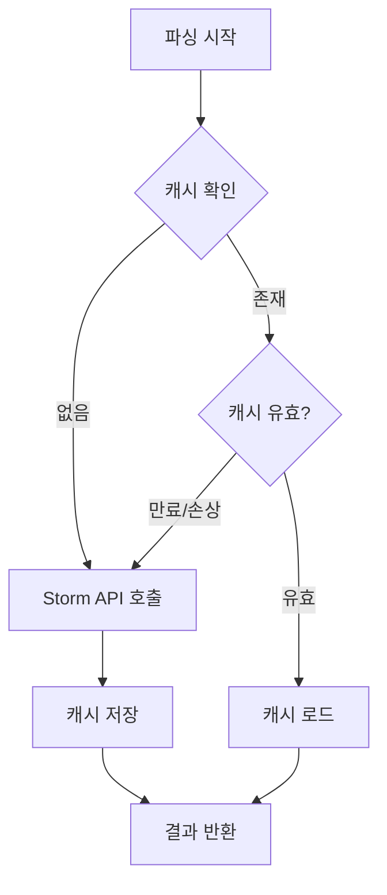
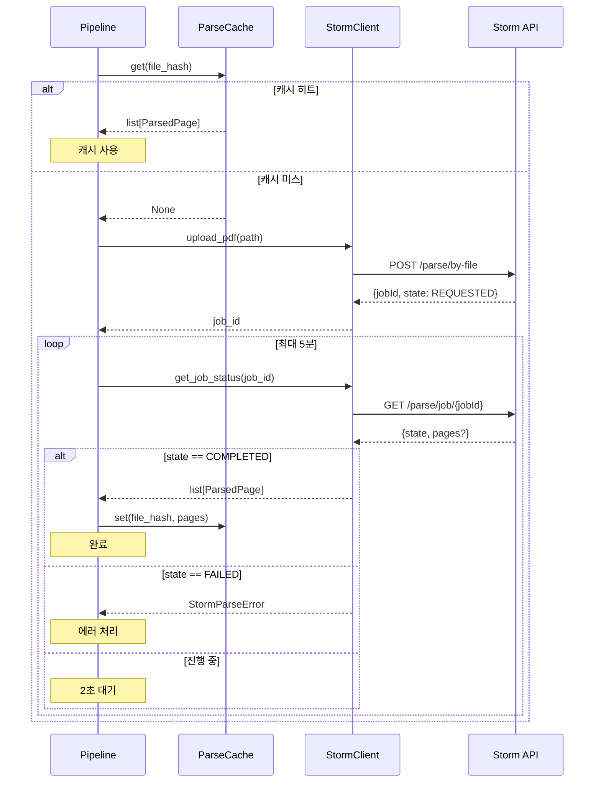
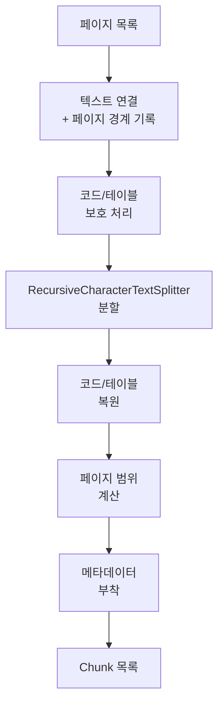
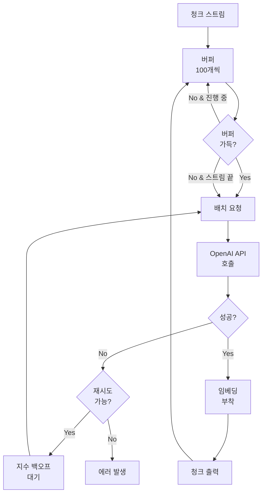
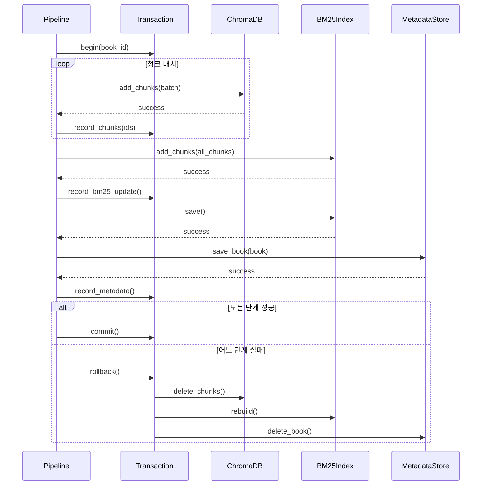
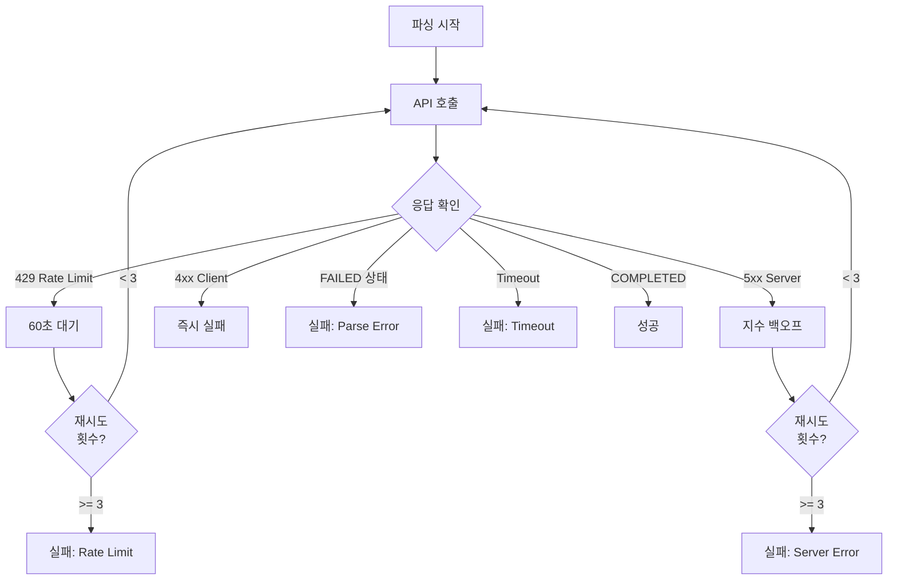

# Ingestion Pipeline Specification

> **Role**: Technical Lead
> **Created**: 2025-12-04
> **Version**: 1.0

---

## 1. Pipeline Overview

PDF 파일을 벡터 DB에 저장하기까지의 전체 파이프라인을 상세히 정의합니다.

### 1.1 전체 흐름



### 1.2 단계별 입출력 정의

| Stage | 입력 | 출력 | 실패 시 |
|-------|------|------|---------|
| 1. 파일 검증 | `Path` | `ValidatedFile` | `ValidationError` 발생, 중단 |
| 2. 문서 파싱 | `ValidatedFile` | `list[ParsedPage]` | `StormParseError` 발생, 중단 |
| 3. 메타데이터 | `list[ParsedPage]` | `Book` | 기본값 사용, 계속 |
| 4. 청킹 | `Book`, `list[ParsedPage]` | `Iterator[Chunk]` | `ChunkingError` 발생, 중단 |
| 5. 임베딩 | `Iterator[Chunk]` | `Iterator[Chunk]` (with embedding) | 재시도 3회, 실패 시 중단 |
| 6. 저장 | `list[Chunk]`, `Book` | `IngestionResult` | 롤백 후 중단 |

---

## 2. Stage 1: 파일 검증

### 2.1 검증 항목

```python
@dataclass
class FileValidation:
    """파일 검증 결과"""
    path: Path
    file_name: str
    file_size: int
    file_hash: str
    is_valid: bool
    errors: list[str]
```

| 검증 | 조건 | 에러 메시지 |
|------|------|------------|
| 존재 여부 | `path.exists()` | `File not found: {path}` |
| 파일 타입 | `path.suffix.lower() == '.pdf'` | `Not a PDF file: {path}` |
| 파일 크기 | `0 < size <= 100MB` | `File too large: {size}MB (max 100MB)` |
| PDF 헤더 | `bytes[:4] == b'%PDF'` | `Invalid PDF format: {path}` |
| 중복 체크 | `hash not in existing_hashes` | `Duplicate file: {existing_title}` |

### 2.2 구현 코드

```python
# ingestion/validator.py

import hashlib
from pathlib import Path
from dataclasses import dataclass, field

from bookbrain.core.exceptions import ValidationError


@dataclass
class ValidatedFile:
    """검증된 파일 정보"""
    path: Path
    file_name: str
    file_size: int
    file_hash: str


@dataclass
class ValidationResult:
    """검증 결과"""
    is_valid: bool
    validated_file: ValidatedFile | None = None
    errors: list[str] = field(default_factory=list)


class FileValidator:
    """PDF 파일 검증기"""

    MAX_FILE_SIZE = 100 * 1024 * 1024  # 100MB
    PDF_MAGIC_BYTES = b'%PDF'

    def __init__(self, existing_hashes: set[str] | None = None):
        """
        Args:
            existing_hashes: 이미 등록된 파일 해시 집합 (중복 체크용)
        """
        self._existing_hashes = existing_hashes or set()

    def validate(self, path: Path) -> ValidationResult:
        """
        파일 검증 수행

        Args:
            path: PDF 파일 경로

        Returns:
            ValidationResult: 검증 결과
        """
        errors = []

        # 1. 존재 여부
        if not path.exists():
            errors.append(f"File not found: {path}")
            return ValidationResult(is_valid=False, errors=errors)

        # 2. 파일 타입
        if path.suffix.lower() != '.pdf':
            errors.append(f"Not a PDF file: {path}")

        # 3. 파일 크기
        file_size = path.stat().st_size
        if file_size == 0:
            errors.append(f"Empty file: {path}")
        elif file_size > self.MAX_FILE_SIZE:
            size_mb = file_size / (1024 * 1024)
            errors.append(f"File too large: {size_mb:.1f}MB (max 100MB)")

        # 4. PDF 헤더
        if not errors:  # 파일 읽기 가능한 경우만
            with open(path, 'rb') as f:
                header = f.read(4)
                if header != self.PDF_MAGIC_BYTES:
                    errors.append(f"Invalid PDF format: {path}")

        # 5. 해시 계산 및 중복 체크
        if not errors:
            file_hash = self._compute_hash(path)

            if file_hash in self._existing_hashes:
                errors.append(f"Duplicate file detected (hash: {file_hash[:8]}...)")
            else:
                validated = ValidatedFile(
                    path=path,
                    file_name=path.name,
                    file_size=file_size,
                    file_hash=file_hash,
                )
                return ValidationResult(
                    is_valid=True,
                    validated_file=validated,
                )

        return ValidationResult(is_valid=False, errors=errors)

    def _compute_hash(self, path: Path) -> str:
        """SHA-256 해시 계산"""
        sha256 = hashlib.sha256()
        with open(path, 'rb') as f:
            for chunk in iter(lambda: f.read(8192), b''):
                sha256.update(chunk)
        return sha256.hexdigest()
```

---

## 3. Stage 2: 문서 파싱

### 3.1 캐싱 전략



### 3.2 캐시 구조

```
data/
└── cache/
    └── parse/
        ├── {file_hash}.json      # 파싱 결과
        └── {file_hash}.meta.json # 메타데이터 (만료 시간 등)
```

**캐시 메타데이터:**
```json
{
  "file_hash": "abc123...",
  "file_name": "book.pdf",
  "cached_at": "2025-12-04T10:00:00Z",
  "expires_at": "2026-12-04T10:00:00Z",
  "storm_job_id": "defa_...",
  "page_count": 100
}
```

### 3.3 구현 코드

```python
# ingestion/cache.py

import json
from pathlib import Path
from datetime import datetime, timedelta
from typing import Optional

from pydantic import BaseModel

from bookbrain.core.config import Settings
from bookbrain.models.api import StormPageResult


class CacheMetadata(BaseModel):
    """캐시 메타데이터"""
    file_hash: str
    file_name: str
    cached_at: datetime
    expires_at: datetime
    storm_job_id: str
    page_count: int


class ParseCache:
    """파싱 결과 캐시"""

    CACHE_DIR = "cache/parse"
    DEFAULT_TTL_DAYS = 365  # 1년

    def __init__(self, settings: Settings):
        self._settings = settings
        self._cache_dir = Path(settings.data_dir) / self.CACHE_DIR
        self._cache_dir.mkdir(parents=True, exist_ok=True)

    def get(self, file_hash: str) -> Optional[list[StormPageResult]]:
        """
        캐시에서 파싱 결과 조회

        Args:
            file_hash: 파일 SHA-256 해시

        Returns:
            파싱 결과 또는 None (캐시 미스/만료)
        """
        meta_path = self._cache_dir / f"{file_hash}.meta.json"
        data_path = self._cache_dir / f"{file_hash}.json"

        if not meta_path.exists() or not data_path.exists():
            return None

        # 메타데이터 로드 및 만료 확인
        with open(meta_path, 'r', encoding='utf-8') as f:
            meta = CacheMetadata.model_validate_json(f.read())

        if datetime.now() > meta.expires_at:
            # 만료된 캐시 삭제
            meta_path.unlink(missing_ok=True)
            data_path.unlink(missing_ok=True)
            return None

        # 데이터 로드
        with open(data_path, 'r', encoding='utf-8') as f:
            pages_data = json.load(f)

        return [StormPageResult.model_validate(p) for p in pages_data]

    def set(
        self,
        file_hash: str,
        file_name: str,
        job_id: str,
        pages: list[StormPageResult],
        ttl_days: int | None = None,
    ) -> None:
        """
        파싱 결과 캐시 저장

        Args:
            file_hash: 파일 해시
            file_name: 원본 파일명
            job_id: Storm Parse job ID
            pages: 파싱 결과
            ttl_days: 캐시 유효 기간 (일)
        """
        ttl = ttl_days or self.DEFAULT_TTL_DAYS
        now = datetime.now()

        # 메타데이터 저장
        meta = CacheMetadata(
            file_hash=file_hash,
            file_name=file_name,
            cached_at=now,
            expires_at=now + timedelta(days=ttl),
            storm_job_id=job_id,
            page_count=len(pages),
        )

        meta_path = self._cache_dir / f"{file_hash}.meta.json"
        with open(meta_path, 'w', encoding='utf-8') as f:
            f.write(meta.model_dump_json(indent=2))

        # 데이터 저장
        data_path = self._cache_dir / f"{file_hash}.json"
        with open(data_path, 'w', encoding='utf-8') as f:
            json.dump(
                [p.model_dump() for p in pages],
                f,
                ensure_ascii=False,
                indent=2,
            )

    def invalidate(self, file_hash: str) -> bool:
        """캐시 무효화"""
        meta_path = self._cache_dir / f"{file_hash}.meta.json"
        data_path = self._cache_dir / f"{file_hash}.json"

        existed = meta_path.exists() or data_path.exists()
        meta_path.unlink(missing_ok=True)
        data_path.unlink(missing_ok=True)

        return existed

    def clear_expired(self) -> int:
        """만료된 캐시 정리"""
        count = 0
        for meta_path in self._cache_dir.glob("*.meta.json"):
            try:
                with open(meta_path, 'r') as f:
                    meta = CacheMetadata.model_validate_json(f.read())

                if datetime.now() > meta.expires_at:
                    file_hash = meta.file_hash
                    self.invalidate(file_hash)
                    count += 1
            except Exception:
                continue

        return count
```

### 3.4 Storm Parse 호출 시퀀스



---

## 4. Stage 3: 메타데이터 추출

### 4.1 추출 규칙

| 필드 | 추출 소스 | 폴백 |
|------|----------|------|
| `book_id` | 파일명 정규화 | UUID 생성 |
| `title` | 1) 메타 JSON, 2) 파일명 | 파일명 |
| `chapters` | 마크다운 `##` 헤더 | 빈 리스트 |
| `language` | 1) 메타 JSON, 2) 텍스트 감지 | "ko" |

### 4.2 파일명 정규화 규칙

```python
def normalize_book_id(file_name: str) -> str:
    """
    파일명 → book_id 변환

    규칙:
    1. 확장자 제거
    2. 한글 → 영문 음역 (optional, 복잡성으로 생략)
    3. 특수문자 → 언더스코어
    4. 연속 언더스코어 → 단일
    5. 소문자 변환
    6. 앞뒤 언더스코어 제거

    예시:
    - "모던자바인액션.pdf" → "모던자바인액션"
    - "Modern Java in Action (2nd).pdf" → "modern_java_in_action_2nd"
    - "Spring Boot 3.0 가이드.pdf" → "spring_boot_3_0_가이드"
    """
    import re

    # 확장자 제거
    name = file_name.rsplit('.', 1)[0]

    # 특수문자 → 언더스코어 (한글, 영문, 숫자 제외)
    name = re.sub(r'[^\w가-힣]', '_', name)

    # 연속 언더스코어 → 단일
    name = re.sub(r'_+', '_', name)

    # 앞뒤 언더스코어 제거
    name = name.strip('_')

    # 소문자 변환 (한글은 영향 없음)
    name = name.lower()

    return name
```

### 4.3 챕터 추출 알고리즘

```python
def extract_chapters(pages: list[ParsedPage]) -> list[Chapter]:
    """
    마크다운에서 챕터 구조 추출

    인식 패턴:
    - ## 또는 # 로 시작하는 줄
    - "제N장", "Chapter N", "Part N" 패턴

    중복 제거:
    - 같은 제목이 여러 페이지에 나오면 첫 번째만 사용
    """
    import re

    chapters = []
    seen_titles = set()

    header_pattern = re.compile(r'^(#{1,2})\s+(.+)$', re.MULTILINE)
    chapter_pattern = re.compile(
        r'^(제\s*\d+\s*장|Chapter\s+\d+|Part\s+\d+|PART\s+\d+)',
        re.IGNORECASE
    )

    for page in pages:
        for match in header_pattern.finditer(page.content):
            level = len(match.group(1))  # # 개수
            title = match.group(2).strip()

            # 챕터 패턴 매칭 또는 레벨 1-2 헤더
            is_chapter = chapter_pattern.match(title) or level <= 2

            if is_chapter and title not in seen_titles:
                seen_titles.add(title)
                chapters.append(Chapter(
                    title=title,
                    level=level,
                    start_page=page.page_number,
                ))

    return chapters
```

### 4.4 구현 코드

```python
# ingestion/parser.py

import re
from typing import Optional

from bookbrain.core.config import Settings
from bookbrain.models.document import Book, Chapter, ParsedPage


class MetadataExtractor:
    """메타데이터 추출기"""

    def __init__(self, settings: Settings):
        self._settings = settings

    def extract(
        self,
        file_name: str,
        file_hash: str,
        pages: list[ParsedPage],
        metadata_override: dict | None = None,
    ) -> Book:
        """
        Book 객체 생성

        Args:
            file_name: 원본 파일명
            file_hash: 파일 해시
            pages: 파싱된 페이지 목록
            metadata_override: 수동 메타데이터 (title, language 등)

        Returns:
            Book: 추출된 메타데이터를 담은 Book 객체
        """
        override = metadata_override or {}

        # book_id
        book_id = self._normalize_book_id(file_name)

        # title (우선순위: override > 파일명)
        title = override.get('title') or self._extract_title_from_filename(file_name)

        # chapters
        chapters = self._extract_chapters(pages)

        # 각 페이지에 챕터 정보 추가
        pages = self._assign_chapters_to_pages(pages, chapters)

        # language
        language = override.get('language', 'ko')

        return Book(
            id=book_id,
            title=title,
            file_name=file_name,
            file_hash=file_hash,
            total_pages=len(pages),
            chapters=chapters,
            language=language,
        )

    def _normalize_book_id(self, file_name: str) -> str:
        """파일명 → book_id"""
        name = file_name.rsplit('.', 1)[0]
        name = re.sub(r'[^\w가-힣]', '_', name)
        name = re.sub(r'_+', '_', name)
        name = name.strip('_').lower()
        return name or f"book_{hash(file_name) % 10000:04d}"

    def _extract_title_from_filename(self, file_name: str) -> str:
        """파일명에서 제목 추출"""
        name = file_name.rsplit('.', 1)[0]
        # 괄호 안 내용 제거 (에디션 정보 등)
        name = re.sub(r'\s*\([^)]*\)\s*', ' ', name)
        # 언더스코어/하이픈 → 공백
        name = re.sub(r'[_-]', ' ', name)
        # 연속 공백 정리
        name = re.sub(r'\s+', ' ', name).strip()
        return name

    def _extract_chapters(self, pages: list[ParsedPage]) -> list[Chapter]:
        """마크다운에서 챕터 추출"""
        chapters = []
        seen_titles = set()

        header_pattern = re.compile(r'^(#{1,2})\s+(.+)$', re.MULTILINE)

        for page in pages:
            for match in header_pattern.finditer(page.content):
                level = len(match.group(1))
                title = match.group(2).strip()

                # 너무 짧은 제목 무시
                if len(title) < 2:
                    continue

                # 코드 관련 헤더 무시
                if title.startswith('```'):
                    continue

                if title not in seen_titles:
                    seen_titles.add(title)
                    chapters.append(Chapter(
                        title=title,
                        level=level,
                        start_page=page.page_number,
                    ))

        return chapters

    def _assign_chapters_to_pages(
        self,
        pages: list[ParsedPage],
        chapters: list[Chapter],
    ) -> list[ParsedPage]:
        """각 페이지에 현재 챕터 정보 할당"""
        if not chapters:
            return pages

        result = []
        current_chapter = None
        chapter_idx = 0

        for page in pages:
            # 이 페이지에서 새 챕터가 시작되는지 확인
            while (
                chapter_idx < len(chapters) and
                chapters[chapter_idx].start_page <= page.page_number
            ):
                current_chapter = chapters[chapter_idx].title
                chapter_idx += 1

            result.append(ParsedPage(
                page_number=page.page_number,
                content=page.content,
                chapter_title=current_chapter,
            ))

        return result
```

---

## 5. Stage 4: 텍스트 청킹

### 5.1 청킹 설정

```python
CHUNKING_CONFIG = {
    # 기본 설정
    "chunk_size": 800,           # 토큰
    "chunk_overlap": 200,        # 토큰

    # 분할자 우선순위 (높은 것부터)
    "separators": [
        "\n## ",                  # H2 헤더
        "\n### ",                 # H3 헤더
        "\n#### ",                # H4 헤더
        "\n\n",                   # 문단
        "\n",                     # 줄바꿈
        "```\n",                  # 코드 블록 끝
        "\n```",                  # 코드 블록 시작
        ". ",                     # 문장
        "。",                     # 한글 문장 (일본어 스타일)
        ", ",                     # 절
        " ",                      # 단어
        "",                       # 문자 (최후)
    ],

    # 토큰 카운터
    "tokenizer": "cl100k_base",  # GPT-4/3.5 토크나이저

    # 코드 블록 보호
    "preserve_code_blocks": True,

    # 테이블 보호
    "preserve_tables": True,
}
```

### 5.2 코드 블록 보호 로직

```python
def protect_code_blocks(text: str) -> tuple[str, dict[str, str]]:
    """
    코드 블록을 플레이스홀더로 치환

    Returns:
        (치환된 텍스트, 플레이스홀더→원본 매핑)
    """
    import re
    import uuid

    code_pattern = re.compile(r'```[\s\S]*?```', re.MULTILINE)
    placeholders = {}

    def replace(match):
        placeholder = f"__CODE_BLOCK_{uuid.uuid4().hex[:8]}__"
        placeholders[placeholder] = match.group(0)
        return placeholder

    protected = code_pattern.sub(replace, text)
    return protected, placeholders


def restore_code_blocks(text: str, placeholders: dict[str, str]) -> str:
    """플레이스홀더를 원본 코드 블록으로 복원"""
    for placeholder, original in placeholders.items():
        text = text.replace(placeholder, original)
    return text
```

### 5.3 청킹 흐름



### 5.4 청크 품질 검증

```python
def validate_chunk(chunk: Chunk) -> list[str]:
    """
    청크 품질 검증

    Returns:
        경고 메시지 목록 (빈 리스트면 OK)
    """
    warnings = []

    # 최소 길이
    if len(chunk.text) < 50:
        warnings.append(f"Chunk too short: {len(chunk.text)} chars")

    # 코드 블록 불완전
    if chunk.text.count('```') % 2 != 0:
        warnings.append("Unclosed code block")

    # 문장 중간 절단 감지
    if not chunk.text.rstrip().endswith(('.', '。', '!', '?', '```', ':', ';')):
        # 마지막 문장이 완전한지 휴리스틱 체크
        last_line = chunk.text.rstrip().split('\n')[-1]
        if len(last_line) > 20 and not last_line.endswith(('다', '요', '함')):
            warnings.append("Possible mid-sentence truncation")

    return warnings
```

---

## 6. Stage 5: 임베딩 생성

### 6.1 배치 처리 전략



### 6.2 Rate Limit 처리

```python
# OpenAI Rate Limits (text-embedding-3-small)
RATE_LIMITS = {
    "rpm": 3000,        # Requests per minute
    "tpm": 1_000_000,   # Tokens per minute
    "batch_size": 100,  # Max texts per request
}

# 재시도 전략
RETRY_CONFIG = {
    "max_attempts": 5,
    "initial_wait": 10,      # 초
    "max_wait": 120,         # 초
    "exponential_base": 2,
}
```

### 6.3 토큰 추정

```python
def estimate_tokens(texts: list[str]) -> int:
    """
    텍스트 목록의 총 토큰 수 추정

    정확한 계산은 비용이 크므로 휴리스틱 사용:
    - 한글: 글자당 ~2 토큰
    - 영어: 단어당 ~1.3 토큰
    - 코드: 문자당 ~0.5 토큰
    """
    import re

    total = 0
    for text in texts:
        # 한글 문자 수
        korean = len(re.findall(r'[가-힣]', text))
        # 영어 단어 수
        english = len(re.findall(r'[a-zA-Z]+', text))
        # 나머지 문자
        other = len(text) - korean - english

        total += korean * 2 + english * 1.3 + other * 0.5

    return int(total)
```

---

## 7. Stage 6: 저장

### 7.1 트랜잭션 전략

```python
@dataclass
class IngestionTransaction:
    """수집 트랜잭션"""

    book_id: str
    chunks_added: list[str] = field(default_factory=list)
    bm25_updated: bool = False
    metadata_saved: bool = False

    def rollback(
        self,
        chroma: ChromaStore,
        bm25: BM25Index,
        meta_store: MetadataStore,
    ) -> None:
        """롤백 수행"""
        # 1. ChromaDB 청크 삭제
        if self.chunks_added:
            chroma.delete_chunks(self.chunks_added)

        # 2. BM25 재구축 (이전 상태로)
        if self.bm25_updated:
            bm25.rebuild_without(self.book_id)

        # 3. 메타데이터 삭제
        if self.metadata_saved:
            meta_store.delete_book(self.book_id)
```

### 7.2 저장 순서



### 7.3 결과 리포트

```python
@dataclass
class IngestionResult:
    """수집 결과"""

    success: bool
    book_id: str
    book_title: str

    # 통계
    total_pages: int
    total_chunks: int
    total_tokens: int

    # 타이밍
    parse_time_sec: float
    chunk_time_sec: float
    embed_time_sec: float
    store_time_sec: float
    total_time_sec: float

    # 비용 추정
    embedding_cost_usd: float
    parse_cost_usd: float  # Storm API

    # 경고/에러
    warnings: list[str] = field(default_factory=list)
    error: str | None = None

    def to_dict(self) -> dict:
        """리포트용 딕셔너리"""
        return {
            "status": "success" if self.success else "failed",
            "book": {
                "id": self.book_id,
                "title": self.book_title,
            },
            "stats": {
                "pages": self.total_pages,
                "chunks": self.total_chunks,
                "tokens": self.total_tokens,
            },
            "timing": {
                "parse": f"{self.parse_time_sec:.1f}s",
                "chunk": f"{self.chunk_time_sec:.1f}s",
                "embed": f"{self.embed_time_sec:.1f}s",
                "store": f"{self.store_time_sec:.1f}s",
                "total": f"{self.total_time_sec:.1f}s",
            },
            "cost": {
                "embedding": f"${self.embedding_cost_usd:.4f}",
                "parse": f"${self.parse_cost_usd:.4f}",
                "total": f"${self.embedding_cost_usd + self.parse_cost_usd:.4f}",
            },
            "warnings": self.warnings,
            "error": self.error,
        }
```

---

## 8. Pipeline Orchestrator

### 8.1 전체 파이프라인 클래스

```python
# ingestion/pipeline.py

import asyncio
import time
from pathlib import Path
from typing import Iterator, Callable

import structlog

from bookbrain.core.config import Settings
from bookbrain.core.exceptions import IngestionError
from bookbrain.ingestion.validator import FileValidator, ValidatedFile
from bookbrain.ingestion.storm_client import StormClient
from bookbrain.ingestion.cache import ParseCache
from bookbrain.ingestion.parser import MetadataExtractor
from bookbrain.ingestion.chunker import TextChunker
from bookbrain.ingestion.embedder import Embedder
from bookbrain.storage.chroma_store import ChromaStore
from bookbrain.storage.bm25_index import BM25Index
from bookbrain.models.document import Book
from bookbrain.models.chunk import Chunk


logger = structlog.get_logger()


class IngestionPipeline:
    """PDF 수집 파이프라인"""

    def __init__(
        self,
        settings: Settings,
        chroma_store: ChromaStore,
        bm25_index: BM25Index,
    ):
        self._settings = settings
        self._chroma = chroma_store
        self._bm25 = bm25_index

        # 컴포넌트 초기화
        self._cache = ParseCache(settings)
        self._extractor = MetadataExtractor(settings)
        self._chunker = TextChunker(settings)
        self._embedder = Embedder(settings)

    async def ingest(
        self,
        pdf_path: Path,
        metadata_override: dict | None = None,
        progress_callback: Callable[[str, float], None] | None = None,
    ) -> IngestionResult:
        """
        PDF 파일 수집 실행

        Args:
            pdf_path: PDF 파일 경로
            metadata_override: 수동 메타데이터 (title, language 등)
            progress_callback: 진행 상황 콜백 (stage, progress)

        Returns:
            IngestionResult: 수집 결과
        """
        start_time = time.perf_counter()
        warnings = []

        def report_progress(stage: str, progress: float):
            if progress_callback:
                progress_callback(stage, progress)

        try:
            # Stage 1: 파일 검증
            report_progress("validating", 0.0)
            logger.info("ingestion_start", path=str(pdf_path))

            existing_hashes = self._get_existing_hashes()
            validator = FileValidator(existing_hashes)
            validation = validator.validate(pdf_path)

            if not validation.is_valid:
                raise IngestionError(
                    f"Validation failed: {', '.join(validation.errors)}"
                )

            validated = validation.validated_file
            report_progress("validating", 1.0)

            # Stage 2: 문서 파싱
            report_progress("parsing", 0.0)
            parse_start = time.perf_counter()

            pages = await self._parse_with_cache(validated)

            parse_time = time.perf_counter() - parse_start
            report_progress("parsing", 1.0)
            logger.info("parsing_complete", pages=len(pages), time=parse_time)

            # Stage 3: 메타데이터 추출
            report_progress("extracting", 0.0)

            book = self._extractor.extract(
                file_name=validated.file_name,
                file_hash=validated.file_hash,
                pages=pages,
                metadata_override=metadata_override,
            )

            report_progress("extracting", 1.0)
            logger.info("metadata_extracted", book_id=book.id, title=book.title)

            # Stage 4: 청킹
            report_progress("chunking", 0.0)
            chunk_start = time.perf_counter()

            chunks = list(self._chunker.chunk_pages(
                pages=pages,
                book_id=book.id,
                book_title=book.title,
                book_file=book.file_name,
            ))

            chunk_time = time.perf_counter() - chunk_start
            report_progress("chunking", 1.0)
            logger.info("chunking_complete", chunks=len(chunks), time=chunk_time)

            # Stage 5: 임베딩
            report_progress("embedding", 0.0)
            embed_start = time.perf_counter()

            total_chunks = len(chunks)
            embedded_chunks = []

            i = 0
            async for chunk in self._embedder.embed_chunks(iter(chunks)):
                embedded_chunks.append(chunk)
                i += 1
                report_progress("embedding", i / total_chunks)

            embed_time = time.perf_counter() - embed_start
            logger.info("embedding_complete", time=embed_time)

            # Stage 6: 저장
            report_progress("storing", 0.0)
            store_start = time.perf_counter()

            # ChromaDB 저장
            self._chroma.add_chunks(embedded_chunks)
            report_progress("storing", 0.5)

            # BM25 인덱스 추가
            self._bm25.add_chunks(embedded_chunks)
            self._bm25.save()
            report_progress("storing", 1.0)

            store_time = time.perf_counter() - store_start
            logger.info("storing_complete", time=store_time)

            # 결과 생성
            total_time = time.perf_counter() - start_time
            total_tokens = sum(
                len(c.text.split()) * 1.5 for c in embedded_chunks  # 추정
            )

            return IngestionResult(
                success=True,
                book_id=book.id,
                book_title=book.title,
                total_pages=len(pages),
                total_chunks=len(embedded_chunks),
                total_tokens=int(total_tokens),
                parse_time_sec=parse_time,
                chunk_time_sec=chunk_time,
                embed_time_sec=embed_time,
                store_time_sec=store_time,
                total_time_sec=total_time,
                embedding_cost_usd=total_tokens / 1000 * 0.00002,  # $0.00002/1K tokens
                parse_cost_usd=0.0,  # Storm 비용 모델에 따라
                warnings=warnings,
            )

        except Exception as e:
            logger.error("ingestion_failed", error=str(e))
            return IngestionResult(
                success=False,
                book_id="",
                book_title="",
                total_pages=0,
                total_chunks=0,
                total_tokens=0,
                parse_time_sec=0,
                chunk_time_sec=0,
                embed_time_sec=0,
                store_time_sec=0,
                total_time_sec=time.perf_counter() - start_time,
                embedding_cost_usd=0,
                parse_cost_usd=0,
                error=str(e),
            )

    async def _parse_with_cache(
        self,
        validated: ValidatedFile,
    ) -> list:
        """캐시 확인 후 파싱"""
        # 캐시 확인
        cached = self._cache.get(validated.file_hash)
        if cached:
            logger.info("cache_hit", file_hash=validated.file_hash[:8])
            return cached

        # Storm Parse 호출
        async with StormClient(self._settings) as client:
            pages = await client.parse_pdf(validated.path)

        # 캐시 저장
        self._cache.set(
            file_hash=validated.file_hash,
            file_name=validated.file_name,
            job_id="",  # 실제 job_id
            pages=pages,
        )

        return pages

    def _get_existing_hashes(self) -> set[str]:
        """등록된 파일 해시 조회"""
        # 메타데이터 저장소에서 조회
        # 구현 필요
        return set()
```

### 8.2 CLI 인터페이스

```python
# main.py

import asyncio
from pathlib import Path
from typing import Optional

import typer
from rich.console import Console
from rich.progress import Progress, SpinnerColumn, TextColumn

from bookbrain.core.config import get_settings
from bookbrain.ingestion.pipeline import IngestionPipeline
from bookbrain.storage.chroma_store import ChromaStore
from bookbrain.storage.bm25_index import BM25Index


app = typer.Typer(help="BookBrain - Personal Library RAG System")
console = Console()


@app.command()
def ingest(
    pdf_path: Path = typer.Argument(..., help="PDF 파일 경로"),
    title: Optional[str] = typer.Option(None, "--title", "-t", help="책 제목 (수동 지정)"),
    language: str = typer.Option("ko", "--lang", "-l", help="문서 언어"),
):
    """PDF 파일을 벡터 DB에 수집"""

    settings = get_settings()

    # 저장소 초기화
    chroma = ChromaStore(settings)
    chroma.initialize()

    bm25 = BM25Index(settings)
    bm25.load()  # 기존 인덱스 로드

    # 파이프라인 실행
    pipeline = IngestionPipeline(settings, chroma, bm25)

    metadata = {}
    if title:
        metadata["title"] = title
    metadata["language"] = language

    with Progress(
        SpinnerColumn(),
        TextColumn("[progress.description]{task.description}"),
        console=console,
    ) as progress:
        task = progress.add_task("수집 중...", total=None)

        def on_progress(stage: str, pct: float):
            stage_names = {
                "validating": "파일 검증",
                "parsing": "문서 파싱",
                "extracting": "메타데이터 추출",
                "chunking": "텍스트 청킹",
                "embedding": "임베딩 생성",
                "storing": "저장",
            }
            progress.update(task, description=f"{stage_names.get(stage, stage)} ({pct*100:.0f}%)")

        result = asyncio.run(
            pipeline.ingest(pdf_path, metadata, on_progress)
        )

    if result.success:
        console.print(f"\n✅ [green]수집 완료[/green]")
        console.print(f"   책: {result.book_title}")
        console.print(f"   페이지: {result.total_pages}")
        console.print(f"   청크: {result.total_chunks}")
        console.print(f"   소요 시간: {result.total_time_sec:.1f}초")
    else:
        console.print(f"\n❌ [red]수집 실패[/red]: {result.error}")
        raise typer.Exit(1)


@app.command()
def search(
    query: str = typer.Argument(..., help="검색 쿼리"),
    top_k: int = typer.Option(10, "--top", "-k", help="결과 개수"),
    mode: str = typer.Option("hybrid", "--mode", "-m", help="검색 모드 (hybrid/vector/keyword)"),
):
    """장서 검색"""
    # 검색 로직...
    pass


@app.command()
def stats():
    """라이브러리 통계"""
    settings = get_settings()

    chroma = ChromaStore(settings)
    chroma.initialize()

    stats = chroma.get_stats()

    console.print(f"\n📚 라이브러리 통계")
    console.print(f"   총 책: {stats['total_books']}권")
    console.print(f"   총 청크: {stats['total_chunks']}개")
    console.print()

    for book in stats['books']:
        console.print(f"   • {book['title']}: {book['chunks']}개 청크")


if __name__ == "__main__":
    app()
```

---

## 9. 에러 복구 시나리오

### 9.1 Storm Parse 실패



### 9.2 임베딩 실패

```python
async def embed_with_recovery(
    texts: list[str],
    embedder: Embedder,
) -> list[list[float]]:
    """
    실패 시 배치 분할 전략

    1. 전체 배치 시도 (100개)
    2. 실패 시 절반으로 분할 (50개씩)
    3. 계속 실패 시 개별 처리 (1개씩)
    """
    batch_sizes = [100, 50, 25, 10, 1]

    for batch_size in batch_sizes:
        try:
            results = []
            for i in range(0, len(texts), batch_size):
                batch = texts[i:i + batch_size]
                embeddings = await embedder.embed_texts(batch)
                results.extend(embeddings)
            return results
        except Exception as e:
            if batch_size == 1:
                raise
            logger.warning(
                "embedding_batch_failed",
                batch_size=batch_size,
                error=str(e),
            )
            continue

    raise EmbeddingError("All batch sizes failed")
```

### 9.3 저장 실패 롤백

```python
async def safe_store(
    chunks: list[Chunk],
    book: Book,
    chroma: ChromaStore,
    bm25: BM25Index,
) -> None:
    """트랜잭션 저장"""

    stored_ids = []

    try:
        # ChromaDB 저장
        for batch in batched(chunks, 100):
            chroma.add_chunks(batch)
            stored_ids.extend([c.id for c in batch])

        # BM25 업데이트
        bm25.add_chunks(chunks)
        bm25.save()

    except Exception as e:
        # 롤백
        logger.error("storage_failed_rolling_back", error=str(e))

        if stored_ids:
            try:
                chroma.delete_chunks(stored_ids)
            except Exception:
                logger.error("rollback_failed")

        raise
```

