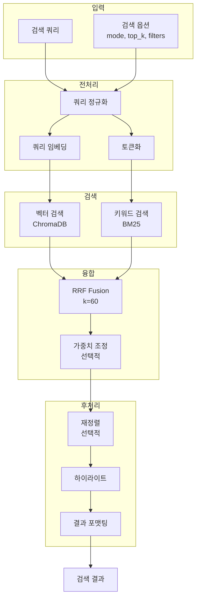

# Search Engine Specification

> **Role**: Technical Lead
> **Created**: 2025-12-04
> **Version**: 1.0

---

## 1. Search Engine Overview

하이브리드 검색 엔진의 상세 알고리즘과 구현을 정의합니다.

### 1.1 검색 아키텍처



### 1.2 검색 모드

| 모드 | 설명 | 사용 시나리오 |
|------|------|--------------|
| `hybrid` | 벡터 + 키워드 결합 | 기본값, 대부분의 경우 |
| `vector` | 벡터 검색만 | 의미 기반 검색, "비슷한 내용 찾기" |
| `keyword` | 키워드 검색만 | 정확한 용어 검색, 코드/API 검색 |

---

## 2. Query Preprocessing

### 2.1 쿼리 정규화

```python
# search/preprocessor.py

import re
from dataclasses import dataclass


@dataclass
class NormalizedQuery:
    """정규화된 쿼리"""
    original: str           # 원본
    normalized: str         # 정규화된 텍스트
    tokens: list[str]       # 토큰 목록
    has_code: bool          # 코드 포함 여부
    has_quotes: bool        # 인용구 포함 여부
    quoted_phrases: list[str]  # 인용구 내용


class QueryPreprocessor:
    """쿼리 전처리기"""

    def preprocess(self, query: str) -> NormalizedQuery:
        """
        쿼리 전처리

        처리 단계:
        1. 앞뒤 공백 제거
        2. 인용구 추출 ("정확한 구문")
        3. 코드 패턴 감지
        4. 특수문자 정규화
        5. 토큰화
        """
        original = query.strip()

        # 인용구 추출
        quoted_phrases = self._extract_quoted(original)
        has_quotes = len(quoted_phrases) > 0

        # 코드 패턴 감지
        has_code = self._detect_code(original)

        # 정규화
        normalized = self._normalize(original)

        # 토큰화
        tokens = self._tokenize(normalized)

        return NormalizedQuery(
            original=original,
            normalized=normalized,
            tokens=tokens,
            has_code=has_code,
            has_quotes=has_quotes,
            quoted_phrases=quoted_phrases,
        )

    def _extract_quoted(self, text: str) -> list[str]:
        """인용구 추출 ("..." 또는 '...')"""
        pattern = r'["\']([^"\']+)["\']'
        return re.findall(pattern, text)

    def _detect_code(self, text: str) -> bool:
        """코드 패턴 감지"""
        code_patterns = [
            r'\b\w+\.\w+\(',           # 메서드 호출: obj.method(
            r'\b\w+\(\)',              # 함수 호출: func()
            r'\b(class|def|function|const|let|var)\s+\w+',  # 선언
            r'[<>\[\]{}]',             # 괄호류
            r'::\w+',                  # 스코프: ::name
            r'\w+::\w+',               # C++/Rust 스코프
            r'@\w+',                   # 데코레이터/어노테이션
        ]

        for pattern in code_patterns:
            if re.search(pattern, text):
                return True
        return False

    def _normalize(self, text: str) -> str:
        """텍스트 정규화"""
        # 연속 공백 → 단일 공백
        text = re.sub(r'\s+', ' ', text)

        # 특수 따옴표 → 표준 따옴표
        text = text.replace('"', '"').replace('"', '"')
        text = text.replace(''', "'").replace(''', "'")

        return text.strip()

    def _tokenize(self, text: str) -> list[str]:
        """토큰화 (한글 + 영어 지원)"""
        # 한글 또는 영숫자 시퀀스
        pattern = r'[가-힣]+|[a-zA-Z0-9_]+'
        tokens = re.findall(pattern, text.lower())
        return [t for t in tokens if len(t) >= 2]  # 2자 이상
```

### 2.2 쿼리 임베딩

```python
# search/query_embedder.py

from functools import lru_cache
import asyncio

from bookbrain.ingestion.embedder import Embedder
from bookbrain.core.config import Settings


class QueryEmbedder:
    """쿼리 임베딩 생성 (캐싱 포함)"""

    def __init__(self, settings: Settings):
        self._embedder = Embedder(settings)
        self._cache: dict[str, list[float]] = {}
        self._cache_max_size = 1000

    async def embed(self, query: str) -> list[float]:
        """
        쿼리 임베딩 생성

        캐싱:
        - 동일 쿼리는 캐시에서 반환
        - LRU 방식으로 최대 1000개 유지
        """
        # 캐시 키 정규화:
        # - 앞뒤 공백 제거
        # - 소문자 변환
        # - 연속 공백을 단일 공백으로 치환 (캐시 적중률 향상)
        import re
        cache_key = re.sub(r'\s+', ' ', query.strip().lower())
        if cache_key in self._cache:
            return self._cache[cache_key]

        # 임베딩 생성
        embedding = await self._embedder.embed_query(query)

        # 캐시 저장 (LRU)
        if len(self._cache) >= self._cache_max_size:
            # 가장 오래된 항목 제거
            oldest = next(iter(self._cache))
            del self._cache[oldest]

        self._cache[cache_key] = embedding

        return embedding

    def clear_cache(self) -> None:
        """캐시 초기화"""
        self._cache.clear()
```

---

## 3. Vector Search

### 3.1 ChromaDB 벡터 검색

```python
# search/vector_search.py

from dataclasses import dataclass
from typing import Optional

from bookbrain.storage.chroma_store import ChromaStore
from bookbrain.models.search import SearchQuery


@dataclass
class VectorSearchResult:
    """벡터 검색 결과"""
    chunk_id: str
    text: str
    distance: float      # 코사인 거리 (0~2)
    similarity: float    # 유사도 (0~1)
    rank: int
    metadata: dict


class VectorSearcher:
    """벡터 유사도 검색"""

    def __init__(self, chroma_store: ChromaStore):
        self._store = chroma_store

    async def search(
        self,
        query_embedding: list[float],
        query: SearchQuery,
    ) -> list[VectorSearchResult]:
        """
        벡터 검색 실행

        Args:
            query_embedding: 쿼리 임베딩 벡터
            query: 검색 쿼리 (필터, top_k 등)

        Returns:
            검색 결과 목록 (유사도 내림차순)
        """
        # ChromaDB 검색
        # top_k * 2로 검색하여 필터링 후에도 충분한 결과 확보
        raw_results = self._store.search(
            query_embedding=query_embedding,
            top_k=query.top_k * 2,
            book_filter=query.book_filter,
        )

        results = []
        for rank, (chunk_id, distance, text, metadata) in enumerate(raw_results, 1):
            # 코사인 거리 → 유사도 변환
            # ChromaDB: distance = 1 - cosine_similarity
            # 따라서: similarity = 1 - distance
            similarity = max(0, 1 - distance)

            results.append(VectorSearchResult(
                chunk_id=chunk_id,
                text=text,
                distance=distance,
                similarity=similarity,
                rank=rank,
                metadata=metadata,
            ))

        return results
```

### 3.2 유사도 계산

#### 코사인 유사도 (Cosine Similarity)

두 벡터 $\mathbf{A}$와 $\mathbf{B}$ 사이의 각도를 기반으로 유사도 측정:

$$
\cos(\theta) = \frac{\mathbf{A} \cdot \mathbf{B}}{\|\mathbf{A}\| \|\mathbf{B}\|} = \frac{\sum_{i=1}^{n} A_i B_i}{\sqrt{\sum_{i=1}^{n} A_i^2} \cdot \sqrt{\sum_{i=1}^{n} B_i^2}}
$$

| 값 | 의미 |
|---|------|
| $\cos(\theta) = 1$ | 완전히 동일한 방향 |
| $\cos(\theta) = 0$ | 직교 (무관) |
| $\cos(\theta) = -1$ | 완전히 반대 방향 |

#### ChromaDB 거리 변환

ChromaDB는 **코사인 거리(distance)**를 반환합니다:

$$
\text{distance} = 1 - \cos(\theta) \quad \text{(범위: } 0 \sim 2\text{)}
$$

유사도로 변환:

$$
\text{similarity} = 1 - \text{distance} = \cos(\theta) \quad \text{(범위: } -1 \sim 1\text{)}
$$

정규화 (0~1 범위로 제한):

$$
\text{similarity}_{\text{norm}} = \max(0, 1 - \text{distance}) \quad \text{(범위: } 0 \sim 1\text{)}
$$

---

## 4. Keyword Search (BM25)

### 4.1 BM25 알고리즘

**BM25 (Best Matching 25)** 는 TF-IDF 기반의 확률적 검색 모델입니다.

#### 전체 스코어 공식

$$
\text{score}(D, Q) = \sum_{i=1}^{|Q|} \text{IDF}(q_i) \cdot \text{TF}(q_i, D)
$$

#### IDF (Inverse Document Frequency)

문서 집합에서 희귀한 단어일수록 높은 가중치:

$$
\text{IDF}(q_i) = \ln\left(\frac{N - n(q_i) + 0.5}{n(q_i) + 0.5} + 1\right)
$$

#### TF (Term Frequency with Saturation)

문서 내 출현 빈도 (saturation 적용):

$$
\text{TF}(q_i, D) = \frac{f(q_i, D) \cdot (k_1 + 1)}{f(q_i, D) + k_1 \cdot \left(1 - b + b \cdot \frac{|D|}{\text{avgdl}}\right)}
$$

#### 파라미터

| 기호 | 의미 | 기본값 |
|------|------|--------|
| $k_1$ | Term frequency saturation | 1.2 ~ 2.0 |
| $b$ | Length normalization | 0.75 |
| $N$ | 전체 문서 수 | - |
| $n(q_i)$ | 쿼리 토큰 $q_i$를 포함하는 문서 수 | - |
| $f(q_i, D)$ | 문서 $D$에서 $q_i$의 출현 빈도 | - |
| $\|D\|$ | 문서 $D$의 길이 (토큰 수) | - |
| $\text{avgdl}$ | 평균 문서 길이 | - |

#### 직관적 해석

```
BM25 = Σ (희귀할수록 중요) × (많이 나올수록 중요하지만 포화됨)
         ───────────────────   ──────────────────────────────────
              IDF 항                      TF 항 (길이 정규화)
```

- **$k_1$ 증가**: TF 포화 완화 (빈도 차이 반영 증가)
- **$b$ → 1**: 긴 문서 페널티 강화
- **$b$ → 0**: 문서 길이 무시

### 4.2 BM25 검색 구현

```python
# search/keyword_search.py

from dataclasses import dataclass
from typing import Optional

from bookbrain.storage.bm25_index import BM25Index
from bookbrain.storage.chroma_store import ChromaStore
from bookbrain.search.preprocessor import QueryPreprocessor
from bookbrain.models.search import SearchQuery


@dataclass
class KeywordSearchResult:
    """키워드 검색 결과"""
    chunk_id: str
    text: str
    score: float         # BM25 점수
    rank: int
    metadata: dict
    matched_terms: list[str]  # 매칭된 토큰


class KeywordSearcher:
    """BM25 키워드 검색"""

    def __init__(
        self,
        bm25_index: BM25Index,
        chroma_store: ChromaStore,  # 메타데이터 조회용
    ):
        self._index = bm25_index
        self._store = chroma_store
        self._preprocessor = QueryPreprocessor()

    def search(
        self,
        query: SearchQuery,
    ) -> list[KeywordSearchResult]:
        """
        BM25 키워드 검색

        Args:
            query: 검색 쿼리

        Returns:
            검색 결과 목록 (BM25 점수 내림차순)
        """
        # 쿼리 전처리
        normalized = self._preprocessor.preprocess(query.text)

        # BM25 검색
        raw_results = self._index.search(
            query=query.text,
            top_k=query.top_k * 2,
            book_filter=query.book_filter,
        )

        results = []
        for rank, (chunk_id, score, text) in enumerate(raw_results, 1):
            # ChromaDB에서 메타데이터 조회
            chunk = self._store.get_chunk(chunk_id)
            if chunk is None:
                continue

            # 매칭된 토큰 찾기
            matched = self._find_matched_terms(text, normalized.tokens)

            results.append(KeywordSearchResult(
                chunk_id=chunk_id,
                text=text,
                score=score,
                rank=rank,
                metadata=chunk.metadata.to_chroma_metadata(),
                matched_terms=matched,
            ))

        return results

    def _find_matched_terms(
        self,
        text: str,
        query_tokens: list[str],
    ) -> list[str]:
        """텍스트에서 매칭된 쿼리 토큰 찾기"""
        text_lower = text.lower()
        matched = []

        for token in query_tokens:
            if token.lower() in text_lower:
                matched.append(token)

        return matched
```

---

## 5. Hybrid Search (RRF)

### 5.1 RRF (Reciprocal Rank Fusion) 알고리즘

**RRF**는 여러 검색 결과 리스트를 순위 기반으로 융합하는 알고리즘입니다.

#### RRF 공식

$$
\text{RRF}(d) = \sum_{r \in R} \frac{1}{k + \text{rank}_r(d)}
$$

#### 파라미터

| 기호 | 의미 | 값 |
|------|------|-----|
| $k$ | 스무딩 상수 | 60 (표준) |
| $R$ | 검색 결과 집합들 | {벡터, 키워드} |
| $\text{rank}_r(d)$ | 결과 집합 $r$에서 문서 $d$의 순위 | 1부터 시작 |

> 문서가 특정 결과 집합에 없으면 해당 항은 제외됩니다.

#### 가중치 적용 RRF

벡터/키워드 검색에 다른 가중치($\alpha$)를 적용:

$$
\text{RRF}_\alpha(d) = \frac{\alpha}{k + \text{rank}_{\text{vector}}(d)} + \frac{1 - \alpha}{k + \text{rank}_{\text{keyword}}(d)}
$$

| $\alpha$ 값 | 의미 |
|-------------|------|
| 0.5 | 동등 가중치 (표준) |
| 0.7 | 벡터 검색 우선 |
| 0.3 | 키워드 검색 우선 |

#### 계산 예시

| 문서 | 벡터 순위 | 키워드 순위 | RRF 점수 ($k=60$) |
|------|----------|------------|-------------------|
| A | 1 | 3 | $\frac{1}{61} + \frac{1}{63} = 0.0323$ |
| B | 5 | 1 | $\frac{1}{65} + \frac{1}{61} = 0.0318$ |

$$
\text{RRF}(A) > \text{RRF}(B) \quad \Rightarrow \quad \text{문서 A 상위 노출}
$$

#### k 값의 영향

$$
\lim_{k \to 0} \frac{1}{k + \text{rank}} \approx \frac{1}{\text{rank}} \quad \text{(순위 차이 민감)}
$$

$$
\lim_{k \to \infty} \frac{1}{k + \text{rank}} \approx \frac{1}{k} \quad \text{(순위 차이 무시)}
$$

- **$k$ 증가**: 순위 차이의 영향 감소, 더 많은 결과가 비슷한 점수
- **$k$ 감소**: 상위 순위에 더 큰 가중치

### 5.2 RRF 구현

```python
# search/rrf_fusion.py

from dataclasses import dataclass
from typing import Optional


@dataclass
class FusedResult:
    """융합된 검색 결과"""
    chunk_id: str
    text: str
    rrf_score: float
    vector_rank: Optional[int]
    vector_score: Optional[float]
    keyword_rank: Optional[int]
    keyword_score: Optional[float]
    metadata: dict


class RRFFusion:
    """Reciprocal Rank Fusion"""

    def __init__(self, k: int = 60):
        """
        Args:
            k: RRF 상수 (기본값: 60)
               - 높을수록 순위 차이의 영향 감소
               - 낮을수록 상위 순위에 더 가중치
        """
        self.k = k

    def fuse(
        self,
        vector_results: list,   # VectorSearchResult
        keyword_results: list,  # KeywordSearchResult
        alpha: float = 0.5,     # 벡터 가중치 (선택적)
    ) -> list[FusedResult]:
        """
        두 검색 결과를 RRF로 융합

        Args:
            vector_results: 벡터 검색 결과
            keyword_results: 키워드 검색 결과
            alpha: 벡터 검색 가중치 (0~1)
                   - 0.5: 동등 가중치 (표준 RRF)
                   - 0.7: 벡터 검색 우선
                   - 0.3: 키워드 검색 우선

        Returns:
            융합된 결과 (RRF 점수 내림차순)
        """
        # 결과 수집
        results: dict[str, FusedResult] = {}

        # 벡터 결과 처리
        for vr in vector_results:
            rrf_score = alpha / (self.k + vr.rank)

            results[vr.chunk_id] = FusedResult(
                chunk_id=vr.chunk_id,
                text=vr.text,
                rrf_score=rrf_score,
                vector_rank=vr.rank,
                vector_score=vr.similarity,
                keyword_rank=None,
                keyword_score=None,
                metadata=vr.metadata,
            )

        # 키워드 결과 처리
        for kr in keyword_results:
            rrf_contribution = (1 - alpha) / (self.k + kr.rank)

            if kr.chunk_id in results:
                # 기존 결과에 추가
                existing = results[kr.chunk_id]
                results[kr.chunk_id] = FusedResult(
                    chunk_id=existing.chunk_id,
                    text=existing.text,
                    rrf_score=existing.rrf_score + rrf_contribution,
                    vector_rank=existing.vector_rank,
                    vector_score=existing.vector_score,
                    keyword_rank=kr.rank,
                    keyword_score=kr.score,
                    metadata=existing.metadata,
                )
            else:
                # 새 결과
                results[kr.chunk_id] = FusedResult(
                    chunk_id=kr.chunk_id,
                    text=kr.text,
                    rrf_score=rrf_contribution,
                    vector_rank=None,
                    vector_score=None,
                    keyword_rank=kr.rank,
                    keyword_score=kr.score,
                    metadata=kr.metadata,
                )

        # 점수 기준 정렬
        sorted_results = sorted(
            results.values(),
            key=lambda x: x.rrf_score,
            reverse=True,
        )

        return sorted_results
```

### 5.3 가중치 조정 가이드

| 시나리오 | alpha 값 | 이유 |
|----------|---------|------|
| 일반 검색 | 0.5 | 균형 잡힌 결과 |
| 개념 검색 ("스트림이란") | 0.7 | 의미 이해 중요 |
| API 검색 ("map() 메서드") | 0.3 | 정확한 용어 중요 |
| 코드 검색 | 0.3 | 정확한 매칭 중요 |
| 에러 메시지 검색 | 0.4 | 정확성 + 맥락 |

---

## 6. Highlighting

### 6.1 하이라이트 전략

```python
# search/highlighter.py

import re
from typing import Optional


class Highlighter:
    """검색어 하이라이트"""

    def __init__(
        self,
        pre_tag: str = "<mark>",
        post_tag: str = "</mark>",
        max_length: int = 500,
        context_chars: int = 50,
    ):
        """
        Args:
            pre_tag: 하이라이트 시작 태그
            post_tag: 하이라이트 종료 태그
            max_length: 최대 출력 길이
            context_chars: 매칭 주변 컨텍스트 문자 수
        """
        self.pre_tag = pre_tag
        self.post_tag = post_tag
        self.max_length = max_length
        self.context_chars = context_chars

    def highlight(
        self,
        text: str,
        query: str,
        mode: str = "snippet",
    ) -> str:
        """
        텍스트에서 쿼리 하이라이트

        Args:
            text: 원본 텍스트
            query: 검색 쿼리
            mode: "full" (전체 텍스트) 또는 "snippet" (발췌)

        Returns:
            하이라이트된 텍스트
        """
        if mode == "full":
            return self._highlight_full(text, query)
        else:
            return self._highlight_snippet(text, query)

    def _highlight_full(self, text: str, query: str) -> str:
        """전체 텍스트 하이라이트"""
        tokens = self._tokenize_query(query)

        result = text
        for token in tokens:
            pattern = re.compile(
                re.escape(token),
                re.IGNORECASE,
            )
            result = pattern.sub(
                f"{self.pre_tag}\\g<0>{self.post_tag}",
                result,
            )

        return result

    def _highlight_snippet(self, text: str, query: str) -> str:
        """
        발췌 + 하이라이트

        전략:
        1. 가장 많은 토큰이 매칭되는 위치 찾기
        2. 해당 위치 주변 컨텍스트 추출
        3. 하이라이트 적용
        """
        tokens = self._tokenize_query(query)
        if not tokens:
            return text[:self.max_length] + "..." if len(text) > self.max_length else text

        # 최적의 위치 찾기
        best_pos = self._find_best_position(text, tokens)

        # 스니펫 추출
        snippet = self._extract_snippet(text, best_pos)

        # 하이라이트 적용
        highlighted = self._highlight_full(snippet, query)

        return highlighted

    def _tokenize_query(self, query: str) -> list[str]:
        """쿼리 토큰화"""
        # 2자 이상의 한글 또는 영숫자
        pattern = r'[가-힣]{2,}|[a-zA-Z0-9_]{2,}'
        return re.findall(pattern, query)

    def _find_best_position(
        self,
        text: str,
        tokens: list[str],
    ) -> int:
        """가장 많은 토큰이 매칭되는 위치"""
        text_lower = text.lower()
        best_pos = 0
        best_count = 0
        window_size = self.max_length

        for i in range(0, len(text), 50):  # 50자씩 슬라이딩
            window = text_lower[i:i + window_size]
            count = sum(1 for t in tokens if t.lower() in window)

            if count > best_count:
                best_count = count
                best_pos = i

        return best_pos

    def _extract_snippet(self, text: str, center_pos: int) -> str:
        """중심 위치 주변 스니펫 추출"""
        half_length = self.max_length // 2

        start = max(0, center_pos - half_length)
        end = min(len(text), center_pos + half_length)

        snippet = text[start:end]

        # 단어 경계 조정
        if start > 0:
            # 앞쪽 단어 잘림 방지
            first_space = snippet.find(' ')
            if first_space > 0 and first_space < 20:
                snippet = "..." + snippet[first_space + 1:]

        if end < len(text):
            # 뒷쪽 단어 잘림 방지
            last_space = snippet.rfind(' ')
            if last_space > len(snippet) - 20:
                snippet = snippet[:last_space] + "..."

        return snippet
```

---

## 7. Search Service

### 7.1 통합 검색 서비스

```python
# search/service.py

import time
import asyncio
from dataclasses import dataclass

from bookbrain.core.config import Settings
from bookbrain.search.preprocessor import QueryPreprocessor, NormalizedQuery
from bookbrain.search.query_embedder import QueryEmbedder
from bookbrain.search.vector_search import VectorSearcher
from bookbrain.search.keyword_search import KeywordSearcher
from bookbrain.search.rrf_fusion import RRFFusion
from bookbrain.search.highlighter import Highlighter
from bookbrain.storage.chroma_store import ChromaStore
from bookbrain.storage.bm25_index import BM25Index
from bookbrain.models.search import (
    SearchQuery,
    SearchResult,
    SearchResponse,
    SearchMode,
)


class SearchService:
    """통합 검색 서비스"""

    def __init__(
        self,
        settings: Settings,
        chroma_store: ChromaStore,
        bm25_index: BM25Index,
    ):
        self._settings = settings

        # 컴포넌트 초기화
        self._preprocessor = QueryPreprocessor()
        self._embedder = QueryEmbedder(settings)
        self._vector_searcher = VectorSearcher(chroma_store)
        self._keyword_searcher = KeywordSearcher(bm25_index, chroma_store)
        self._fusion = RRFFusion(k=settings.rrf_k)
        self._highlighter = Highlighter()

    async def search(self, query: SearchQuery) -> SearchResponse:
        """
        검색 실행

        Args:
            query: 검색 쿼리

        Returns:
            검색 응답
        """
        start_time = time.perf_counter()

        # 쿼리 전처리
        normalized = self._preprocessor.preprocess(query.text)

        # 모드별 검색 실행
        if query.mode == SearchMode.VECTOR:
            results = await self._search_vector(query, normalized)
        elif query.mode == SearchMode.KEYWORD:
            results = await self._search_keyword(query, normalized)
        else:  # HYBRID
            results = await self._search_hybrid(query, normalized)

        # 결과 변환 및 하이라이트
        search_results = []
        for i, result in enumerate(results[:query.top_k], 1):
            highlighted = self._highlighter.highlight(
                result.text,
                query.text,
                mode="snippet",
            )

            search_results.append(SearchResult(
                chunk_id=result.chunk_id,
                text=result.text,
                score=result.rrf_score if hasattr(result, 'rrf_score') else result.similarity,
                score_vector=result.vector_score if hasattr(result, 'vector_score') else None,
                score_bm25=result.keyword_score if hasattr(result, 'keyword_score') else None,
                rank_vector=result.vector_rank if hasattr(result, 'vector_rank') else None,
                rank_bm25=result.keyword_rank if hasattr(result, 'keyword_rank') else None,
                book_id=result.metadata.get("book_id", ""),
                book_title=result.metadata.get("book_title", ""),
                chapter=result.metadata.get("chapter"),
                page_start=result.metadata.get("page_start", 0),
                page_end=result.metadata.get("page_end", 0),
                highlighted_text=highlighted,
            ))

        elapsed_ms = (time.perf_counter() - start_time) * 1000

        return SearchResponse(
            query=query,
            results=search_results,
            total_found=len(results),
            search_time_ms=elapsed_ms,
        )

    async def _search_vector(
        self,
        query: SearchQuery,
        normalized: NormalizedQuery,
    ) -> list:
        """벡터 검색"""
        embedding = await self._embedder.embed(query.text)
        return await self._vector_searcher.search(embedding, query)

    async def _search_keyword(
        self,
        query: SearchQuery,
        normalized: NormalizedQuery,
    ) -> list:
        """키워드 검색"""
        return self._keyword_searcher.search(query)

    async def _search_hybrid(
        self,
        query: SearchQuery,
        normalized: NormalizedQuery,
    ) -> list:
        """하이브리드 검색"""
        # 병렬 실행
        embedding_task = asyncio.create_task(
            self._embedder.embed(query.text)
        )

        # 키워드 검색 (동기)
        keyword_results = self._keyword_searcher.search(query)

        # 벡터 검색
        embedding = await embedding_task
        vector_results = await self._vector_searcher.search(embedding, query)

        # RRF 융합
        fused = self._fusion.fuse(
            vector_results,
            keyword_results,
            alpha=query.vector_weight,
        )

        return fused

    def get_stats(self) -> dict:
        """라이브러리 통계"""
        from bookbrain.storage.chroma_store import ChromaStore
        # chroma_store에서 통계 조회
        pass
```

---

## 8. Performance Optimization

### 8.1 캐싱 전략

| 대상 | 캐시 유형 | TTL | 무효화 조건 |
|------|----------|-----|------------|
| 쿼리 임베딩 | 인메모리 LRU | 무제한 | 앱 재시작 |
| 검색 결과 | Streamlit 캐시 | 60초 | 쿼리 변경 |
| 라이브러리 통계 | Streamlit 캐시 | 5분 | 수동 갱신 |
| BM25 인덱스 | 파일 | 무제한 | 데이터 변경 |

### 8.2 병렬화

```python
async def parallel_search(
    query: SearchQuery,
    embedder: QueryEmbedder,
    vector_searcher: VectorSearcher,
    keyword_searcher: KeywordSearcher,
) -> tuple:
    """병렬 검색 실행"""
    import asyncio

    # 임베딩과 키워드 검색 동시 시작
    embed_task = asyncio.create_task(embedder.embed(query.text))
    keyword_task = asyncio.create_task(
        asyncio.to_thread(keyword_searcher.search, query)
    )

    # 임베딩 완료 대기
    embedding = await embed_task

    # 벡터 검색 시작
    vector_task = asyncio.create_task(
        vector_searcher.search(embedding, query)
    )

    # 모든 결과 수집
    vector_results = await vector_task
    keyword_results = await keyword_task

    return vector_results, keyword_results
```

### 8.3 인덱스 최적화

```python
# ChromaDB HNSW 파라미터
CHROMA_HNSW_CONFIG = {
    "hnsw:space": "cosine",
    "hnsw:construction_ef": 100,  # 인덱스 구축 시 정확도
    "hnsw:search_ef": 50,         # 검색 시 정확도
    "hnsw:M": 16,                 # 연결 수
}

# BM25 최적화
BM25_CONFIG = {
    "k1": 1.5,      # term frequency 포화 속도
    "b": 0.75,      # 문서 길이 정규화
}
```

---

## 9. Error Handling

### 9.1 검색 에러 계층

```python
# core/exceptions.py (확장)

class SearchError(BookBrainError):
    """검색 관련 에러"""
    pass


class EmptyQueryError(SearchError):
    """빈 쿼리"""
    pass


class EmbeddingTimeoutError(SearchError):
    """임베딩 생성 타임아웃"""
    pass


class IndexNotReadyError(SearchError):
    """인덱스 미준비"""
    pass
```

### 9.2 에러 복구

```python
async def safe_search(
    service: SearchService,
    query: SearchQuery,
) -> SearchResponse:
    """에러 복구가 포함된 검색"""

    try:
        return await service.search(query)

    except EmbeddingTimeoutError:
        # 벡터 검색 실패 시 키워드 검색으로 폴백
        fallback_query = query.model_copy(update={"mode": SearchMode.KEYWORD})
        return await service.search(fallback_query)

    except IndexNotReadyError:
        # 인덱스 준비 안됨
        return SearchResponse(
            query=query,
            results=[],
            total_found=0,
            search_time_ms=0,
            error="검색 인덱스가 준비되지 않았습니다.",
        )

    except Exception as e:
        # 기타 에러
        return SearchResponse(
            query=query,
            results=[],
            total_found=0,
            search_time_ms=0,
            error=str(e),
        )
```

---

## 10. Metrics & Logging

### 10.1 검색 메트릭

```python
@dataclass
class SearchMetrics:
    """검색 성능 메트릭"""
    query_text: str
    mode: SearchMode
    top_k: int

    # 타이밍
    preprocess_ms: float
    embedding_ms: float
    vector_search_ms: float
    keyword_search_ms: float
    fusion_ms: float
    highlight_ms: float
    total_ms: float

    # 결과
    vector_results_count: int
    keyword_results_count: int
    final_results_count: int

    # 점수 분포
    score_max: float
    score_min: float
    score_avg: float
```

### 10.2 로깅

```python
import structlog

logger = structlog.get_logger()

async def search_with_logging(
    service: SearchService,
    query: SearchQuery,
) -> SearchResponse:
    """로깅이 포함된 검색"""

    logger.info(
        "search_start",
        query=query.text,
        mode=query.mode,
        top_k=query.top_k,
    )

    try:
        response = await service.search(query)

        logger.info(
            "search_complete",
            query=query.text,
            results=len(response.results),
            time_ms=response.search_time_ms,
            top_score=response.results[0].score if response.results else 0,
        )

        return response

    except Exception as e:
        logger.error(
            "search_error",
            query=query.text,
            error=str(e),
        )
        raise
```

