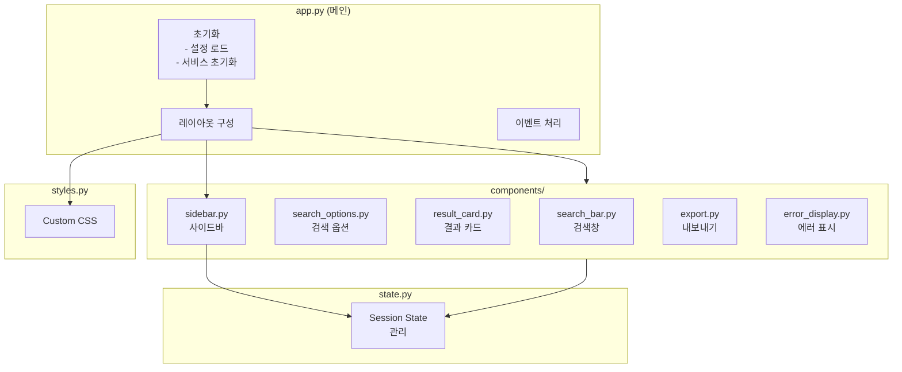

# UI Specification

> **Role**: Technical Lead / Frontend
> **Created**: 2025-12-04
> **Version**: 1.0

---

## 1. UI Architecture

### 1.1 컴포넌트 구조



### 1.2 파일 구조

```
src/bookbrain/ui/
├── __init__.py
├── app.py                    # 메인 앱 진입점
├── state.py                  # Session state 관리
├── styles.py                 # Custom CSS
├── constants.py              # UI 상수
└── components/
    ├── __init__.py
    ├── search_bar.py         # 검색창 컴포넌트
    ├── search_options.py     # 검색 옵션 컴포넌트
    ├── result_card.py        # 결과 카드 컴포넌트
    ├── result_list.py        # 결과 목록 컴포넌트
    ├── sidebar.py            # 사이드바 컴포넌트
    ├── export.py             # 내보내기 컴포넌트
    └── error_display.py      # 에러 표시 컴포넌트
```

---

## 2. Main App (`app.py`)

### 2.1 앱 설정

```python
# ui/app.py

import streamlit as st

from bookbrain.core.config import get_settings
from bookbrain.search.service import SearchService
from bookbrain.storage.chroma_store import ChromaStore
from bookbrain.storage.bm25_index import BM25Index
from bookbrain.ui.state import initialize_state, get_state
from bookbrain.ui.styles import inject_custom_css
from bookbrain.ui.components import (
    render_search_bar,
    render_search_options,
    render_result_list,
    render_sidebar,
)


# 페이지 설정 (반드시 첫 번째 Streamlit 호출)
st.set_page_config(
    page_title="BookBrain",
    page_icon="📚",
    layout="wide",
    initial_sidebar_state="expanded",
    menu_items={
        "Get Help": None,
        "Report a bug": None,
        "About": "BookBrain - Personal Library RAG System v1.0",
    },
)


@st.cache_resource
def get_search_service() -> SearchService:
    """
    검색 서비스 싱글톤

    캐싱:
    - 앱 수명 동안 유지
    - 재시작 시 재초기화
    """
    settings = get_settings()

    # ChromaDB 초기화
    chroma = ChromaStore(settings)
    chroma.initialize()

    # BM25 로드
    bm25 = BM25Index(settings)
    bm25.load()

    return SearchService(settings, chroma, bm25)


def main():
    """메인 앱"""
    # CSS 주입
    inject_custom_css()

    # 상태 초기화
    initialize_state()

    # 서비스 로드
    search_service = get_search_service()

    # 헤더
    render_header()

    # 사이드바
    with st.sidebar:
        sidebar_options = render_sidebar(search_service)

    # 메인 영역
    col1, col2 = st.columns([3, 1])

    with col1:
        # 검색창
        query = render_search_bar()

        # 검색 옵션
        options = render_search_options()

    # 검색 실행
    if query:
        execute_search(search_service, query, options, sidebar_options)


def render_header():
    """헤더 렌더링"""
    st.title("📚 BookBrain")
    st.caption("개인 장서 시맨틱 검색")


async def execute_search(
    service: SearchService,
    query: str,
    options: dict,
    sidebar_options: dict,
):
    """검색 실행 및 결과 표시"""
    from bookbrain.models.search import SearchQuery, SearchMode

    state = get_state()

    # 검색 쿼리 구성
    search_query = SearchQuery(
        text=query,
        mode=SearchMode(options["mode"]),
        top_k=options["top_k"],
        book_filter=sidebar_options.get("book_filter"),
        vector_weight=options.get("vector_weight", 0.5),
    )

    # 검색 실행
    with st.spinner("검색 중..."):
        try:
            response = await service.search(search_query)
            state.current_results = response
            state.add_to_history(query)
            state.error_message = None

        except Exception as e:
            state.error_message = str(e)
            state.current_results = None

    # 결과 표시
    if state.error_message:
        render_error(state.error_message)
    elif state.current_results:
        render_result_list(state.current_results, query)
    else:
        st.info("검색어를 입력하세요.")


def render_error(message: str):
    """에러 표시"""
    st.error(f"⚠️ 검색 중 오류가 발생했습니다: {message}")
    if st.button("🔄 다시 시도"):
        st.rerun()


if __name__ == "__main__":
    import asyncio
    asyncio.run(main())
```

---

## 3. State Management (`state.py`)

### 3.1 상태 클래스

```python
# ui/state.py

from dataclasses import dataclass, field
from typing import Optional, Any
from datetime import datetime

import streamlit as st

from bookbrain.models.search import SearchResponse


@dataclass
class AppState:
    """애플리케이션 상태"""

    # === 검색 상태 ===
    current_query: str = ""
    current_results: Optional[SearchResponse] = None
    is_searching: bool = False

    # === 검색 옵션 ===
    search_mode: str = "hybrid"
    top_k: int = 10
    vector_weight: float = 0.5

    # === 필터 ===
    selected_books: list[str] = field(default_factory=list)

    # === 히스토리 ===
    search_history: list[dict] = field(default_factory=list)
    max_history: int = 20

    # === UI 상태 ===
    show_scores: bool = False
    show_full_text: bool = False
    error_message: Optional[str] = None

    # === 통계 캐시 ===
    library_stats: Optional[dict] = None
    stats_updated_at: Optional[datetime] = None

    def add_to_history(self, query: str) -> None:
        """검색 히스토리에 추가"""
        entry = {
            "query": query,
            "timestamp": datetime.now().isoformat(),
            "results_count": len(self.current_results.results) if self.current_results else 0,
        }

        # 중복 제거
        self.search_history = [
            h for h in self.search_history
            if h["query"] != query
        ]

        # 앞에 추가
        self.search_history.insert(0, entry)

        # 최대 개수 유지
        self.search_history = self.search_history[:self.max_history]

    def clear_results(self) -> None:
        """결과 초기화"""
        self.current_results = None
        self.error_message = None

    def get_recent_queries(self, limit: int = 5) -> list[str]:
        """최근 검색어 목록"""
        return [h["query"] for h in self.search_history[:limit]]


def initialize_state() -> None:
    """세션 상태 초기화"""
    if "app_state" not in st.session_state:
        st.session_state.app_state = AppState()


def get_state() -> AppState:
    """현재 상태 가져오기"""
    if "app_state" not in st.session_state:
        initialize_state()
    return st.session_state.app_state


def update_state(**kwargs) -> None:
    """상태 업데이트"""
    state = get_state()
    for key, value in kwargs.items():
        if hasattr(state, key):
            setattr(state, key, value)
```

---

## 4. Components

### 4.1 Search Bar (`components/search_bar.py`)

```python
# ui/components/search_bar.py

import streamlit as st
from typing import Optional

from bookbrain.ui.state import get_state


def render_search_bar() -> Optional[str]:
    """
    검색창 컴포넌트

    Returns:
        입력된 검색어 또는 None
    """
    state = get_state()

    # 컨테이너
    container = st.container()

    with container:
        # 검색 입력 행
        col1, col2 = st.columns([6, 1])

        with col1:
            query = st.text_input(
                label="검색어",
                value=state.current_query,
                placeholder="예: 스트림 API 사용법, Spring Security 인증 설정",
                label_visibility="collapsed",
                key="search_input",
                on_change=_on_query_change,
            )

        with col2:
            search_clicked = st.button(
                "🔍 검색",
                use_container_width=True,
                type="primary",
            )

        # 검색 실행 조건
        should_search = False

        if search_clicked and query:
            should_search = True

        # Enter 키 감지 (query가 변경되고 이전과 다른 경우)
        if query and query != state.current_query:
            state.current_query = query
            should_search = True

        if should_search:
            return query

    return None


def _on_query_change():
    """검색어 변경 핸들러"""
    state = get_state()
    state.clear_results()


def render_search_suggestions() -> Optional[str]:
    """
    검색 제안 표시

    Returns:
        선택된 제안 검색어 또는 None
    """
    state = get_state()
    recent = state.get_recent_queries(5)

    if not recent:
        return None

    st.caption("최근 검색:")

    cols = st.columns(len(recent))
    for i, query in enumerate(recent):
        with cols[i]:
            if st.button(
                query,
                key=f"suggestion_{i}",
                use_container_width=True,
            ):
                return query

    return None
```

### 4.2 Search Options (`components/search_options.py`)

```python
# ui/components/search_options.py

import streamlit as st
from typing import TypedDict

from bookbrain.ui.state import get_state


class SearchOptions(TypedDict):
    """검색 옵션"""
    mode: str
    top_k: int
    vector_weight: float


def render_search_options() -> SearchOptions:
    """
    검색 옵션 컴포넌트

    Returns:
        검색 옵션 딕셔너리
    """
    state = get_state()

    with st.expander("🔧 검색 옵션", expanded=False):
        col1, col2, col3 = st.columns(3)

        with col1:
            mode = st.selectbox(
                "검색 모드",
                options=["hybrid", "vector", "keyword"],
                index=["hybrid", "vector", "keyword"].index(state.search_mode),
                format_func=lambda x: {
                    "hybrid": "🔀 하이브리드 (추천)",
                    "vector": "🧠 의미 검색",
                    "keyword": "🔤 키워드 검색",
                }[x],
                help="""
                - 하이브리드: 의미 + 키워드 결합 (기본값, 대부분의 경우 최적)
                - 의미 검색: 유사한 개념 찾기 (예: "자바 함수형 프로그래밍")
                - 키워드 검색: 정확한 용어 찾기 (예: "map() 메서드")
                """,
                key="search_mode_select",
            )

        with col2:
            top_k = st.slider(
                "결과 개수",
                min_value=5,
                max_value=50,
                value=state.top_k,
                step=5,
                help="표시할 검색 결과 수",
                key="top_k_slider",
            )

        with col3:
            vector_weight = st.slider(
                "의미 검색 비중",
                min_value=0.0,
                max_value=1.0,
                value=state.vector_weight,
                step=0.1,
                help="하이브리드 검색 시 의미 검색의 가중치 (1.0 = 의미 검색만)",
                disabled=mode != "hybrid",
                key="vector_weight_slider",
            )

        # 고급 옵션
        with st.container():
            col_a, col_b = st.columns(2)

            with col_a:
                show_scores = st.checkbox(
                    "점수 상세 표시",
                    value=state.show_scores,
                    key="show_scores_check",
                )

            with col_b:
                show_full = st.checkbox(
                    "전체 텍스트 표시",
                    value=state.show_full_text,
                    key="show_full_check",
                )

        # 상태 업데이트
        state.search_mode = mode
        state.top_k = top_k
        state.vector_weight = vector_weight
        state.show_scores = show_scores
        state.show_full_text = show_full

    return SearchOptions(
        mode=mode,
        top_k=top_k,
        vector_weight=vector_weight,
    )
```

### 4.3 Result Card (`components/result_card.py`)

```python
# ui/components/result_card.py

import streamlit as st
from typing import Optional

from bookbrain.models.search import SearchResult
from bookbrain.ui.state import get_state


def render_result_card(
    result: SearchResult,
    rank: int,
    query: str,
) -> None:
    """
    검색 결과 카드 렌더링

    Args:
        result: 검색 결과
        rank: 순위 (1부터)
        query: 원본 검색어 (하이라이트용)
    """
    state = get_state()

    with st.container():
        # 카드 컨테이너
        st.markdown(
            f"""
            <div class="result-card" data-rank="{rank}">
            """,
            unsafe_allow_html=True,
        )

        # 헤더: 순위 + 책 제목
        col_title, col_score = st.columns([5, 1])

        with col_title:
            st.markdown(f"### {rank}. 📖 {result.book_title}")

        with col_score:
            score_display = f"{result.score:.3f}"
            st.metric(label="Score", value=score_display, label_visibility="collapsed")

        # 출처 정보
        chapter_str = f" > {result.chapter}" if result.chapter else ""
        page_str = f"p.{result.page_start}"
        if result.page_end != result.page_start:
            page_str = f"p.{result.page_start}-{result.page_end}"

        st.caption(f"📍 {chapter_str} | {page_str}")

        st.divider()

        # 본문 (하이라이트 적용)
        if state.show_full_text:
            content = result.text
        else:
            content = result.highlighted_text or result.text[:500]

        st.markdown(content, unsafe_allow_html=True)

        # 점수 상세 (선택적)
        if state.show_scores:
            render_score_breakdown(result)

        # 액션 버튼
        render_card_actions(result, rank)

        st.markdown("</div>", unsafe_allow_html=True)
        st.markdown("---")


def render_score_breakdown(result: SearchResult) -> None:
    """점수 상세 표시"""
    with st.expander("📊 점수 상세", expanded=False):
        cols = st.columns(3)

        with cols[0]:
            st.metric(
                label="Total",
                value=f"{result.score:.4f}",
            )

        with cols[1]:
            if result.score_vector is not None:
                rank_str = f"(#{result.rank_vector})" if result.rank_vector else ""
                st.metric(
                    label=f"Vector {rank_str}",
                    value=f"{result.score_vector:.4f}",
                )
            else:
                st.metric(label="Vector", value="-")

        with cols[2]:
            if result.score_bm25 is not None:
                rank_str = f"(#{result.rank_bm25})" if result.rank_bm25 else ""
                st.metric(
                    label=f"BM25 {rank_str}",
                    value=f"{result.score_bm25:.4f}",
                )
            else:
                st.metric(label="BM25", value="-")


def render_card_actions(result: SearchResult, rank: int) -> None:
    """카드 액션 버튼"""
    col1, col2, col3 = st.columns([1, 1, 4])

    with col1:
        if st.button("📋 복사", key=f"copy_{rank}"):
            _copy_to_clipboard(result)
            st.toast("클립보드에 복사되었습니다!")

    with col2:
        if st.button("📄 전체", key=f"full_{rank}"):
            _show_full_modal(result)


def _copy_to_clipboard(result: SearchResult) -> None:
    """클립보드 복사"""
    import pyperclip

    text = f"""
## {result.book_title}
{result.chapter or ""} | p.{result.page_start}

> {result.text}
""".strip()

    try:
        pyperclip.copy(text)
    except Exception:
        pass  # 클립보드 접근 실패 시 무시


def _show_full_modal(result: SearchResult) -> None:
    """전체 텍스트 모달"""
    # Streamlit은 모달을 직접 지원하지 않음
    # dialog 또는 expander 사용
    st.session_state[f"show_full_{result.chunk_id}"] = True
```

### 4.4 Result List (`components/result_list.py`)

```python
# ui/components/result_list.py

import streamlit as st

from bookbrain.models.search import SearchResponse
from bookbrain.ui.components.result_card import render_result_card


def render_result_list(
    response: SearchResponse,
    query: str,
) -> None:
    """
    검색 결과 목록 렌더링

    Args:
        response: 검색 응답
        query: 원본 검색어
    """
    # 결과 요약
    render_result_summary(response)

    # 결과가 없는 경우
    if not response.results:
        render_no_results(query)
        return

    # 결과 카드 목록
    for rank, result in enumerate(response.results, 1):
        render_result_card(result, rank, query)

    # 더 보기 (페이지네이션)
    if len(response.results) < response.total_found:
        render_load_more(response)


def render_result_summary(response: SearchResponse) -> None:
    """결과 요약 표시"""
    col1, col2, col3 = st.columns([2, 1, 1])

    with col1:
        st.markdown(
            f"📊 **{response.total_found}개** 결과 "
            f"({response.search_time_ms:.0f}ms)"
        )

    with col2:
        mode_labels = {
            "hybrid": "하이브리드",
            "vector": "의미 검색",
            "keyword": "키워드",
        }
        st.caption(f"모드: {mode_labels.get(response.query.mode.value, response.query.mode.value)}")

    with col3:
        st.caption(f"Top-{response.query.top_k}")


def render_no_results(query: str) -> None:
    """결과 없음 표시"""
    st.warning("🔍 검색 결과가 없습니다")

    st.info(f"""
    **검색어**: {query}

    다음을 시도해보세요:
    - 다른 키워드로 검색
    - 검색 모드를 "하이브리드"로 변경
    - 책 필터를 해제
    - 더 일반적인 용어 사용
    """)

    # 관련 검색어 제안 (향후 구현)
    # render_suggestions(query)


def render_load_more(response: SearchResponse) -> None:
    """
    더 보기 버튼

    Note (v1.1 개선 고려):
        현재 구현은 top_k를 늘려서 재검색하므로 st.rerun() 시
        스크롤이 맨 위로 이동하는 UX 이슈가 있습니다.

        개선 방안:
        1. st.session_state에 기존 결과를 저장하고, 추가 결과만 append
        2. st.components.v1.html로 스크롤 위치 유지 스크립트 삽입
        3. 무한 스크롤 대신 "페이지 1, 2, 3..." 방식으로 변경

        v1.0에서는 단순 재검색 방식으로 구현하고,
        v1.1에서 UX 개선을 진행합니다.
    """
    remaining = response.total_found - len(response.results)

    if st.button(f"➕ 더 보기 ({remaining}개 남음)"):
        # 페이지네이션 구현
        # 현재는 top_k를 늘려서 재검색 (v1.1에서 UX 개선 예정)
        state = get_state()
        state.top_k = min(state.top_k + 10, 50)
        st.rerun()
```

### 4.5 Sidebar (`components/sidebar.py`)

```python
# ui/components/sidebar.py

import streamlit as st
from typing import TypedDict

from bookbrain.search.service import SearchService
from bookbrain.ui.state import get_state


class SidebarOptions(TypedDict):
    """사이드바 옵션"""
    book_filter: list[str] | None


def render_sidebar(service: SearchService) -> SidebarOptions:
    """
    사이드바 렌더링

    Args:
        service: 검색 서비스 (통계 조회용)

    Returns:
        사이드바 옵션
    """
    state = get_state()

    # 라이브러리 통계
    render_library_stats(service)

    st.divider()

    # 책 필터
    book_filter = render_book_filter(service)

    st.divider()

    # 최근 검색
    render_recent_searches()

    st.divider()

    # 앱 정보
    render_app_info()

    return SidebarOptions(book_filter=book_filter)


def render_library_stats(service: SearchService) -> None:
    """라이브러리 통계"""
    st.header("📊 라이브러리")

    # 캐시된 통계 사용
    stats = _get_cached_stats(service)

    col1, col2 = st.columns(2)
    with col1:
        st.metric("총 책", f"{stats['total_books']}권")
    with col2:
        st.metric("총 청크", f"{stats['total_chunks']:,}개")

    # 갱신 버튼
    if st.button("🔄 새로고침", key="refresh_stats"):
        _invalidate_stats_cache()
        st.rerun()


def render_book_filter(service: SearchService) -> list[str] | None:
    """책 필터"""
    st.header("🔖 책 필터")

    stats = _get_cached_stats(service)
    books = stats.get("books", [])

    if not books:
        st.caption("등록된 책이 없습니다")
        return None

    # 책 목록 (청크 수 표시)
    book_options = {
        b["id"]: f"{b['title']} ({b['chunks']})"
        for b in books
    }

    selected = st.multiselect(
        "검색할 책 선택",
        options=list(book_options.keys()),
        format_func=lambda x: book_options[x],
        placeholder="전체 책에서 검색",
        key="book_filter_select",
    )

    if selected:
        st.caption(f"{len(selected)}권 선택됨")
        return selected

    return None


def render_recent_searches() -> None:
    """최근 검색"""
    st.header("🕐 최근 검색")

    state = get_state()
    recent = state.get_recent_queries(5)

    if not recent:
        st.caption("검색 기록이 없습니다")
        return

    for query in recent:
        if st.button(
            f"🔍 {query}",
            key=f"recent_{hash(query)}",
            use_container_width=True,
        ):
            state.current_query = query
            st.rerun()

    # 기록 삭제
    if st.button("🗑️ 기록 삭제", key="clear_history"):
        state.search_history = []
        st.rerun()


def render_app_info() -> None:
    """앱 정보"""
    st.caption("""
    ---
    **BookBrain** v1.0

    개인 장서 시맨틱 검색
    """)


@st.cache_data(ttl=300)  # 5분 캐시
def _get_cached_stats(_service: SearchService) -> dict:
    """캐시된 통계"""
    return _service.get_stats()


def _invalidate_stats_cache() -> None:
    """통계 캐시 무효화"""
    _get_cached_stats.clear()
```

### 4.6 Export (`components/export.py`)

```python
# ui/components/export.py

import streamlit as st
from datetime import datetime

from bookbrain.models.search import SearchResponse


def render_export_button(response: SearchResponse, query: str) -> None:
    """
    내보내기 버튼

    Args:
        response: 검색 응답
        query: 원본 검색어
    """
    col1, col2 = st.columns([1, 1])

    with col1:
        if st.button("📋 마크다운 복사", key="export_copy"):
            markdown = _generate_markdown(response, query)
            _copy_to_clipboard(markdown)
            st.toast("마크다운이 복사되었습니다!")

    with col2:
        markdown = _generate_markdown(response, query)
        st.download_button(
            label="💾 파일 저장",
            data=markdown,
            file_name=f"bookbrain_search_{datetime.now().strftime('%Y%m%d_%H%M%S')}.md",
            mime="text/markdown",
            key="export_download",
        )


def _generate_markdown(response: SearchResponse, query: str) -> str:
    """마크다운 생성"""
    lines = [
        f"# 검색 결과: \"{query}\"",
        "",
        f"검색 시간: {datetime.now().strftime('%Y-%m-%d %H:%M:%S')}",
        f"결과 수: {len(response.results)}개",
        f"검색 모드: {response.query.mode.value}",
        "",
        "---",
        "",
    ]

    for i, result in enumerate(response.results, 1):
        page_str = f"p.{result.page_start}"
        if result.page_end != result.page_start:
            page_str = f"p.{result.page_start}-{result.page_end}"

        lines.extend([
            f"## {i}. {result.book_title}",
            f"*{result.chapter or ''}* | {page_str}",
            "",
            f"> {result.text}",
            "",
            f"점수: {result.score:.4f}",
            "",
            "---",
            "",
        ])

    lines.append("*BookBrain으로 검색됨*")

    return "\n".join(lines)


def _copy_to_clipboard(text: str) -> None:
    """클립보드 복사"""
    try:
        import pyperclip
        pyperclip.copy(text)
    except Exception:
        pass
```

---

## 5. Styles (`styles.py`)

### 5.1 Custom CSS

```python
# ui/styles.py

import streamlit as st


def inject_custom_css() -> None:
    """커스텀 CSS 주입"""
    st.markdown(CUSTOM_CSS, unsafe_allow_html=True)


CUSTOM_CSS = """
<style>
/* === 전역 스타일 === */

/* 폰트 설정 */
@import url('https://fonts.googleapis.com/css2?family=Noto+Sans+KR:wght@400;500;700&display=swap');

html, body, [class*="css"] {
    font-family: 'Noto Sans KR', sans-serif;
}

/* === 검색 결과 카드 === */

.result-card {
    padding: 1.5rem;
    border-radius: 12px;
    background: var(--background-color);
    border: 1px solid var(--secondary-background-color);
    margin-bottom: 1rem;
    transition: box-shadow 0.2s ease;
}

.result-card:hover {
    box-shadow: 0 4px 12px rgba(0, 0, 0, 0.1);
}

/* 라이트 모드 */
@media (prefers-color-scheme: light) {
    .result-card {
        background: #ffffff;
        border-color: #e0e0e0;
    }
}

/* 다크 모드 */
@media (prefers-color-scheme: dark) {
    .result-card {
        background: #1e1e1e;
        border-color: #333333;
    }
}

/* === 하이라이트 === */

mark, .highlight {
    background-color: #fef08a;
    padding: 0 4px;
    border-radius: 3px;
    color: inherit;
}

/* 다크 모드 하이라이트 */
@media (prefers-color-scheme: dark) {
    mark, .highlight {
        background-color: #854d0e;
        color: #fef9c3;
    }
}

/* === 검색창 === */

.stTextInput > div > div > input {
    font-size: 1.1rem;
    padding: 0.75rem 1rem;
    border-radius: 8px;
}

.stTextInput > div > div > input:focus {
    border-color: #3b82f6;
    box-shadow: 0 0 0 3px rgba(59, 130, 246, 0.1);
}

/* === 버튼 === */

.stButton > button {
    border-radius: 8px;
    font-weight: 500;
    transition: all 0.2s ease;
}

.stButton > button:hover {
    transform: translateY(-1px);
}

/* Primary 버튼 */
.stButton > button[kind="primary"] {
    background: linear-gradient(135deg, #3b82f6, #2563eb);
    border: none;
}

/* === 메트릭 === */

.stMetric {
    background: var(--secondary-background-color);
    padding: 1rem;
    border-radius: 8px;
}

/* === 사이드바 === */

.css-1d391kg {
    padding: 1.5rem;
}

.css-1d391kg .stButton > button {
    width: 100%;
    justify-content: flex-start;
}

/* === 코드 블록 === */

.stMarkdown code {
    background: #f1f5f9;
    padding: 0.2rem 0.4rem;
    border-radius: 4px;
    font-size: 0.9em;
}

@media (prefers-color-scheme: dark) {
    .stMarkdown code {
        background: #334155;
    }
}

/* === 인용구 === */

.stMarkdown blockquote {
    border-left: 4px solid #3b82f6;
    padding-left: 1rem;
    margin-left: 0;
    color: #64748b;
}

/* === 점수 배지 === */

.score-badge {
    display: inline-block;
    padding: 0.25rem 0.5rem;
    border-radius: 9999px;
    font-size: 0.75rem;
    font-weight: 500;
}

.score-high {
    background: #dcfce7;
    color: #166534;
}

.score-medium {
    background: #fef9c3;
    color: #854d0e;
}

.score-low {
    background: #fee2e2;
    color: #991b1b;
}

/* === 반응형 === */

@media (max-width: 768px) {
    .result-card {
        padding: 1rem;
    }

    .stTextInput > div > div > input {
        font-size: 1rem;
    }
}

/* === 스피너 === */

.stSpinner > div {
    border-color: #3b82f6 transparent transparent transparent;
}

/* === 애니메이션 === */

@keyframes fadeIn {
    from { opacity: 0; transform: translateY(10px); }
    to { opacity: 1; transform: translateY(0); }
}

.result-card {
    animation: fadeIn 0.3s ease-out;
}

/* === 스크롤바 === */

::-webkit-scrollbar {
    width: 8px;
    height: 8px;
}

::-webkit-scrollbar-track {
    background: transparent;
}

::-webkit-scrollbar-thumb {
    background: #cbd5e1;
    border-radius: 4px;
}

::-webkit-scrollbar-thumb:hover {
    background: #94a3b8;
}
</style>
"""
```

---

## 6. Constants (`constants.py`)

```python
# ui/constants.py

from enum import Enum


class UITheme(str, Enum):
    """UI 테마"""
    LIGHT = "light"
    DARK = "dark"
    AUTO = "auto"


# 페이지 설정
PAGE_CONFIG = {
    "title": "BookBrain",
    "icon": "📚",
    "layout": "wide",
}

# 기본값
DEFAULTS = {
    "search_mode": "hybrid",
    "top_k": 10,
    "vector_weight": 0.5,
    "max_history": 20,
    "snippet_length": 500,
}

# 검색 모드 라벨
SEARCH_MODE_LABELS = {
    "hybrid": "🔀 하이브리드",
    "vector": "🧠 의미 검색",
    "keyword": "🔤 키워드 검색",
}

# 점수 임계값
SCORE_THRESHOLDS = {
    "high": 0.7,
    "medium": 0.4,
}

# 에러 메시지
ERROR_MESSAGES = {
    "empty_query": "검색어를 입력하세요.",
    "no_results": "검색 결과가 없습니다.",
    "api_error": "검색 중 오류가 발생했습니다.",
    "timeout": "검색 시간이 초과되었습니다.",
}

# 도움말 텍스트
HELP_TEXTS = {
    "search_mode": """
    - **하이브리드**: 의미 검색과 키워드 검색을 결합 (추천)
    - **의미 검색**: 유사한 개념과 맥락 찾기
    - **키워드 검색**: 정확한 단어 매칭
    """,
    "vector_weight": """
    하이브리드 검색에서 의미 검색의 비중을 조절합니다.
    - 0.0: 키워드 검색만
    - 0.5: 균형 (기본값)
    - 1.0: 의미 검색만
    """,
    "book_filter": """
    특정 책에서만 검색하려면 선택하세요.
    선택하지 않으면 모든 책에서 검색합니다.
    """,
}
```

---

## 7. Responsive Layout

### 7.1 화면 크기별 레이아웃

| 화면 크기 | 레이아웃 | 사이드바 |
|----------|---------|---------|
| Desktop (>1200px) | Wide, 3:1 비율 | 확장 |
| Tablet (768-1200px) | Wide, 2:1 비율 | 축소 가능 |
| Mobile (<768px) | Full width | 숨김 (햄버거 메뉴) |

### 7.2 반응형 구현

```python
def get_responsive_columns():
    """화면 크기에 따른 컬럼 비율"""
    # Streamlit은 자동 반응형
    # CSS로 추가 조정
    return st.columns([3, 1])
```

---

## 8. Accessibility

### 8.1 접근성 요구사항

| 항목 | 구현 |
|------|------|
| 키보드 네비게이션 | Tab 순서, Enter 검색 |
| 색상 대비 | WCAG AA 준수 |
| 스크린 리더 | aria-label 속성 |
| 포커스 표시 | 명확한 포커스 링 |

### 8.2 키보드 단축키

| 단축키 | 동작 |
|--------|------|
| `/` | 검색창 포커스 |
| `Enter` | 검색 실행 |
| `Esc` | 검색창 클리어 |
| `↑/↓` | 결과 탐색 (향후) |

---

## 9. Performance

### 9.1 최적화 전략

| 대상 | 전략 |
|------|------|
| 초기 로딩 | `@st.cache_resource` 서비스 |
| 검색 결과 | `@st.cache_data(ttl=60)` |
| 라이브러리 통계 | `@st.cache_data(ttl=300)` |
| 이미지 | 사용 안 함 (텍스트 기반) |

### 9.2 Lazy Loading

```python
def render_result_list_lazy(results: list, batch_size: int = 10):
    """
    결과 지연 로딩

    첫 batch_size개만 렌더링하고,
    "더 보기" 버튼으로 추가 로드
    """
    state = get_state()
    visible_count = state.get("visible_results", batch_size)

    for i, result in enumerate(results[:visible_count]):
        render_result_card(result, i + 1, state.current_query)

    if visible_count < len(results):
        if st.button("더 보기"):
            state["visible_results"] = visible_count + batch_size
            st.rerun()
```

