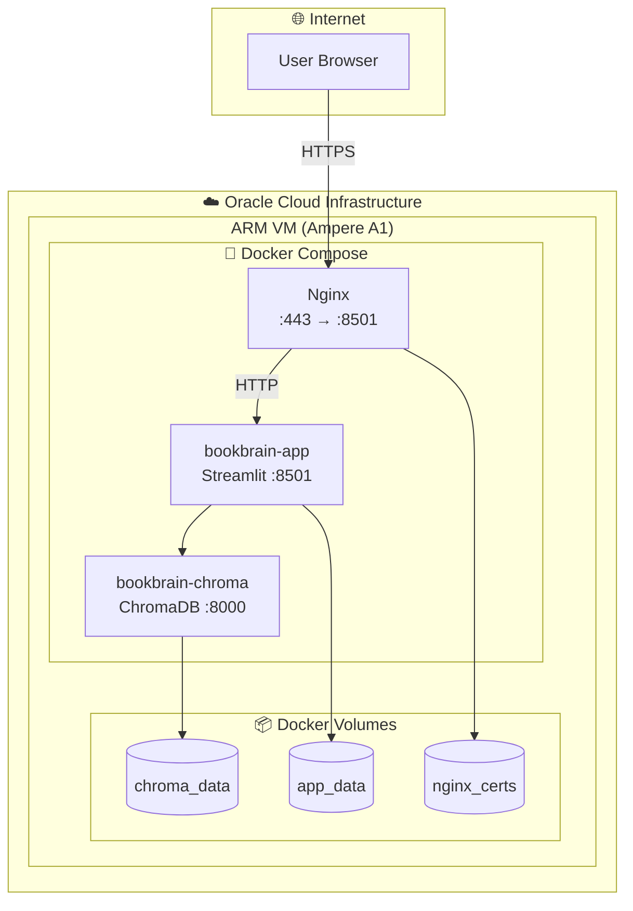

# Deployment Specification

> **Role**: DevOps / Infrastructure
> **Created**: 2025-12-04
> **Version**: 1.0

---

## 1. Deployment Overview

### 1.1 배포 아키텍처



### 1.2 인프라 요구사항

| 항목 | 최소 | 권장 |
|------|------|------|
| CPU | 2 vCPU | 4 vCPU |
| RAM | 8 GB | 16 GB |
| Storage | 50 GB | 100 GB |
| OS | Ubuntu 22.04 LTS | Ubuntu 24.04 LTS |
| Docker | 24.0+ | 25.0+ |

---

## 2. Docker Configuration

### 2.1 Dockerfile

```dockerfile
# Dockerfile

# ============ Builder Stage ============
FROM python:3.12-slim as builder

WORKDIR /app

# 시스템 의존성
RUN apt-get update && apt-get install -y --no-install-recommends \
    build-essential \
    curl \
    && rm -rf /var/lib/apt/lists/*

# Poetry 설치
ENV POETRY_HOME="/opt/poetry"
ENV PATH="$POETRY_HOME/bin:$PATH"
RUN curl -sSL https://install.python-poetry.org | python3 -

# 의존성 설치
COPY pyproject.toml poetry.lock ./
RUN poetry config virtualenvs.create false \
    && poetry install --no-interaction --no-ansi --only main

# ============ Runtime Stage ============
FROM python:3.12-slim as runtime

WORKDIR /app

# 런타임 의존성만
RUN apt-get update && apt-get install -y --no-install-recommends \
    curl \
    && rm -rf /var/lib/apt/lists/*

# 파이썬 패키지 복사
COPY --from=builder /usr/local/lib/python3.12/site-packages /usr/local/lib/python3.12/site-packages
COPY --from=builder /usr/local/bin /usr/local/bin

# 앱 코드 복사
COPY src/ ./src/

# 환경 변수
ENV PYTHONUNBUFFERED=1
ENV PYTHONDONTWRITEBYTECODE=1
ENV PYTHONPATH=/app/src

# 데이터 디렉토리
VOLUME ["/app/data"]

# 포트
EXPOSE 8501

# 헬스체크
HEALTHCHECK --interval=30s --timeout=10s --start-period=5s --retries=3 \
    CMD curl -f http://localhost:8501/_stcore/health || exit 1

# 실행
CMD ["python", "-m", "streamlit", "run", "src/bookbrain/ui/app.py", \
     "--server.address", "0.0.0.0", \
     "--server.port", "8501", \
     "--server.headless", "true"]
```

### 2.2 Docker Compose

```yaml
# docker-compose.yml

version: "3.9"

services:
  # ============ Nginx Reverse Proxy ============
  nginx:
    image: nginx:1.25-alpine
    container_name: bookbrain-nginx
    restart: unless-stopped
    ports:
      - "80:80"
      - "443:443"
    volumes:
      - ./nginx/nginx.conf:/etc/nginx/nginx.conf:ro
      - ./nginx/conf.d:/etc/nginx/conf.d:ro
      - nginx_certs:/etc/letsencrypt:ro
      - nginx_www:/var/www/certbot:ro
    depends_on:
      - app
    networks:
      - bookbrain-net
    healthcheck:
      test: ["CMD", "nginx", "-t"]
      interval: 30s
      timeout: 10s
      retries: 3

  # ============ Certbot (SSL) ============
  certbot:
    image: certbot/certbot:latest
    container_name: bookbrain-certbot
    volumes:
      - nginx_certs:/etc/letsencrypt
      - nginx_www:/var/www/certbot
    entrypoint: "/bin/sh -c 'trap exit TERM; while :; do certbot renew; sleep 12h & wait $${!}; done;'"

  # ============ Main Application ============
  app:
    build:
      context: .
      dockerfile: Dockerfile
    image: bookbrain:latest
    container_name: bookbrain-app
    restart: unless-stopped
    environment:
      - STORM_API_KEY=${STORM_API_KEY}
      - OPENAI_API_KEY=${OPENAI_API_KEY}
      - DATA_DIR=/app/data
      - CHROMA_HOST=chroma
      - CHROMA_PORT=8000
      - LOG_LEVEL=INFO
    volumes:
      - app_data:/app/data
    depends_on:
      chroma:
        condition: service_healthy
    networks:
      - bookbrain-net
    healthcheck:
      test: ["CMD", "curl", "-f", "http://localhost:8501/_stcore/health"]
      interval: 30s
      timeout: 10s
      start_period: 30s
      retries: 3

  # ============ ChromaDB ============
  chroma:
    image: chromadb/chroma:0.5.20
    container_name: bookbrain-chroma
    restart: unless-stopped
    environment:
      - IS_PERSISTENT=TRUE
      - PERSIST_DIRECTORY=/chroma/chroma
      - ANONYMIZED_TELEMETRY=FALSE
      - ALLOW_RESET=FALSE
    volumes:
      - chroma_data:/chroma/chroma
    networks:
      - bookbrain-net
    healthcheck:
      test: ["CMD", "curl", "-f", "http://localhost:8000/api/v1/heartbeat"]
      interval: 30s
      timeout: 10s
      start_period: 10s
      retries: 3

networks:
  bookbrain-net:
    driver: bridge

volumes:
  app_data:
    driver: local
  chroma_data:
    driver: local
  nginx_certs:
    driver: local
  nginx_www:
    driver: local
```

### 2.3 Nginx Configuration

```nginx
# nginx/nginx.conf

user nginx;
worker_processes auto;
error_log /var/log/nginx/error.log warn;
pid /var/run/nginx.pid;

events {
    worker_connections 1024;
    multi_accept on;
}

http {
    include /etc/nginx/mime.types;
    default_type application/octet-stream;

    # 로깅
    log_format main '$remote_addr - $remote_user [$time_local] "$request" '
                    '$status $body_bytes_sent "$http_referer" '
                    '"$http_user_agent" "$http_x_forwarded_for"';
    access_log /var/log/nginx/access.log main;

    # 성능 설정
    sendfile on;
    tcp_nopush on;
    tcp_nodelay on;
    keepalive_timeout 65;
    types_hash_max_size 2048;

    # Gzip 압축
    gzip on;
    gzip_vary on;
    gzip_proxied any;
    gzip_comp_level 6;
    gzip_types text/plain text/css text/xml application/json application/javascript application/xml;

    # 보안 헤더
    add_header X-Frame-Options "SAMEORIGIN" always;
    add_header X-Content-Type-Options "nosniff" always;
    add_header X-XSS-Protection "1; mode=block" always;
    add_header Referrer-Policy "strict-origin-when-cross-origin" always;

    # Rate Limiting
    limit_req_zone $binary_remote_addr zone=general:10m rate=10r/s;

    # 파일 업로드 제한 (PDF 최대 100MB)
    client_max_body_size 100M;

    include /etc/nginx/conf.d/*.conf;
}
```

```nginx
# nginx/conf.d/bookbrain.conf

# HTTP → HTTPS 리다이렉트
server {
    listen 80;
    server_name bookbrain.example.com;

    # Let's Encrypt 인증
    location /.well-known/acme-challenge/ {
        root /var/www/certbot;
    }

    location / {
        return 301 https://$host$request_uri;
    }
}

# HTTPS 서버
server {
    listen 443 ssl http2;
    server_name bookbrain.example.com;

    # SSL 인증서
    ssl_certificate /etc/letsencrypt/live/bookbrain.example.com/fullchain.pem;
    ssl_certificate_key /etc/letsencrypt/live/bookbrain.example.com/privkey.pem;

    # SSL 설정 (Mozilla Modern)
    ssl_protocols TLSv1.3;
    ssl_prefer_server_ciphers off;
    ssl_session_timeout 1d;
    ssl_session_cache shared:SSL:10m;
    ssl_session_tickets off;

    # HSTS
    add_header Strict-Transport-Security "max-age=63072000" always;

    # Basic Auth
    auth_basic "BookBrain";
    auth_basic_user_file /etc/nginx/.htpasswd;

    # Rate Limiting
    limit_req zone=general burst=20 nodelay;

    # 프록시 설정
    location / {
        proxy_pass http://app:8501;
        proxy_http_version 1.1;

        # WebSocket 지원 (Streamlit)
        proxy_set_header Upgrade $http_upgrade;
        proxy_set_header Connection "upgrade";

        proxy_set_header Host $host;
        proxy_set_header X-Real-IP $remote_addr;
        proxy_set_header X-Forwarded-For $proxy_add_x_forwarded_for;
        proxy_set_header X-Forwarded-Proto $scheme;

        # 타임아웃
        proxy_connect_timeout 60s;
        proxy_send_timeout 60s;
        proxy_read_timeout 60s;

        # 버퍼
        proxy_buffering off;
        proxy_buffer_size 4k;
    }

    # Streamlit WebSocket
    location /_stcore/stream {
        proxy_pass http://app:8501/_stcore/stream;
        proxy_http_version 1.1;
        proxy_set_header Upgrade $http_upgrade;
        proxy_set_header Connection "upgrade";
        proxy_set_header Host $host;
        proxy_read_timeout 86400;
    }

    # 헬스체크 (인증 없이)
    location /health {
        auth_basic off;
        proxy_pass http://app:8501/_stcore/health;
    }
}
```

---

## 3. Oracle Cloud Setup

### 3.1 인스턴스 생성

```bash
# OCI CLI로 인스턴스 생성

# 1. Compartment ID 확인
oci iam compartment list --query "data[].{name:name, id:id}" --output table

# 2. Availability Domain 확인
oci iam availability-domain list --query "data[].name" --output table

# 3. Shape 확인 (Ampere A1)
oci compute shape list \
    --compartment-id $COMPARTMENT_ID \
    --query "data[?contains(name, 'VM.Standard.A1')]" \
    --output table

# 4. Image 확인 (Ubuntu)
oci compute image list \
    --compartment-id $COMPARTMENT_ID \
    --operating-system "Canonical Ubuntu" \
    --query "data[?contains(\"display-name\", '22.04')].{name:\"display-name\", id:id}" \
    --output table

# 5. 인스턴스 생성
oci compute instance launch \
    --compartment-id $COMPARTMENT_ID \
    --availability-domain $AD \
    --shape "VM.Standard.A1.Flex" \
    --shape-config '{"ocpus": 4, "memoryInGBs": 24}' \
    --subnet-id $SUBNET_ID \
    --image-id $IMAGE_ID \
    --display-name "bookbrain" \
    --assign-public-ip true \
    --ssh-authorized-keys-file ~/.ssh/id_rsa.pub
```

### 3.2 Security List 설정

```bash
# 인바운드 규칙 추가

# SSH (22)
oci network security-list update \
    --security-list-id $SECURITY_LIST_ID \
    --ingress-security-rules '[
        {
            "source": "0.0.0.0/0",
            "protocol": "6",
            "tcpOptions": {"destinationPortRange": {"min": 22, "max": 22}}
        },
        {
            "source": "0.0.0.0/0",
            "protocol": "6",
            "tcpOptions": {"destinationPortRange": {"min": 80, "max": 80}}
        },
        {
            "source": "0.0.0.0/0",
            "protocol": "6",
            "tcpOptions": {"destinationPortRange": {"min": 443, "max": 443}}
        }
    ]'
```

### 3.3 서버 초기 설정

```bash
#!/bin/bash
# setup-server.sh

set -e

echo "=== BookBrain Server Setup ==="

# 1. 시스템 업데이트
sudo apt update && sudo apt upgrade -y

# 2. 기본 패키지 설치
sudo apt install -y \
    curl \
    wget \
    git \
    htop \
    vim \
    ufw \
    fail2ban

# 3. Docker 설치
curl -fsSL https://get.docker.com -o get-docker.sh
sudo sh get-docker.sh
sudo usermod -aG docker $USER

# 4. Docker Compose 설치
sudo curl -L "https://github.com/docker/compose/releases/latest/download/docker-compose-$(uname -s)-$(uname -m)" \
    -o /usr/local/bin/docker-compose
sudo chmod +x /usr/local/bin/docker-compose

# 5. 방화벽 설정
sudo ufw default deny incoming
sudo ufw default allow outgoing
sudo ufw allow ssh
sudo ufw allow http
sudo ufw allow https
sudo ufw --force enable

# 6. Fail2ban 설정
sudo systemctl enable fail2ban
sudo systemctl start fail2ban

# 7. 스왑 설정 (메모리 부족 대비)
sudo fallocate -l 4G /swapfile
sudo chmod 600 /swapfile
sudo mkswap /swapfile
sudo swapon /swapfile
echo '/swapfile none swap sw 0 0' | sudo tee -a /etc/fstab

# 8. 앱 디렉토리 생성
sudo mkdir -p /opt/bookbrain
sudo chown $USER:$USER /opt/bookbrain

echo "=== Setup Complete ==="
echo "Please log out and back in for Docker group changes"
```

---

## 4. Deployment Scripts

### 4.1 배포 스크립트

```bash
#!/bin/bash
# deploy.sh

set -e

# 설정
DEPLOY_DIR="/opt/bookbrain"
BACKUP_DIR="/opt/bookbrain/backups"
COMPOSE_FILE="docker-compose.yml"

echo "=== BookBrain Deployment ==="
echo "Timestamp: $(date)"

# 1. 백업
echo "[1/5] Creating backup..."
./scripts/backup.sh

# 2. 코드 업데이트
echo "[2/5] Pulling latest code..."
cd $DEPLOY_DIR
git pull origin main

# 3. 환경 변수 확인
echo "[3/5] Checking environment..."
if [ ! -f .env ]; then
    echo "Error: .env file not found"
    exit 1
fi

# 4. 이미지 빌드
echo "[4/5] Building images..."
docker-compose build --no-cache app

# 5. 서비스 재시작
echo "[5/5] Restarting services..."
docker-compose down
docker-compose up -d

# 헬스체크
echo "Waiting for services..."
sleep 30

if curl -sf http://localhost/health > /dev/null; then
    echo "✅ Deployment successful!"
else
    echo "❌ Health check failed"
    docker-compose logs --tail=50
    exit 1
fi
```

### 4.2 백업 스크립트

```bash
#!/bin/bash
# scripts/backup.sh

set -e

BACKUP_DIR="/opt/bookbrain/backups"
DATE=$(date +%Y%m%d_%H%M%S)
BACKUP_FILE="bookbrain_backup_${DATE}.tar.gz"

# 백업 디렉토리 생성
mkdir -p $BACKUP_DIR

echo "=== BookBrain Backup ==="

# 1. 서비스 일시 중지 (데이터 무결성)
echo "[1/4] Pausing services..."
docker-compose pause chroma

# 2. 볼륨 백업
echo "[2/4] Backing up volumes..."
docker run --rm \
    -v bookbrain_chroma_data:/source:ro \
    -v $BACKUP_DIR:/backup \
    alpine tar -czvf /backup/chroma_${DATE}.tar.gz -C /source .

docker run --rm \
    -v bookbrain_app_data:/source:ro \
    -v $BACKUP_DIR:/backup \
    alpine tar -czvf /backup/app_${DATE}.tar.gz -C /source .

# 3. 서비스 재개
echo "[3/4] Resuming services..."
docker-compose unpause chroma

# 4. 오래된 백업 정리 (30일 이상)
echo "[4/4] Cleaning old backups..."
find $BACKUP_DIR -name "*.tar.gz" -mtime +30 -delete

echo "✅ Backup complete: $BACKUP_DIR"
ls -lh $BACKUP_DIR/*.tar.gz | tail -5
```

### 4.3 복원 스크립트

```bash
#!/bin/bash
# scripts/restore.sh

set -e

if [ -z "$1" ]; then
    echo "Usage: ./restore.sh <backup_date>"
    echo "Example: ./restore.sh 20251204_120000"
    exit 1
fi

BACKUP_DATE=$1
BACKUP_DIR="/opt/bookbrain/backups"

echo "=== BookBrain Restore ==="
echo "Restoring from: $BACKUP_DATE"

# 1. 서비스 중지
echo "[1/4] Stopping services..."
docker-compose down

# 2. ChromaDB 복원
echo "[2/4] Restoring ChromaDB..."
docker run --rm \
    -v bookbrain_chroma_data:/target \
    -v $BACKUP_DIR:/backup:ro \
    alpine sh -c "rm -rf /target/* && tar -xzvf /backup/chroma_${BACKUP_DATE}.tar.gz -C /target"

# 3. App 데이터 복원
echo "[3/4] Restoring app data..."
docker run --rm \
    -v bookbrain_app_data:/target \
    -v $BACKUP_DIR:/backup:ro \
    alpine sh -c "rm -rf /target/* && tar -xzvf /backup/app_${BACKUP_DATE}.tar.gz -C /target"

# 4. 서비스 시작
echo "[4/4] Starting services..."
docker-compose up -d

echo "✅ Restore complete"
```

---

## 5. SSL Certificate

### 5.1 Let's Encrypt 초기 설정

```bash
#!/bin/bash
# scripts/init-ssl.sh

DOMAIN="bookbrain.example.com"
EMAIL="admin@example.com"

# 1. 임시 Nginx 설정 (HTTP만)
cat > nginx/conf.d/temp.conf << 'EOF'
server {
    listen 80;
    server_name _;

    location /.well-known/acme-challenge/ {
        root /var/www/certbot;
    }

    location / {
        return 200 'OK';
    }
}
EOF

# 2. Nginx 시작
docker-compose up -d nginx

# 3. 인증서 발급
docker-compose run --rm certbot certonly \
    --webroot \
    --webroot-path=/var/www/certbot \
    --email $EMAIL \
    --agree-tos \
    --no-eff-email \
    -d $DOMAIN

# 4. 정식 Nginx 설정으로 교체
rm nginx/conf.d/temp.conf
docker-compose restart nginx

echo "✅ SSL certificate installed for $DOMAIN"
```

### 5.2 인증서 갱신 (자동)

```bash
# /etc/cron.d/certbot-renew

0 3 * * * root docker-compose -f /opt/bookbrain/docker-compose.yml run --rm certbot renew --quiet && docker-compose -f /opt/bookbrain/docker-compose.yml exec nginx nginx -s reload
```

---

## 6. Monitoring

### 6.1 헬스체크 스크립트

```bash
#!/bin/bash
# scripts/healthcheck.sh

ENDPOINT="https://bookbrain.example.com/health"
SLACK_WEBHOOK="https://hooks.slack.com/services/xxx"

# 헬스체크 실행
HTTP_STATUS=$(curl -s -o /dev/null -w "%{http_code}" $ENDPOINT)

if [ "$HTTP_STATUS" != "200" ]; then
    # 알림 전송
    curl -X POST -H 'Content-type: application/json' \
        --data "{\"text\":\"🚨 BookBrain Health Check Failed! Status: $HTTP_STATUS\"}" \
        $SLACK_WEBHOOK

    # 재시작 시도
    cd /opt/bookbrain
    docker-compose restart app

    sleep 30

    # 재확인
    HTTP_STATUS=$(curl -s -o /dev/null -w "%{http_code}" $ENDPOINT)
    if [ "$HTTP_STATUS" == "200" ]; then
        curl -X POST -H 'Content-type: application/json' \
            --data "{\"text\":\"✅ BookBrain recovered after restart\"}" \
            $SLACK_WEBHOOK
    fi
fi
```

### 6.2 로그 모니터링

```yaml
# docker-compose.override.yml (로깅)

version: "3.9"

services:
  app:
    logging:
      driver: "json-file"
      options:
        max-size: "100m"
        max-file: "5"

  chroma:
    logging:
      driver: "json-file"
      options:
        max-size: "50m"
        max-file: "3"

  nginx:
    logging:
      driver: "json-file"
      options:
        max-size: "50m"
        max-file: "5"
```

### 6.3 리소스 모니터링

```bash
#!/bin/bash
# scripts/monitor.sh

echo "=== BookBrain Resource Monitor ==="
echo "Timestamp: $(date)"
echo

echo "=== Docker Stats ==="
docker stats --no-stream --format "table {{.Name}}\t{{.CPUPerc}}\t{{.MemUsage}}\t{{.NetIO}}"

echo
echo "=== Disk Usage ==="
df -h /opt/bookbrain

echo
echo "=== Volume Sizes ==="
docker system df -v | grep -E "VOLUME|bookbrain"
```

---

## 7. Environment Variables

### 7.1 `.env` 파일

```bash
# .env

# === API Keys (Required) ===
STORM_API_KEY=your_storm_api_jwt_token
OPENAI_API_KEY=sk-your_openai_api_key

# === Application ===
DATA_DIR=/app/data
LOG_LEVEL=INFO

# === ChromaDB ===
CHROMA_HOST=chroma
CHROMA_PORT=8000

# === Nginx ===
DOMAIN=bookbrain.example.com
SSL_EMAIL=admin@example.com

# === Basic Auth ===
# 생성: htpasswd -nb username password
AUTH_USERNAME=admin
AUTH_PASSWORD_HASH=$apr1$xxxxx$xxxxx

# === Backup ===
BACKUP_RETENTION_DAYS=30
```

### 7.2 환경 변수 검증

```python
# scripts/validate_env.py

import os
import sys

REQUIRED_VARS = [
    "STORM_API_KEY",
    "OPENAI_API_KEY",
]

OPTIONAL_VARS = [
    ("DATA_DIR", "/app/data"),
    ("LOG_LEVEL", "INFO"),
    ("CHROMA_HOST", "chroma"),
    ("CHROMA_PORT", "8000"),
]

def validate():
    errors = []

    for var in REQUIRED_VARS:
        if not os.getenv(var):
            errors.append(f"Missing required: {var}")

    if errors:
        print("❌ Environment validation failed:")
        for e in errors:
            print(f"  - {e}")
        sys.exit(1)

    print("✅ Environment validation passed")

    print("\nCurrent configuration:")
    for var in REQUIRED_VARS:
        val = os.getenv(var, "")
        masked = val[:4] + "*" * (len(val) - 8) + val[-4:] if len(val) > 8 else "***"
        print(f"  {var}: {masked}")

    for var, default in OPTIONAL_VARS:
        print(f"  {var}: {os.getenv(var, default)}")

if __name__ == "__main__":
    validate()
```

---

## 8. Rollback Procedure

### 8.1 롤백 스크립트

```bash
#!/bin/bash
# scripts/rollback.sh

set -e

# 이전 이미지 태그 확인
PREVIOUS_TAG=$(docker images bookbrain --format "{{.Tag}}" | sed -n '2p')

if [ -z "$PREVIOUS_TAG" ]; then
    echo "No previous image found"
    exit 1
fi

echo "=== Rolling back to: $PREVIOUS_TAG ==="

# 1. 현재 상태 백업
./scripts/backup.sh

# 2. 서비스 중지
docker-compose down

# 3. 이전 이미지로 교체
docker tag bookbrain:$PREVIOUS_TAG bookbrain:latest

# 4. 서비스 시작
docker-compose up -d

# 5. 헬스체크
sleep 30
if curl -sf http://localhost/health > /dev/null; then
    echo "✅ Rollback successful"
else
    echo "❌ Rollback failed - manual intervention required"
    exit 1
fi
```

---

## 9. Troubleshooting

### 9.1 일반적인 문제

| 문제 | 원인 | 해결 |
|------|------|------|
| 502 Bad Gateway | App 컨테이너 다운 | `docker-compose restart app` |
| SSL 에러 | 인증서 만료 | `certbot renew` |
| 느린 검색 | 메모리 부족 | 스왑 확인, 인스턴스 업그레이드 |
| 디스크 풀 | 로그/백업 누적 | 로그 정리, 오래된 백업 삭제 |

### 9.2 디버깅 명령

```bash
# 컨테이너 상태 확인
docker-compose ps

# 로그 확인
docker-compose logs -f app
docker-compose logs -f chroma
docker-compose logs -f nginx

# 컨테이너 접속
docker-compose exec app bash
docker-compose exec chroma sh

# 네트워크 확인
docker network inspect bookbrain_bookbrain-net

# 볼륨 확인
docker volume inspect bookbrain_chroma_data
```

