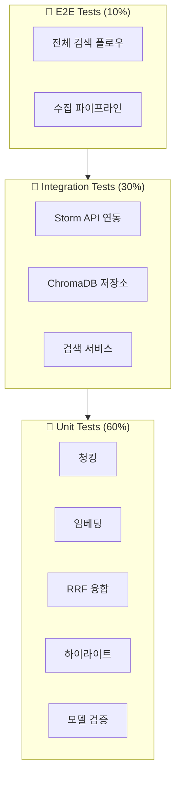

# Testing Specification

> **Role**: QA / Test Engineer
> **Created**: 2025-12-04
> **Version**: 1.0

---

## 1. Testing Strategy

### 1.1 테스트 피라미드



### 1.2 테스트 범위

| 계층 | 대상 | 커버리지 목표 |
|------|------|--------------|
| Unit | 순수 함수, 모델, 유틸 | 90% |
| Integration | 외부 서비스 연동 | 80% |
| E2E | 주요 사용자 플로우 | 70% |
| 전체 | - | 85% |

---

## 2. Test Structure

### 2.1 디렉토리 구조

```
tests/
├── __init__.py
├── conftest.py                 # 공통 픽스처
├── pytest.ini                  # pytest 설정
│
├── unit/                       # 단위 테스트
│   ├── __init__.py
│   ├── test_models.py          # Pydantic 모델
│   ├── test_chunker.py         # 텍스트 청킹
│   ├── test_embedder.py        # 임베딩 생성
│   ├── test_bm25.py            # BM25 인덱스
│   ├── test_rrf.py             # RRF 융합
│   ├── test_highlighter.py     # 하이라이트
│   ├── test_preprocessor.py    # 쿼리 전처리
│   └── test_utils.py           # 유틸리티
│
├── integration/                # 통합 테스트
│   ├── __init__.py
│   ├── test_storm_client.py    # Storm Parse API
│   ├── test_chroma_store.py    # ChromaDB
│   ├── test_search_service.py  # 검색 서비스
│   └── test_pipeline.py        # 수집 파이프라인
│
├── e2e/                        # E2E 테스트
│   ├── __init__.py
│   ├── test_search_flow.py     # 검색 전체 플로우
│   └── test_ingest_flow.py     # 수집 전체 플로우
│
└── fixtures/                   # 테스트 데이터
    ├── sample.pdf              # 샘플 PDF
    ├── parsed_pages.json       # 파싱 결과
    ├── chunks.json             # 청크 데이터
    └── embeddings.npy          # 임베딩 벡터
```

### 2.2 pytest 설정

```ini
# pytest.ini

[pytest]
testpaths = tests
python_files = test_*.py
python_classes = Test*
python_functions = test_*

# 마커
markers =
    unit: Unit tests
    integration: Integration tests
    e2e: End-to-end tests
    slow: Slow tests
    external: Tests requiring external services

# 비동기
asyncio_mode = auto

# 출력
addopts =
    -v
    --tb=short
    --strict-markers
    -ra
    --cov=src/bookbrain
    --cov-report=term-missing
    --cov-report=html:htmlcov
    --cov-fail-under=85

# 환경
env =
    STORM_API_KEY=test_key
    OPENAI_API_KEY=test_key
    DATA_DIR=/tmp/bookbrain_test
    LOG_LEVEL=DEBUG
```

---

## 3. Fixtures (`conftest.py`)

### 3.1 공통 픽스처

```python
# tests/conftest.py

import os
import pytest
import asyncio
from pathlib import Path
from typing import Generator, AsyncGenerator

import chromadb
from chromadb.config import Settings as ChromaSettings

from bookbrain.core.config import Settings
from bookbrain.models.document import Book, Chapter, ParsedPage
from bookbrain.models.chunk import Chunk, ChunkMetadata
from bookbrain.models.search import SearchQuery, SearchMode


# ============ Session Fixtures ============

@pytest.fixture(scope="session")
def event_loop():
    """세션 범위 이벤트 루프"""
    loop = asyncio.get_event_loop_policy().new_event_loop()
    yield loop
    loop.close()


@pytest.fixture(scope="session")
def test_data_dir(tmp_path_factory) -> Path:
    """세션 범위 테스트 데이터 디렉토리"""
    return tmp_path_factory.mktemp("bookbrain_test")


# ============ Settings Fixture ============

@pytest.fixture
def settings(test_data_dir: Path) -> Settings:
    """테스트용 설정"""
    return Settings(
        storm_api_key="test_storm_key",
        openai_api_key="test_openai_key",
        data_dir=test_data_dir,
        chunk_size=200,  # 테스트용 작은 사이즈
        chunk_overlap=50,
        log_level="DEBUG",
    )


# ============ Model Fixtures ============

@pytest.fixture
def sample_book() -> Book:
    """샘플 Book 객체"""
    return Book(
        id="test_book",
        title="테스트 책",
        file_name="test_book.pdf",
        file_hash="a" * 64,
        total_pages=10,
        chapters=[
            Chapter(title="1장 소개", level=1, start_page=1),
            Chapter(title="2장 본론", level=1, start_page=5),
        ],
        language="ko",
    )


@pytest.fixture
def sample_pages() -> list[ParsedPage]:
    """샘플 파싱된 페이지"""
    return [
        ParsedPage(
            page_number=1,
            content="## 1장 소개\n\n이것은 첫 번째 페이지입니다.\n자바 스트림 API에 대해 알아봅니다.",
            chapter_title="1장 소개",
        ),
        ParsedPage(
            page_number=2,
            content="### 1.1 스트림이란\n\n스트림은 데이터 처리 연산을 지원합니다.\n```java\nList<String> names = list.stream().collect(toList());\n```",
            chapter_title="1장 소개",
        ),
        ParsedPage(
            page_number=3,
            content="## 2장 본론\n\n람다 표현식을 활용한 함수형 프로그래밍.",
            chapter_title="2장 본론",
        ),
    ]


@pytest.fixture
def sample_chunks() -> list[Chunk]:
    """샘플 청크 목록"""
    return [
        Chunk(
            id="chunk_001",
            text="자바 8에서 제공하는 스트림 API는 데이터 처리 연산을 지원하도록 설계되었습니다.",
            metadata=ChunkMetadata(
                book_id="modern_java",
                book_title="모던 자바 인 액션",
                book_file="modern_java.pdf",
                chapter="1장 소개",
                page_start=1,
                page_end=1,
                chunk_index=0,
                content_type="text",
            ),
            embedding=[0.1] * 1536,
        ),
        Chunk(
            id="chunk_002",
            text="람다 표현식을 사용하면 간결하고 유연한 코드를 작성할 수 있습니다.",
            metadata=ChunkMetadata(
                book_id="modern_java",
                book_title="모던 자바 인 액션",
                book_file="modern_java.pdf",
                chapter="2장 람다",
                page_start=10,
                page_end=11,
                chunk_index=1,
                content_type="text",
            ),
            embedding=[0.2] * 1536,
        ),
        Chunk(
            id="chunk_003",
            text="Optional 클래스는 null을 대신하여 값의 존재 여부를 명시적으로 표현합니다.",
            metadata=ChunkMetadata(
                book_id="modern_java",
                book_title="모던 자바 인 액션",
                book_file="modern_java.pdf",
                chapter="3장 Optional",
                page_start=20,
                page_end=20,
                chunk_index=2,
                content_type="text",
            ),
            embedding=[0.3] * 1536,
        ),
    ]


@pytest.fixture
def sample_query() -> SearchQuery:
    """샘플 검색 쿼리"""
    return SearchQuery(
        text="스트림 API 사용법",
        mode=SearchMode.HYBRID,
        top_k=10,
        book_filter=None,
        vector_weight=0.5,
    )


# ============ Storage Fixtures ============

@pytest.fixture
def chroma_client(test_data_dir: Path) -> chromadb.Client:
    """테스트용 ChromaDB 클라이언트 (Ephemeral)"""
    return chromadb.EphemeralClient(
        settings=ChromaSettings(
            anonymized_telemetry=False,
            allow_reset=True,
        )
    )


@pytest.fixture
def chroma_collection(chroma_client: chromadb.Client):
    """테스트용 ChromaDB 컬렉션"""
    collection = chroma_client.get_or_create_collection(
        name="test_collection",
        metadata={"hnsw:space": "cosine"},
    )
    yield collection
    # Cleanup
    chroma_client.delete_collection("test_collection")


# ============ Mock Fixtures ============

@pytest.fixture
def mock_storm_response() -> dict:
    """Mock Storm Parse API 응답"""
    return {
        "jobId": "test_job_123",
        "state": "COMPLETED",
        "requestedAt": "2025-12-04T00:00:00Z",
        "completedAt": "2025-12-04T00:01:00Z",
        "pages": [
            {"pageNumber": 1, "content": "## Chapter 1\n\nContent of page 1"},
            {"pageNumber": 2, "content": "### Section 1.1\n\nContent of page 2"},
        ],
    }


@pytest.fixture
def mock_embeddings() -> list[list[float]]:
    """Mock 임베딩 벡터"""
    import numpy as np
    np.random.seed(42)
    return [np.random.randn(1536).tolist() for _ in range(10)]
```

---

## 4. Unit Tests

### 4.1 Models (`test_models.py`)

```python
# tests/unit/test_models.py

import pytest
from pydantic import ValidationError

from bookbrain.models.document import Book, Chapter, ParsedPage
from bookbrain.models.chunk import Chunk, ChunkMetadata
from bookbrain.models.search import SearchQuery, SearchResult, SearchMode


class TestBookModel:
    """Book 모델 테스트"""

    def test_valid_book(self, sample_book):
        """유효한 Book 생성"""
        assert sample_book.id == "test_book"
        assert sample_book.total_pages == 10
        assert len(sample_book.chapters) == 2

    def test_book_id_pattern(self):
        """book_id 패턴 검증"""
        with pytest.raises(ValidationError) as exc_info:
            Book(
                id="Invalid ID!",  # 특수문자 포함
                title="Test",
                file_name="test.pdf",
                file_hash="a" * 64,
                total_pages=1,
            )

        assert "pattern" in str(exc_info.value)

    def test_book_file_hash_length(self):
        """file_hash 길이 검증"""
        with pytest.raises(ValidationError):
            Book(
                id="test",
                title="Test",
                file_name="test.pdf",
                file_hash="short",  # 64자 미만
                total_pages=1,
            )


class TestChunkMetadata:
    """ChunkMetadata 모델 테스트"""

    def test_page_range_validation(self):
        """page_end >= page_start 검증"""
        with pytest.raises(ValidationError):
            ChunkMetadata(
                book_id="test",
                book_title="Test",
                book_file="test.pdf",
                chapter="1장",
                page_start=10,
                page_end=5,  # start보다 작음
                chunk_index=0,
                content_type="text",
            )

    def test_to_chroma_metadata(self):
        """ChromaDB 메타데이터 변환"""
        meta = ChunkMetadata(
            book_id="test",
            book_title="Test",
            book_file="test.pdf",
            chapter=None,
            page_start=1,
            page_end=1,
            chunk_index=0,
            content_type="text",
        )

        chroma_meta = meta.to_chroma_metadata()

        assert chroma_meta["book_id"] == "test"
        assert chroma_meta["chapter"] == ""  # None → 빈 문자열


class TestChunk:
    """Chunk 모델 테스트"""

    def test_generate_id(self):
        """청크 ID 생성"""
        id1 = Chunk.generate_id("book1", 0)
        id2 = Chunk.generate_id("book1", 1)
        id3 = Chunk.generate_id("book1", 0)  # 동일 입력

        assert id1 != id2  # 다른 index는 다른 ID
        assert id1 == id3  # 동일 입력은 동일 ID
        assert len(id1) == 16  # 16자리 해시

    def test_embedding_dimension(self):
        """임베딩 차원 검증"""
        with pytest.raises(ValidationError):
            Chunk(
                id="test",
                text="Test content",
                metadata=ChunkMetadata(
                    book_id="test",
                    book_title="Test",
                    book_file="test.pdf",
                    page_start=1,
                    page_end=1,
                    chunk_index=0,
                ),
                embedding=[0.1] * 100,  # 1536이 아닌 100
            )


class TestSearchQuery:
    """SearchQuery 모델 테스트"""

    def test_default_values(self):
        """기본값 확인"""
        query = SearchQuery(text="test")

        assert query.mode == SearchMode.HYBRID
        assert query.top_k == 10
        assert query.vector_weight == 0.5
        assert query.book_filter is None

    def test_top_k_range(self):
        """top_k 범위 검증"""
        with pytest.raises(ValidationError):
            SearchQuery(text="test", top_k=0)

        with pytest.raises(ValidationError):
            SearchQuery(text="test", top_k=101)

    def test_vector_weight_range(self):
        """vector_weight 범위 검증"""
        with pytest.raises(ValidationError):
            SearchQuery(text="test", vector_weight=1.5)
```

### 4.2 Chunker (`test_chunker.py`)

```python
# tests/unit/test_chunker.py

import pytest

from bookbrain.ingestion.chunker import TextChunker
from bookbrain.models.document import ParsedPage


class TestTextChunker:
    """TextChunker 테스트"""

    def test_basic_chunking(self, settings, sample_pages):
        """기본 청킹"""
        chunker = TextChunker(settings)

        chunks = list(chunker.chunk_pages(
            pages=sample_pages,
            book_id="test",
            book_title="Test Book",
            book_file="test.pdf",
        ))

        assert len(chunks) > 0
        assert all(c.id for c in chunks)
        assert all(c.text for c in chunks)
        assert all(c.metadata.book_id == "test" for c in chunks)

    def test_chunk_overlap(self, settings):
        """청크 오버랩 확인"""
        # 긴 텍스트 생성
        long_text = "테스트 문장입니다. " * 100
        pages = [ParsedPage(page_number=1, content=long_text)]

        chunker = TextChunker(settings)
        chunks = list(chunker.chunk_pages(pages, "test", "Test", "test.pdf"))

        # 오버랩 존재 확인 (인접 청크 간 공통 텍스트)
        if len(chunks) >= 2:
            overlap_found = False
            for i in range(len(chunks) - 1):
                if chunks[i].text[-50:] in chunks[i + 1].text[:100]:
                    overlap_found = True
                    break
            # 오버랩 설정이 있으면 발견되어야 함
            assert overlap_found or settings.chunk_overlap == 0

    def test_code_block_preservation(self, settings):
        """코드 블록 보존"""
        code_content = """## 코드 예제

```python
def hello():
    print("Hello, World!")
    return True
```

위 코드는 간단한 예제입니다.
"""
        pages = [ParsedPage(page_number=1, content=code_content)]

        chunker = TextChunker(settings)
        chunks = list(chunker.chunk_pages(pages, "test", "Test", "test.pdf"))

        # 코드 블록이 완전히 포함된 청크가 있어야 함
        full_code = "def hello():"
        assert any(full_code in c.text for c in chunks)

    def test_page_range_tracking(self, settings, sample_pages):
        """페이지 범위 추적"""
        chunker = TextChunker(settings)
        chunks = list(chunker.chunk_pages(
            pages=sample_pages,
            book_id="test",
            book_title="Test",
            book_file="test.pdf",
        ))

        for chunk in chunks:
            assert chunk.metadata.page_start >= 1
            assert chunk.metadata.page_end >= chunk.metadata.page_start
            assert chunk.metadata.page_end <= len(sample_pages)

    def test_content_type_detection(self, settings):
        """콘텐츠 타입 감지"""
        code_page = ParsedPage(
            page_number=1,
            content="```java\npublic class Test {}\n```\n```java\nSystem.out.println();\n```",
        )
        text_page = ParsedPage(
            page_number=2,
            content="이것은 일반 텍스트입니다. 코드가 없습니다.",
        )

        chunker = TextChunker(settings)

        code_chunks = list(chunker.chunk_pages([code_page], "t", "T", "t.pdf"))
        text_chunks = list(chunker.chunk_pages([text_page], "t", "T", "t.pdf"))

        # 코드가 많은 청크는 'code' 또는 'mixed'
        assert any(c.metadata.content_type in ("code", "mixed") for c in code_chunks)
        # 텍스트만 있는 청크는 'text'
        assert all(c.metadata.content_type == "text" for c in text_chunks)

    def test_empty_pages(self, settings):
        """빈 페이지 처리"""
        pages = [ParsedPage(page_number=1, content="   \n\n   ")]

        chunker = TextChunker(settings)
        chunks = list(chunker.chunk_pages(pages, "t", "T", "t.pdf"))

        # 빈 페이지는 청크가 생성되지 않아야 함
        assert len(chunks) == 0

    def test_chunk_index_sequential(self, settings, sample_pages):
        """청크 인덱스 순차적 증가"""
        chunker = TextChunker(settings)
        chunks = list(chunker.chunk_pages(
            pages=sample_pages,
            book_id="test",
            book_title="Test",
            book_file="test.pdf",
        ))

        indices = [c.metadata.chunk_index for c in chunks]
        assert indices == list(range(len(chunks)))
```

### 4.3 RRF Fusion (`test_rrf.py`)

```python
# tests/unit/test_rrf.py

import pytest
from dataclasses import dataclass

from bookbrain.search.rrf_fusion import RRFFusion


@dataclass
class MockVectorResult:
    chunk_id: str
    text: str
    similarity: float
    rank: int
    metadata: dict


@dataclass
class MockKeywordResult:
    chunk_id: str
    text: str
    score: float
    rank: int
    metadata: dict


class TestRRFFusion:
    """RRF Fusion 테스트"""

    @pytest.fixture
    def fusion(self):
        return RRFFusion(k=60)

    @pytest.fixture
    def vector_results(self):
        return [
            MockVectorResult("A", "Doc A", 0.95, 1, {"book_id": "b1"}),
            MockVectorResult("B", "Doc B", 0.85, 2, {"book_id": "b1"}),
            MockVectorResult("C", "Doc C", 0.75, 3, {"book_id": "b1"}),
        ]

    @pytest.fixture
    def keyword_results(self):
        return [
            MockKeywordResult("B", "Doc B", 12.5, 1, {"book_id": "b1"}),
            MockKeywordResult("D", "Doc D", 10.0, 2, {"book_id": "b1"}),
            MockKeywordResult("A", "Doc A", 8.0, 3, {"book_id": "b1"}),
        ]

    def test_basic_fusion(self, fusion, vector_results, keyword_results):
        """기본 RRF 융합"""
        results = fusion.fuse(vector_results, keyword_results)

        # 결과 존재
        assert len(results) > 0

        # 점수 내림차순
        scores = [r.rrf_score for r in results]
        assert scores == sorted(scores, reverse=True)

    def test_both_sources_combined(self, fusion, vector_results, keyword_results):
        """양쪽 소스에서 나온 결과 통합"""
        results = fusion.fuse(vector_results, keyword_results)

        # A, B는 양쪽에서 나옴 → 점수 합산
        result_a = next(r for r in results if r.chunk_id == "A")
        result_b = next(r for r in results if r.chunk_id == "B")

        # 양쪽 점수 모두 있어야 함
        assert result_a.vector_rank is not None
        assert result_a.keyword_rank is not None
        assert result_b.vector_rank is not None
        assert result_b.keyword_rank is not None

    def test_single_source_result(self, fusion, vector_results, keyword_results):
        """한쪽에서만 나온 결과"""
        results = fusion.fuse(vector_results, keyword_results)

        # C는 벡터에서만
        result_c = next(r for r in results if r.chunk_id == "C")
        assert result_c.vector_rank is not None
        assert result_c.keyword_rank is None

        # D는 키워드에서만
        result_d = next(r for r in results if r.chunk_id == "D")
        assert result_d.vector_rank is None
        assert result_d.keyword_rank is not None

    def test_rrf_formula(self, fusion):
        """RRF 공식 검증"""
        # score = 1 / (k + rank)

        # 벡터 rank 1, 키워드 rank 3
        expected_a = (1 / (60 + 1)) + (1 / (60 + 3))
        # = 0.01639 + 0.01587 = 0.03226

        vector = [MockVectorResult("A", "A", 0.9, 1, {})]
        keyword = [MockKeywordResult("A", "A", 10, 3, {})]

        results = fusion.fuse(vector, keyword, alpha=0.5)
        result_a = results[0]

        assert abs(result_a.rrf_score - expected_a * 0.5 * 2) < 0.0001

    def test_alpha_weighting(self, fusion, vector_results, keyword_results):
        """alpha 가중치 테스트"""
        # alpha=1.0: 벡터만
        results_vector = fusion.fuse(vector_results, keyword_results, alpha=1.0)

        # alpha=0.0: 키워드만
        results_keyword = fusion.fuse(vector_results, keyword_results, alpha=0.0)

        # 벡터 우선 시 벡터 1등이 최상위
        assert results_vector[0].chunk_id == "A"

        # 키워드 우선 시 키워드 1등이 최상위
        assert results_keyword[0].chunk_id == "B"

    def test_empty_results(self, fusion):
        """빈 결과 처리"""
        results = fusion.fuse([], [])
        assert results == []

        results = fusion.fuse([], [MockKeywordResult("A", "A", 10, 1, {})])
        assert len(results) == 1

    def test_k_parameter_effect(self):
        """k 파라미터 효과"""
        vector = [
            MockVectorResult("A", "A", 0.9, 1, {}),
            MockVectorResult("B", "B", 0.8, 2, {}),
        ]

        # k가 작을수록 순위 차이 영향 큼
        fusion_small_k = RRFFusion(k=1)
        fusion_large_k = RRFFusion(k=100)

        results_small = fusion_small_k.fuse(vector, [])
        results_large = fusion_large_k.fuse(vector, [])

        # 점수 차이 계산
        diff_small = results_small[0].rrf_score - results_small[1].rrf_score
        diff_large = results_large[0].rrf_score - results_large[1].rrf_score

        # k가 작을수록 점수 차이 큼
        assert diff_small > diff_large
```

### 4.4 Highlighter (`test_highlighter.py`)

```python
# tests/unit/test_highlighter.py

import pytest

from bookbrain.search.highlighter import Highlighter


class TestHighlighter:
    """Highlighter 테스트"""

    @pytest.fixture
    def highlighter(self):
        return Highlighter(
            pre_tag="<mark>",
            post_tag="</mark>",
            max_length=200,
        )

    def test_basic_highlight(self, highlighter):
        """기본 하이라이트"""
        text = "자바 스트림 API는 데이터 처리를 위한 도구입니다."
        query = "스트림"

        result = highlighter.highlight(text, query, mode="full")

        assert "<mark>스트림</mark>" in result

    def test_multiple_matches(self, highlighter):
        """여러 매칭 하이라이트"""
        text = "스트림은 스트림 API를 통해 스트림 처리를 합니다."
        query = "스트림"

        result = highlighter.highlight(text, query, mode="full")

        assert result.count("<mark>스트림</mark>") == 3

    def test_case_insensitive(self, highlighter):
        """대소문자 무시"""
        text = "Stream API와 STREAM 처리, stream 연산"
        query = "stream"

        result = highlighter.highlight(text, query, mode="full")

        assert "<mark>Stream</mark>" in result
        assert "<mark>STREAM</mark>" in result
        assert "<mark>stream</mark>" in result

    def test_snippet_mode(self, highlighter):
        """스니펫 모드"""
        text = "A" * 100 + " 스트림 API " + "B" * 100
        query = "스트림"

        result = highlighter.highlight(text, query, mode="snippet")

        # 최대 길이 이내
        assert len(result) <= highlighter.max_length + 50  # 여유분

        # 매칭 포함
        assert "<mark>스트림</mark>" in result

    def test_multiple_query_terms(self, highlighter):
        """여러 검색어"""
        text = "자바 8의 스트림 API는 람다와 함께 사용합니다."
        query = "스트림 람다"

        result = highlighter.highlight(text, query, mode="full")

        assert "<mark>스트림</mark>" in result
        assert "<mark>람다</mark>" in result

    def test_no_match(self, highlighter):
        """매칭 없음"""
        text = "이것은 테스트 문장입니다."
        query = "없는단어"

        result = highlighter.highlight(text, query, mode="full")

        assert "<mark>" not in result
        assert result == text

    def test_empty_query(self, highlighter):
        """빈 검색어"""
        text = "테스트 문장입니다."
        query = ""

        result = highlighter.highlight(text, query, mode="full")

        assert result == text

    def test_special_characters(self, highlighter):
        """특수문자 이스케이프"""
        text = "정규식에서 . * + 등은 특수문자입니다."
        query = "."

        # 에러 없이 실행
        result = highlighter.highlight(text, query, mode="full")
        assert result  # 결과 존재

    def test_korean_tokens(self, highlighter):
        """한글 토큰"""
        text = "자바스크립트는 자바와 다른 언어입니다."
        query = "자바"

        result = highlighter.highlight(text, query, mode="full")

        # "자바스크립트"의 "자바"도 하이라이트
        assert "<mark>자바</mark>" in result
```

---

## 5. Integration Tests

### 5.1 ChromaDB Store (`test_chroma_store.py`)

```python
# tests/integration/test_chroma_store.py

import pytest

from bookbrain.storage.chroma_store import ChromaStore


@pytest.mark.integration
class TestChromaStore:
    """ChromaStore 통합 테스트"""

    @pytest.fixture
    def store(self, settings):
        """테스트용 ChromaStore"""
        store = ChromaStore(settings)
        store.initialize()
        yield store
        store.clear()  # Cleanup

    def test_add_and_get_chunk(self, store, sample_chunks):
        """청크 추가 및 조회"""
        # 추가
        count = store.add_chunks(sample_chunks)
        assert count == len(sample_chunks)

        # 조회
        chunk = store.get_chunk(sample_chunks[0].id)
        assert chunk is not None
        assert chunk.text == sample_chunks[0].text

    def test_search(self, store, sample_chunks):
        """벡터 검색"""
        store.add_chunks(sample_chunks)

        # 첫 번째 청크의 임베딩으로 검색
        query_embedding = sample_chunks[0].embedding

        results = store.search(
            query_embedding=query_embedding,
            top_k=3,
        )

        # 결과 존재
        assert len(results) > 0

        # 첫 번째 결과가 가장 유사
        assert results[0][0] == sample_chunks[0].id

    def test_search_with_filter(self, store, sample_chunks):
        """필터링 검색"""
        store.add_chunks(sample_chunks)

        # 존재하지 않는 book_id로 필터
        results = store.search(
            query_embedding=sample_chunks[0].embedding,
            top_k=10,
            book_filter=["nonexistent_book"],
        )

        # 결과 없음
        assert len(results) == 0

    def test_delete_book(self, store, sample_chunks):
        """책 삭제"""
        store.add_chunks(sample_chunks)

        # 삭제
        deleted = store.delete_book("modern_java")

        assert deleted == len(sample_chunks)

        # 확인
        chunk = store.get_chunk(sample_chunks[0].id)
        assert chunk is None

    def test_get_stats(self, store, sample_chunks):
        """통계 조회"""
        store.add_chunks(sample_chunks)

        stats = store.get_stats()

        assert stats["total_chunks"] == len(sample_chunks)
        assert stats["total_books"] == 1
        assert len(stats["books"]) == 1

    def test_upsert_existing(self, store, sample_chunks):
        """기존 청크 업데이트"""
        # 첫 추가
        store.add_chunks(sample_chunks)

        # 동일 ID로 재추가 (내용 변경)
        modified_chunk = sample_chunks[0].model_copy(update={
            "text": "수정된 텍스트"
        })
        store.add_chunks([modified_chunk])

        # 확인
        chunk = store.get_chunk(modified_chunk.id)
        assert chunk.text == "수정된 텍스트"

        # 총 개수 동일
        stats = store.get_stats()
        assert stats["total_chunks"] == len(sample_chunks)
```

### 5.2 Search Service (`test_search_service.py`)

```python
# tests/integration/test_search_service.py

import pytest
from unittest.mock import AsyncMock, patch

from bookbrain.search.service import SearchService
from bookbrain.models.search import SearchQuery, SearchMode


@pytest.mark.integration
class TestSearchService:
    """SearchService 통합 테스트"""

    @pytest.fixture
    async def service(self, settings, sample_chunks):
        """테스트용 SearchService"""
        from bookbrain.storage.chroma_store import ChromaStore
        from bookbrain.storage.bm25_index import BM25Index

        chroma = ChromaStore(settings)
        chroma.initialize()
        chroma.add_chunks(sample_chunks)

        bm25 = BM25Index(settings)
        bm25.build(sample_chunks)

        service = SearchService(settings, chroma, bm25)

        yield service

        # Cleanup
        chroma.clear()

    @pytest.mark.asyncio
    async def test_hybrid_search(self, service):
        """하이브리드 검색"""
        with patch.object(
            service._embedder,
            'embed',
            new_callable=AsyncMock,
            return_value=[0.1] * 1536,
        ):
            query = SearchQuery(
                text="스트림 API",
                mode=SearchMode.HYBRID,
                top_k=5,
            )

            response = await service.search(query)

            assert len(response.results) > 0
            assert response.search_time_ms > 0
            assert response.query == query

    @pytest.mark.asyncio
    async def test_vector_only_search(self, service):
        """벡터 검색만"""
        with patch.object(
            service._embedder,
            'embed',
            new_callable=AsyncMock,
            return_value=[0.1] * 1536,
        ):
            query = SearchQuery(
                text="람다 표현식",
                mode=SearchMode.VECTOR,
                top_k=5,
            )

            response = await service.search(query)

            # 벡터 점수만 존재
            for result in response.results:
                assert result.score_vector is not None
                assert result.score_bm25 is None

    @pytest.mark.asyncio
    async def test_keyword_only_search(self, service):
        """키워드 검색만"""
        query = SearchQuery(
            text="Optional",
            mode=SearchMode.KEYWORD,
            top_k=5,
        )

        response = await service.search(query)

        # 키워드 점수만 존재
        for result in response.results:
            if result.score_bm25 is not None:
                assert result.score_vector is None

    @pytest.mark.asyncio
    async def test_highlight_in_results(self, service):
        """결과에 하이라이트 포함"""
        query = SearchQuery(
            text="스트림",
            mode=SearchMode.KEYWORD,
            top_k=5,
        )

        response = await service.search(query)

        # 하이라이트된 텍스트 존재
        for result in response.results:
            if "스트림" in result.text:
                assert result.highlighted_text is not None
                assert "<mark>" in result.highlighted_text
```

---

## 6. E2E Tests

### 6.1 Search Flow (`test_search_flow.py`)

```python
# tests/e2e/test_search_flow.py

import pytest
from pathlib import Path

from bookbrain.core.config import get_settings
from bookbrain.ingestion.pipeline import IngestionPipeline
from bookbrain.search.service import SearchService
from bookbrain.models.search import SearchQuery, SearchMode


@pytest.mark.e2e
@pytest.mark.slow
class TestSearchFlow:
    """검색 전체 플로우 E2E 테스트"""

    @pytest.fixture(scope="class")
    def ingested_service(self, tmp_path_factory):
        """수집 완료된 검색 서비스"""
        # 임시 디렉토리
        test_dir = tmp_path_factory.mktemp("e2e_test")

        # 설정
        settings = get_settings()
        settings.data_dir = test_dir

        # 샘플 PDF 수집 (fixtures 사용)
        sample_pdf = Path(__file__).parent.parent / "fixtures" / "sample.pdf"

        if sample_pdf.exists():
            pipeline = IngestionPipeline(settings)
            import asyncio
            asyncio.run(pipeline.ingest(sample_pdf))

        # 서비스 반환
        from bookbrain.storage.chroma_store import ChromaStore
        from bookbrain.storage.bm25_index import BM25Index

        chroma = ChromaStore(settings)
        chroma.initialize()

        bm25 = BM25Index(settings)
        bm25.load()

        return SearchService(settings, chroma, bm25)

    @pytest.mark.asyncio
    async def test_full_search_flow(self, ingested_service):
        """전체 검색 플로우"""
        query = SearchQuery(
            text="테스트 검색어",
            mode=SearchMode.HYBRID,
            top_k=5,
        )

        response = await ingested_service.search(query)

        # 응답 구조 검증
        assert response is not None
        assert hasattr(response, 'results')
        assert hasattr(response, 'search_time_ms')

    @pytest.mark.asyncio
    async def test_search_result_structure(self, ingested_service):
        """검색 결과 구조 검증"""
        query = SearchQuery(text="자바", mode=SearchMode.HYBRID, top_k=3)

        response = await ingested_service.search(query)

        for result in response.results:
            # 필수 필드
            assert result.chunk_id
            assert result.text
            assert result.score >= 0
            assert result.book_id
            assert result.book_title
            assert result.page_start >= 1
```

---

## 7. Test Commands

### 7.1 실행 명령

```bash
# 전체 테스트
pytest

# 단위 테스트만
pytest tests/unit/ -v

# 통합 테스트만
pytest -m integration -v

# E2E 테스트만
pytest -m e2e -v

# 특정 파일
pytest tests/unit/test_chunker.py -v

# 특정 테스트
pytest tests/unit/test_chunker.py::TestTextChunker::test_basic_chunking -v

# 커버리지 리포트
pytest --cov=src/bookbrain --cov-report=html

# 느린 테스트 제외
pytest -m "not slow"

# 외부 서비스 테스트 제외
pytest -m "not external"

# 병렬 실행
pytest -n auto
```

### 7.2 CI 설정

```yaml
# .github/workflows/test.yml

name: Tests

on:
  push:
    branches: [main, develop]
  pull_request:
    branches: [main]

jobs:
  test:
    runs-on: ubuntu-latest

    steps:
      - uses: actions/checkout@v4

      - name: Set up Python
        uses: actions/setup-python@v5
        with:
          python-version: "3.12"

      - name: Install dependencies
        run: |
          pip install poetry
          poetry install

      - name: Run unit tests
        run: |
          poetry run pytest tests/unit/ -v --cov=src/bookbrain

      - name: Run integration tests
        run: |
          poetry run pytest tests/integration/ -v -m "not external"

      - name: Upload coverage
        uses: codecov/codecov-action@v4
```

