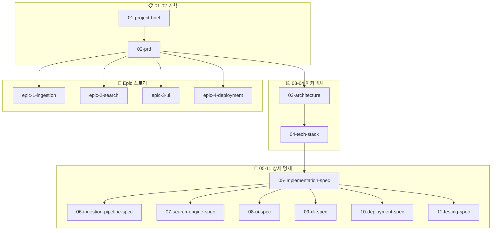

# BookBrain Documentation Index

> **Project**: Personal Library RAG System
> **Version**: 1.2
> **Last Updated**: 2025-12-05

---

## 문서 구조

```
docs/
├── README.md                         ← 현재 문서 (인덱스)
│
├── 📋 기획 문서
│   ├── 01-project-brief.md           프로젝트 개요
│   └── 02-prd.md                     제품 요구사항서
│
├── 🏗️ 아키텍처 문서
│   ├── 03-architecture.md            시스템 아키텍처
│   └── 04-tech-stack.md              기술 스택 & 파일 구조
│
├── 📝 상세 명세 문서
│   ├── 05-implementation-spec.md     구현 명세 (LLM용 메인)
│   ├── 06-ingestion-pipeline-spec.md 수집 파이프라인 상세
│   ├── 07-search-engine-spec.md      검색 엔진 상세
│   ├── 08-ui-spec.md                 UI/UX 상세
│   ├── 09-cli-spec.md                CLI 상세
│   ├── 10-deployment-spec.md         배포 상세
│   └── 11-testing-spec.md            테스트 상세
│
└── 📖 스토리 문서
    └── stories/
        ├── epic-1-ingestion.md       Epic 1: 데이터 수집
        ├── epic-2-search.md          Epic 2: 검색 엔진
        ├── epic-3-ui.md              Epic 3: Streamlit UI
        └── epic-4-deployment.md      Epic 4: 배포
```

---

## 문서별 안내

### 01-02. 기획 문서 (Planning)

| # | 문서 | 대상 독자 | 내용 |
|---|------|----------|------|
| 01 | [project-brief.md](./01-project-brief.md) | 모든 이해관계자 | 프로젝트 개요, 목표, 범위, Risk & Cost |
| 02 | [prd.md](./02-prd.md) | PM, 개발자 | 기능 요구사항, 사용자 시나리오, 대표 쿼리 50개 |

### 03-04. 아키텍처 문서 (Architecture)

| # | 문서 | 대상 독자 | 내용 |
|---|------|----------|------|
| 03 | [architecture.md](./03-architecture.md) | 개발자, 아키텍트 | 시스템 구조, 컴포넌트, 데이터 흐름 |
| 04 | [tech-stack.md](./04-tech-stack.md) | 개발자 | 기술 스택, 패키지 버전, 파일 구조 |

### 05-11. 상세 명세 문서 (Specifications)

| # | 문서 | 대상 독자 | 내용 |
|---|------|----------|------|
| 05 | [implementation-spec.md](./05-implementation-spec.md) | **LLM, 개발자** | 모든 인터페이스, 모델, 에러 처리 |
| 06 | [ingestion-pipeline-spec.md](./06-ingestion-pipeline-spec.md) | 개발자 | PDF → 벡터 DB 전체 플로우 |
| 07 | [search-engine-spec.md](./07-search-engine-spec.md) | 개발자 | 검색 알고리즘, RRF, 하이라이트 |
| 08 | [ui-spec.md](./08-ui-spec.md) | 프론트엔드 개발자 | Streamlit 컴포넌트, 상태 관리 |
| 09 | [cli-spec.md](./09-cli-spec.md) | 개발자 | CLI 명령어, 옵션 |
| 10 | [deployment-spec.md](./10-deployment-spec.md) | DevOps | Docker, Oracle Cloud, SSL |
| 11 | [testing-spec.md](./11-testing-spec.md) | QA, 개발자 | 테스트 전략, 픽스처, 예제 |

### Epic 스토리 문서 (Stories)

| Epic | 문서 | Stories | 내용 |
|------|------|---------|------|
| E1 | [epic-1-ingestion.md](./stories/epic-1-ingestion.md) | 9개 | PDF 파싱, 청킹, 임베딩 |
| E2 | [epic-2-search.md](./stories/epic-2-search.md) | 7개 | 벡터/키워드/하이브리드 검색 |
| E3 | [epic-3-ui.md](./stories/epic-3-ui.md) | 8개 | Streamlit 웹 UI |
| E4 | [epic-4-deployment.md](./stories/epic-4-deployment.md) | 8개 | Docker, 배포, 운영 |

---

## 문서 간 관계



---

## 문서 통계

| 항목 | 수량 |
|------|------|
| 총 문서 수 | 15개 |
| 총 라인 수 | ~9,500줄 |
| 총 스토리 수 | 32개 |
| 대표 쿼리 수 | 50개 |

---

## 빠른 시작 가이드

### LLM에게 코드 생성 요청 시

1. **반드시 읽어야 할 문서**:
   - `05-implementation-spec.md` - 모든 인터페이스 정의
   - 해당 기능의 상세 명세 (예: 검색 → `07-search-engine-spec.md`)

2. **참고하면 좋은 문서**:
   - `04-tech-stack.md` - 패키지 버전 확인
   - `11-testing-spec.md` - 테스트 작성 가이드

### 개발자가 읽을 순서

```
01 → 02 → 03 → 04 → 05 → 해당 Epic 스토리
```

1. `01-project-brief.md` → 전체 그림 이해
2. `02-prd.md` → 기능 요구사항
3. `03-architecture.md` → 시스템 구조
4. `04-tech-stack.md` → 기술 스택
5. `05-implementation-spec.md` → 구현 상세
6. 해당 Epic의 스토리 → 구현할 기능

### Sprint 진행 시

| Sprint | Epic | Spec |
|--------|------|------|
| 1-3 | `epic-1-ingestion.md` | `06-ingestion-pipeline-spec.md` |
| 4-5 | `epic-2-search.md` | `07-search-engine-spec.md` |
| 6-7 | `epic-3-ui.md` | `08-ui-spec.md` |
| 8-9 | `epic-4-deployment.md` | `10-deployment-spec.md` |

---

## 문서 업데이트 이력

| 날짜 | 버전 | 변경 내용 |
|------|------|----------|
| 2025-12-04 | 1.0 | 초기 문서 생성 |
| 2025-12-04 | 1.1 | 상세 명세 문서 7종 추가 |
| 2025-12-05 | 1.2 | 번호 접두사 추가, Risk & Cost, 대표 쿼리 50개, v2.0 고려사항 |

---

## 문서 작성 규칙

### 파일 명명

- 번호 접두사: `{NN}-{name}.md` (예: `01-project-brief.md`)
- Epic 스토리: `epic-{N}-{name}.md`
- 소문자, 하이픈 구분

### 마크다운 스타일

- 헤더: `#`~`###` 사용 (4단계 이상 지양)
- 다이어그램: Mermaid 사용
- 코드: 언어 명시 (```python, ```bash)
- 수식: LaTeX 사용 (`$$...$$`)

### 버전 관리

- 각 문서 헤더에 `Version`, `Updated` 명시
- 주요 변경 시 버전 증가
