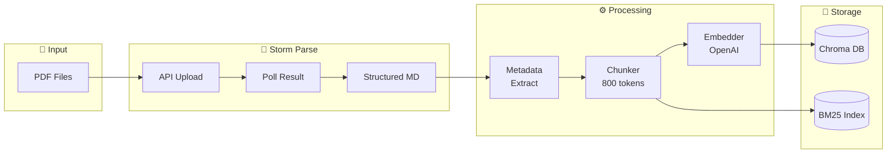
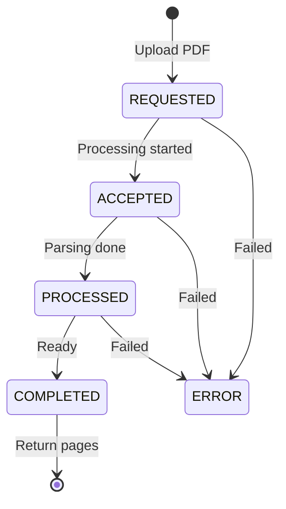
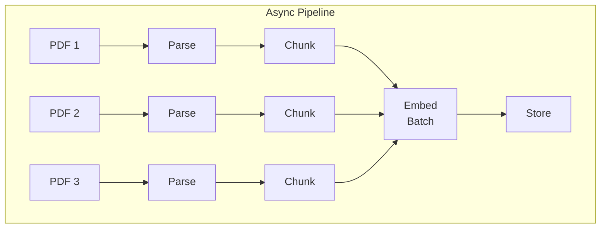

# Epic 1: Data Ingestion Pipeline

> **Role**: Scrum Master
> **Created**: 2025-12-04
> **Updated**: 2025-12-04
> **Epic Owner**: Developer
> **Priority**: P0 (Must Have)

---

## Epic Overview

### Goal
PDF 파일을 Storm Parse API로 구조화된 텍스트로 변환하고, 청킹하여 벡터 임베딩을 생성한 후 Chroma DB에 저장하는 파이프라인 구축

### Architecture



### Success Criteria
- [ ] 보유 PDF 전체 파싱 및 저장 완료
- [ ] 모든 청크에 메타데이터(책명, 챕터, 페이지) 포함
- [ ] Chroma DB + BM25 인덱스 정상 구축
- [ ] 처리 시간 및 비용 리포트 생성

### Dependencies
- Storm Parse API Key
- OpenAI API Key
- PDF 파일 준비 완료

---

## Stories

### Story 1.1: 프로젝트 초기 설정

**As a** Developer
**I want** 프로젝트 구조와 개발 환경을 설정
**So that** 일관된 환경에서 개발을 시작할 수 있다

#### Acceptance Criteria

```gherkin
Given 빈 프로젝트 디렉토리
When 초기 설정 스크립트 실행
Then pyproject.toml이 생성된다
And 필요한 디렉토리 구조가 생성된다
And .env.example이 생성된다
And 가상환경에 패키지가 설치된다
```

#### Tasks
- [ ] `pyproject.toml` 작성 (Python 3.12+, 최신 패키지 버전)
- [ ] 디렉토리 구조 생성 (`src/`, `data/`, `tests/`)
- [ ] `.env.example` 작성 (Storm API, OpenAI API 포함)
- [ ] `.gitignore` 작성
- [ ] `Makefile` 기본 명령어 작성
- [ ] `README.md` 초안 작성

#### Definition of Done
- `make install` 실행 시 환경 구성 완료
- `python -c "import bookbrain"` 성공

---

### Story 1.2: Storm Parse API 클라이언트 구현

**As a** Developer
**I want** Storm Parse API와 통신하는 클라이언트 구현
**So that** PDF를 구조화된 마크다운으로 변환할 수 있다

#### Acceptance Criteria

```gherkin
Given PDF 파일 경로
When StormParseClient.parse_pdf() 호출
Then PDF가 API에 업로드된다
And jobId가 반환된다
And 폴링으로 COMPLETED 상태까지 대기한다
And 구조화된 마크다운 페이지 리스트가 반환된다
```

#### Tasks
- [ ] `StormParseClient` 클래스 구현
- [ ] `upload_pdf()` 메서드 - multipart/form-data 업로드
- [ ] `poll_result()` 메서드 - 상태 폴링 (with tenacity retry)
- [ ] `parse_pdf()` 메서드 - 통합 파이프라인
- [ ] `ParseResult`, `ParsePage` Pydantic 모델
- [ ] 에러 핸들링 (401, 403, timeout)
- [ ] 유닛 테스트 (모킹)

#### API Endpoints

```python
# Upload
POST /api/v2/parse/by-file
Headers: Authorization: Bearer {token}
Body: multipart/form-data (file, language="ko")
Response: { "jobId": "...", "state": "REQUESTED" }

# Poll
GET /api/v2/parse/job/{jobId}
Response: { "state": "COMPLETED", "pages": [...] }
```

#### State Machine



#### Definition of Done
- 테스트 PDF 파싱 성공
- 페이지별 content 반환 확인
- 에러 시 적절한 예외 발생

---

### Story 1.3: 파싱 결과 처리기 구현

**As a** Developer
**I want** Storm Parse 결과에서 메타데이터를 추출
**So that** 청크에 출처 정보를 포함할 수 있다

#### Acceptance Criteria

```gherkin
Given Storm Parse API 결과 (pages 리스트)
When ParseResultProcessor.process() 호출
Then 책 제목이 추출된다
And 챕터 정보가 추출된다 (### 패턴)
And 페이지 번호가 매핑된다
```

#### Tasks
- [ ] `ParseResultProcessor` 클래스 구현
- [ ] `extract_book_title()` - 파일명 또는 첫 페이지에서 추출
- [ ] `extract_chapters()` - ### 패턴으로 챕터 구분
- [ ] `build_page_map()` - 페이지 번호 → 콘텐츠 매핑
- [ ] 유닛 테스트 (실제 파싱 결과 샘플로)

#### Sample Parse Result

```python
# parse_result.txt 형식 분석
{
    "pages": [
        {
            "pageNumber": 1,
            "content": "### 자바 8, 9, 10, 11 : 무슨 일이 일어나고 있는가?\n\n이 장의 내용은 다음과 같습니다..."
        }
    ]
}

# 추출할 메타데이터
metadata = {
    "book_title": "모던 자바 인 액션",
    "chapter": "1장 - 자바 8, 9, 10, 11",
    "page_number": 37
}
```

#### Definition of Done
- 테스트 데이터에서 메타데이터 정확히 추출
- 챕터 패턴 인식률 > 90%

---

### Story 1.4: 텍스트 청커 구현

**As a** Developer
**I want** 파싱된 텍스트를 검색에 적합한 크기로 분할
**So that** 정밀한 검색이 가능하다

#### Acceptance Criteria

```gherkin
Given 페이지별 텍스트 리스트
When TextChunker.chunk() 호출
Then 800 토큰 크기의 청크가 생성된다
And 200 토큰의 오버랩이 적용된다
And 코드 블록이 중간에 잘리지 않는다
And 각 청크에 원본 페이지 정보가 포함된다
```

#### Tasks
- [ ] `TextChunker` 클래스 구현
- [ ] LangChain `RecursiveCharacterTextSplitter` 활용
- [ ] tiktoken 기반 토큰 계산
- [ ] 코드 블록 보존 로직 (``` 구분)
- [ ] 청크-페이지 매핑 로직
- [ ] `Chunk` Pydantic 모델
- [ ] 유닛 테스트 작성

#### Configuration

```python
CHUNK_CONFIG = {
    "chunk_size": 800,        # 토큰
    "chunk_overlap": 200,     # 토큰
    "separators": [
        "\n\n",               # 단락 구분
        "\n",                 # 줄바꿈
        "```",                # 코드 블록 (보존 시도)
        ". ",                 # 문장 끝
        " ",                  # 단어
    ],
    "length_function": lambda x: len(tiktoken.encoding_for_model("gpt-4").encode(x))
}
```

#### Definition of Done
- 청크 크기가 800 토큰 ± 10% 범위
- 코드 블록 무결성 테스트 통과
- 오버랩으로 문맥 연결 확인

---

### Story 1.5: 임베딩 생성기 구현

**As a** Developer
**I want** 텍스트 청크를 벡터로 변환
**So that** 시맨틱 검색이 가능하다

#### Acceptance Criteria

```gherkin
Given 텍스트 청크 리스트
When Embedder.embed_batch() 호출
Then OpenAI API로 임베딩이 생성된다
And 배치 처리로 API 호출이 최적화된다
And Rate limit 에러가 적절히 핸들링된다
And 비용이 계산되어 로깅된다
```

#### Tasks
- [ ] `Embedder` 클래스 구현 (async)
- [ ] OpenAI 클라이언트 설정
- [ ] 배치 처리 (100개씩)
- [ ] 재시도 로직 (tenacity)
- [ ] 비용 계산 로직
- [ ] `EmbeddedChunk` 모델
- [ ] 유닛 테스트 (모킹)

#### Cost Estimation

```python
# text-embedding-3-small: $0.02 / 1M tokens
# 예상: 50권 × 200청크 × 800토큰 = 8M 토큰 ≈ $0.16
```

#### Definition of Done
- 테스트 청크 임베딩 성공
- 1536차원 벡터 생성 확인
- 배치 처리 동작 확인

---

### Story 1.6: Chroma 저장소 구현

**As a** Developer
**I want** 임베딩과 메타데이터를 Chroma DB에 저장
**So that** 나중에 벡터 검색할 수 있다

#### Acceptance Criteria

```gherkin
Given 임베딩된 청크 리스트
When ChromaStore.add() 호출
Then Chroma 컬렉션에 데이터가 저장된다
And 메타데이터가 함께 저장된다
And 중복 ID는 업데이트된다
And 저장 건수가 리포트된다
```

#### Tasks
- [ ] `ChromaStore` 클래스 구현
- [ ] Chroma 클라이언트 설정 (HTTP 또는 persistent)
- [ ] 컬렉션 생성/조회 로직
- [ ] `add()` 메서드 구현
- [ ] 기존 데이터 삭제/재생성 옵션
- [ ] 통합 테스트 작성

#### Chroma Metadata

```python
# Chroma 메타데이터 제한: 문자열, 숫자, 불리언만 가능
metadata = {
    "book_title": str,
    "book_file": str,
    "chapter": str,
    "page_start": int,
    "page_end": int,
    "chunk_index": int,
}
```

#### Definition of Done
- 데이터 저장 후 조회 성공
- 메타데이터 필터링 동작 확인
- 컬렉션 삭제/재생성 동작 확인

---

### Story 1.7: BM25 인덱스 구현

**As a** Developer
**I want** 청크 텍스트로 BM25 인덱스를 구축
**So that** 키워드 검색이 가능하다

#### Acceptance Criteria

```gherkin
Given 모든 청크 텍스트
When BM25Store.build_index() 호출
Then BM25 인덱스가 생성된다
And 인덱스가 파일로 저장된다
And 로드 시 검색이 동작한다
```

#### Tasks
- [ ] `BM25Store` 클래스 구현
- [ ] rank_bm25 라이브러리 활용
- [ ] 토크나이저 선택 (공백 기반)
- [ ] pickle 저장/로드
- [ ] 청크 ID 매핑 유지
- [ ] 유닛 테스트 작성

#### Implementation

```python
from rank_bm25 import BM25Okapi

class BM25Store:
    def __init__(self):
        self.bm25 = None
        self.chunk_ids = []

    def build_index(self, chunks: list[Chunk]):
        tokenized = [self._tokenize(c.text) for c in chunks]
        self.bm25 = BM25Okapi(tokenized)
        self.chunk_ids = [c.id for c in chunks]

    def _tokenize(self, text: str) -> list[str]:
        # 간단한 공백 토크나이징 (한글+영어 혼합)
        return text.lower().split()

    def save(self, path: Path):
        with open(path, "wb") as f:
            pickle.dump({"bm25": self.bm25, "ids": self.chunk_ids}, f)

    def load(self, path: Path):
        with open(path, "rb") as f:
            data = pickle.load(f)
            self.bm25 = data["bm25"]
            self.chunk_ids = data["ids"]
```

#### Definition of Done
- 인덱스 빌드 성공
- 키워드 검색 결과 반환
- 저장/로드 사이클 동작 확인

---

### Story 1.8: 파싱 결과 캐싱

**As a** Developer
**I want** Storm Parse 결과를 로컬에 캐싱
**So that** 재실행 시 API 비용을 절약할 수 있다

#### Acceptance Criteria

```gherkin
Given 이미 파싱된 PDF
When 동일 PDF로 파이프라인 재실행
Then 캐시된 결과가 사용된다
And API 호출이 발생하지 않는다
```

#### Tasks
- [ ] `ParseCache` 클래스 구현
- [ ] 파일 해시 기반 캐시 키
- [ ] JSON 파일로 결과 저장
- [ ] 캐시 히트/미스 로깅
- [ ] 캐시 무효화 옵션 (--force-parse)

#### Cache Structure

```
data/parsed/
├── {file_hash}_meta.json     # 파일 정보
└── {file_hash}_pages.json    # 파싱 결과
```

#### Definition of Done
- 캐시 히트 시 API 호출 없음
- --force-parse 옵션 동작

---

### Story 1.9: 통합 파이프라인 구현

**As a** Developer
**I want** PDF → 벡터 DB 전체 과정을 하나의 파이프라인으로 실행
**So that** 간편하게 데이터를 수집할 수 있다

#### Acceptance Criteria

```gherkin
Given PDF 파일이 있는 디렉토리
When python scripts/ingest.py --pdf-dir ./data/pdfs 실행
Then 모든 PDF가 처리된다
And Chroma DB에 저장된다
And BM25 인덱스가 생성된다
And 처리 리포트가 출력된다
```

#### Tasks
- [ ] `IngestionPipeline` 클래스 구현
- [ ] CLI 스크립트 작성 (`scripts/ingest.py`)
- [ ] Typer + Rich 기반 CLI
- [ ] 진행률 표시 (rich.progress)
- [ ] 에러 핸들링 및 스킵 로직
- [ ] 최종 리포트 생성
- [ ] 통합 테스트 작성

#### CLI Interface

```bash
# 전체 수집
python scripts/ingest.py --pdf-dir ./data/pdfs

# 단일 파일
python scripts/ingest.py --pdf ./data/pdfs/modern_java.pdf

# 재수집 (캐시 무시)
python scripts/ingest.py --pdf-dir ./data/pdfs --force-parse

# 드라이런 (저장 안 함)
python scripts/ingest.py --pdf-dir ./data/pdfs --dry-run

# 임베딩만 재생성
python scripts/ingest.py --pdf-dir ./data/pdfs --skip-parse
```

#### Report Example

```
╔══════════════════════════════════════════════════════════════╗
║                    Ingestion Report                          ║
╠══════════════════════════════════════════════════════════════╣
║  Total PDFs processed: 52                                    ║
║  Total pages parsed: 12,345                                  ║
║  Total chunks created: 10,234                                ║
║  Total tokens embedded: 8,187,200                            ║
║                                                              ║
║  API Costs:                                                  ║
║    Storm Parse: ~$XX.XX (52 documents)                       ║
║    OpenAI Embedding: $0.16                                   ║
║                                                              ║
║  Processing time: 45m 12s                                    ║
║                                                              ║
║  Storage:                                                    ║
║    Chroma collection: bookbrain (10,234 documents)           ║
║    BM25 index: ./data/bm25_index.pkl (18MB)                  ║
║                                                              ║
║  Errors: 0                                                   ║
║  Cache hits: 12 (skipped re-parsing)                         ║
╚══════════════════════════════════════════════════════════════╝
```

#### Definition of Done
- 테스트 PDF 3개로 E2E 테스트 통과
- 리포트 정상 출력
- 에러 발생 시 스킵 후 계속 진행
- 캐시 동작 확인

---

## Sprint Planning Suggestion

### Sprint 1 (Foundation)
- Story 1.1: 프로젝트 초기 설정
- Story 1.2: Storm Parse API 클라이언트

### Sprint 2 (Processing)
- Story 1.3: 파싱 결과 처리기
- Story 1.4: 텍스트 청커
- Story 1.8: 파싱 결과 캐싱

### Sprint 3 (Storage & Integration)
- Story 1.5: 임베딩 생성기
- Story 1.6: Chroma 저장소
- Story 1.7: BM25 인덱스
- Story 1.9: 통합 파이프라인

---

## Technical Considerations

### Async Architecture



- Storm Parse: 동시 업로드 가능 (rate limit 확인 필요)
- OpenAI Embedding: 배치 처리 + async
- Chroma: 배치 upsert

### Error Handling Strategy

| Error | Strategy |
|-------|----------|
| Storm Parse timeout | 최대 10분 대기, 3회 재시도 |
| Storm Parse 500 | 5분 후 재시도, 최대 3회 |
| OpenAI rate limit | exponential backoff |
| Chroma connection | 재연결 시도 |

---

## Risks & Mitigations

| Risk | Mitigation |
|------|------------|
| Storm Parse API 비용 초과 | 사전 비용 계산, 캐싱으로 재호출 방지 |
| 대용량 PDF 처리 시간 | 비동기 처리, 진행률 표시 |
| 파싱 품질 이슈 | 샘플 검증, 수동 보정 옵션 |
| API 장애 | 재시도 로직, 부분 저장 |

